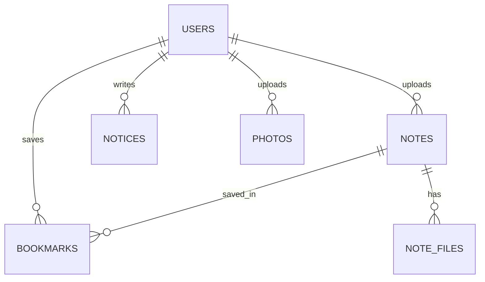

> 상태: 초안 | 최종수정: 2026-08-01 | 담당: @somsumun

[← 문서 인덱스](../README.md)

# 데이터 모델

**스키마를 바꾸기 전에 이 문서를 먼저 확인하고, 바뀌면 이 문서도 같이 갱신하세요.** Flyway 마이그레이션(`V*__*.sql`)이 이 정의의 원본을 그대로 반영해야 합니다.

## ERD

## 테이블 정의

### users

| 컬럼 | 타입 | 제약 | 설명 |
|---|---|---|---|
| `id` | bigint | PK, auto | |
| `email` | varchar(255) | UNIQUE, NOT NULL | 학교 이메일 (로그인 ID) |
| `student_no` | varchar(20) | NOT NULL | 학번 (신원 확인용) |
| `name` | varchar(50) | NOT NULL | |
| `password_hash` | varchar(255) | NOT NULL | |
| `role` | enum | NOT NULL, default `USER` | `USER`, `ADMIN` |
| `status` | enum | NOT NULL, default `PENDING` | `PENDING`, `ACTIVE`, `SUSPENDED` |
| `created_at` | datetime | NOT NULL | 가입 신청일시 |
| `approved_at` | datetime | NULL | 승인일시 |

### notes

| 컬럼 | 타입 | 제약 | 설명 |
|---|---|---|---|
| `id` | bigint | PK, auto | |
| `category` | enum | NOT NULL | `EXAM`, `SUBJECT` |
| `title` | varchar(200) | NOT NULL | |
| `subject_name` | varchar(100) | NOT NULL | 과목명 |
| `professor` | varchar(50) | NULL | 교수명 |
| `year` | int | NOT NULL | 개설 연도 |
| `semester` | enum | NOT NULL | `SPRING`, `FALL` |
| `exam_type` | enum | NULL | `MIDTERM`, `FINAL` (category=`EXAM`일 때 필수) |
| `uploader_id` | bigint | FK → users.id | |
| `created_at` | datetime | NOT NULL | |
| `updated_at` | datetime | NOT NULL | |

- 인덱스: `(category, created_at)`, `(subject_name)`, `(year, semester)`

### note_files

| 컬럼 | 타입 | 제약 | 설명 |
|---|---|---|---|
| `id` | bigint | PK, auto | |
| `note_id` | bigint | FK → notes.id, ON DELETE CASCADE | |
| `original_name` | varchar(255) | NOT NULL | 업로드 당시 파일명 |
| `stored_path` | varchar(500) | NOT NULL | 서버 저장 경로 |
| `size_bytes` | bigint | NOT NULL | |

### bookmarks

| 컬럼 | 타입 | 제약 | 설명 |
|---|---|---|---|
| `user_id` | bigint | PK, FK → users.id | |
| `note_id` | bigint | PK, FK → notes.id | |
| `created_at` | datetime | NOT NULL | |

- 복합 PK `(user_id, note_id)`로 중복 등록을 방지한다.

### notices

| 컬럼 | 타입 | 제약 | 설명 |
|---|---|---|---|
| `id` | bigint | PK, auto | |
| `title` | varchar(200) | NOT NULL | |
| `content` | text | NOT NULL | |
| `is_pinned` | boolean | NOT NULL, default false | 상단 고정 여부 |
| `author_id` | bigint | FK → users.id | |
| `created_at` | datetime | NOT NULL | |
| `updated_at` | datetime | NOT NULL | |

- 정렬 기준: `is_pinned DESC, created_at DESC`

### photos

| 컬럼 | 타입 | 제약 | 설명 |
|---|---|---|---|
| `id` | bigint | PK, auto | |
| `caption` | varchar(200) | NULL | |
| `stored_path` | varchar(500) | NOT NULL | 리사이즈된 이미지 경로 |
| `uploader_id` | bigint | FK → users.id | |
| `created_at` | datetime | NOT NULL | |

---
[← 이전: 인증/권한](auth.md) · [다음: API 명세 →](api.md)
