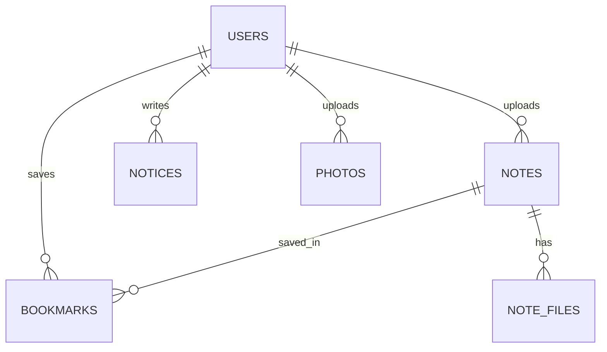

# 동아리 홈페이지 기능 명세서

> 학교 동아리 내부용 웹사이트. 회원 승인제로 운영하며, 시험/과목 정리본 공유와 공지·활동사진 아카이브를 제공한다.

- **문서 버전**: v1.0
- **최종 수정**: 2026-08-01

---

## 1. 개요

### 1.1 목적

동아리 구성원이 학습 자료(시험 정리본, 과목 정리본)를 공유하고, 공지사항과 활동 사진을 확인할 수 있는 폐쇄형 커뮤니티 사이트를 구축한다.

### 1.2 범위

| 포함 | 미포함 |
|---|---|
| 회원 가입 승인제, 로그인/로그아웃 | 모바일 앱 / 반응형 모바일 UI |
| 자료 업로드·검색·다운로드·즐겨찾기 | 댓글, Q&A |
| 공지 게시 및 상단 고정 | 알림(이메일/푸시) |
| 활동 사진 다중 업로드 및 리사이즈 | 자료 신고 기능 |
| 관리자 회원 관리 | 통계 대시보드, 감사 로그 |

### 1.3 용어

| 용어 | 정의 |
|---|---|
| 자료 | 시험 정리본 및 과목 정리본을 통칭 |
| 정리본 | 사용자가 업로드한 학습 문서 (파일 1개 이상) |
| 승인 | 관리자가 가입 신청을 수락하여 `PENDING` → `ACTIVE`로 전환하는 행위 |

---

## 2. 사용자 및 권한

### 2.1 Role

| Role | 설명 |
|---|---|
| `USER` | 일반 동아리원 |
| `ADMIN` | 관리자 |

### 2.2 Status

Role과 Status는 **분리하여 관리**한다. 가입 대기·정지는 권한이 아니라 계정 상태이다.

| Status | 설명 | 로그인 | 접근 가능 범위 |
|---|---|---|---|
| `PENDING` | 가입 신청 후 승인 대기 | 가능 | 대기중 안내 화면만 |
| `ACTIVE` | 정상 이용 | 가능 | 권한에 따른 전체 기능 |
| `SUSPENDED` | 관리자에 의한 이용 정지 | **차단** | 없음 (정지 안내 표시) |

> 가입 **거부** 시에는 별도 상태를 두지 않고 계정 레코드를 삭제한다. 거부된 사용자는 재신청할 수 있다.

### 2.3 권한 매트릭스

| 기능 | 비로그인 | PENDING | USER (ACTIVE) | ADMIN (ACTIVE) |
|---|:---:|:---:|:---:|:---:|
| 회원가입 신청 | O | - | - | - |
| 로그인 / 로그아웃 | O | O | O | O |
| 대기중 안내 화면 | - | O | - | - |
| 자료 목록·검색·다운로드 | X | X | O | O |
| 자료 업로드 | X | X | O | O |
| 자료 수정·삭제 | X | X | 본인 것만 | 전체 |
| 즐겨찾기 | X | X | O | O |
| 공지 조회 | X | X | O | O |
| 공지 등록·수정·삭제·고정 | X | X | X | O |
| 활동사진 조회 | X | X | O | O |
| 활동사진 업로드·삭제 | X | X | X | O |
| 회원 관리 | X | X | X | O |

---

## 3. 기능 요구사항

### 3.1 인증 (AUTH)

#### AUTH-01 회원가입 신청

- 입력: 학교 이메일, 학번, 이름, 비밀번호, 비밀번호 확인
- 학교 이메일 도메인을 검증한다 (예: `@___.ac.kr`). 허용 도메인은 설정값으로 관리한다.
- 이메일 중복 시 신청을 거부한다.
- 신청 성공 시 계정은 `USER` / `PENDING` 상태로 생성된다.

> **인증 수단 결정**: 학번은 동아리 내에서 서로 알고 있는 값이므로 비밀번호로 사용하지 않는다. 학번은 신원 확인(승인 심사)용으로만 저장하고, 로그인은 `학교 이메일 + 비밀번호` 조합을 사용한다.

#### AUTH-02 로그인

- 입력: 학교 이메일, 비밀번호
- 비밀번호는 단방향 해시(bcrypt 등)로 저장하며 평문을 보관하지 않는다.
- 실패 시 이메일/비밀번호 중 무엇이 틀렸는지 구분하지 않고 동일한 메시지를 반환한다.
- Status별 처리:
  - `ACTIVE` → 정상 로그인
  - `PENDING` → 로그인은 허용하되 대기중 안내 화면으로 강제 이동
  - `SUSPENDED` → 로그인 차단, 정지 안내 메시지 반환

#### AUTH-03 로그아웃

- 세션(또는 토큰)을 무효화하고 로그인 화면으로 이동한다.

#### AUTH-04 대기중 안내 화면

- `PENDING` 사용자가 접근 가능한 **유일한** 화면이다.
- 승인 대기 중임을 안내하고, 로그아웃 버튼을 제공한다.
- 인증 API 외의 모든 API 호출은 `403 PENDING_APPROVAL`로 차단하며, 프론트엔드는 이를 감지해 이 화면으로 리다이렉트한다.

---

### 3.2 자료 공유 (NOTE)

시험 정리본과 과목 정리본은 `category` 필드로 구분되며, 동일한 데이터 구조와 기능을 공유한다.

| category | 설명 | 추가 필드 |
|---|---|---|
| `EXAM` | 시험 정리본 | `exam_type` (중간/기말) 필수 |
| `SUBJECT` | 과목 정리본 | `exam_type` 미사용 (NULL) |

#### NOTE-01 자료 목록 조회

- 카테고리별로 목록을 조회하며 페이지네이션을 지원한다.
- 정렬: 최신순(기본), 제목순

#### NOTE-02 검색

- 대상: 제목, 과목명, 교수명
- 단일 키워드 입력으로 위 필드를 통합 검색한다.

#### NOTE-03 필터

| 필터 | 값 |
|---|---|
| 과목 | 등록된 과목명 목록 |
| 교수 | 등록된 교수명 목록 |
| 연도 | 등록된 연도 목록 |
| 학기 | 1학기 / 2학기 |
| 시험 구분 | 중간 / 기말 (`EXAM`에만 노출) |

- 검색어와 필터는 **AND 조건**으로 함께 적용된다.

#### NOTE-04 자료 업로드

- 입력: 카테고리, 제목, 과목명, 교수명, 연도, 학기, (시험 구분), 파일
- 파일은 1개 이상 첨부하며 다중 첨부를 허용한다.
- 허용 확장자와 최대 용량은 설정값으로 제한한다. (권장: `pdf, docx, pptx, hwp, zip, png, jpg` / 파일당 20MB)
- 업로드자는 로그인 사용자로 자동 기록된다.

#### NOTE-05 자료 수정

- 본인이 업로드한 자료만 수정할 수 있다. (`ADMIN`은 전체 가능)
- 메타데이터 수정 및 첨부파일 추가·삭제를 지원한다.

#### NOTE-06 자료 삭제

- 본인이 업로드한 자료만 삭제할 수 있다. (`ADMIN`은 전체 가능)
- 삭제 시 연결된 첨부파일과 즐겨찾기 레코드를 함께 제거한다.

#### NOTE-07 자료 다운로드

- 로그인한 `ACTIVE` 사용자만 다운로드할 수 있다.
- 파일은 직접 URL 노출 없이 서버를 경유해 전달한다.

#### NOTE-08 즐겨찾기

- 자료 상세 및 목록에서 즐겨찾기 추가/해제가 가능하다.
- `(회원, 자료)` 조합은 유일하며 중복 등록되지 않는다.
- 별도의 "내 즐겨찾기" 목록 화면을 제공한다.

---

### 3.3 공지 (NOTICE)

#### NOTICE-01 공지 목록 조회

- **고정 공지가 최상단**에 표시되고, 그 아래 일반 공지가 최신순으로 정렬된다.
- 고정 공지는 목록에서 시각적으로 구분한다.

#### NOTICE-02 공지 상세 조회

#### NOTICE-03 공지 등록·수정·삭제 *(ADMIN)*

- 입력: 제목, 본문, 고정 여부

#### NOTICE-04 상단 고정 토글 *(ADMIN)*

- 목록에서 바로 고정/해제할 수 있다.
- 고정 공지 개수 상한은 두지 않되, 다수 고정 시 등록일 최신순으로 정렬한다.

---

### 3.4 활동 사진 (PHOTO)

#### PHOTO-01 사진 목록 조회

- 최신순 그리드 형태로 표시하며 페이지네이션을 지원한다.

#### PHOTO-02 다중 업로드 *(ADMIN)*

- 한 번에 여러 장의 이미지를 선택해 업로드한다.
- 각 이미지는 개별 레코드로 저장된다. (앨범 그룹 없음)
- 업로드 진행 상태를 표시하고, 일부 실패 시 성공한 항목은 유지한다.

#### PHOTO-03 이미지 리사이즈

- 서버에서 업로드된 이미지를 지정 해상도로 변환 후 저장한다.
- 권장 기준: 가로 최대 1920px, 비율 유지, JPEG 품질 85. 기준 미만 이미지는 원본을 유지한다.
- 허용 형식: `jpg`, `jpeg`, `png`

#### PHOTO-04 사진 삭제 *(ADMIN)*

---

### 3.5 회원 관리 (ADMIN)

#### ADM-01 회원 목록

- 표시 항목: 이름, 학번, 이메일, Role, Status, 가입 신청일, 승인일
- **검색**: 이름, 학번, 이메일
- **필터**: Status, Role
- **정렬**: 이름, 학번, 가입 신청일
- **페이지네이션** 지원

#### ADM-02 가입 신청 일괄 승인 / 거부

- `PENDING` 목록에서 **체크박스로 여러 명을 선택**해 한 번에 처리한다.
- 전체 선택 체크박스를 제공한다.
- 승인: `PENDING` → `ACTIVE`, 승인일시 기록
- 거부: 계정 레코드 삭제
- 처리 전 확인 다이얼로그를 표시하고, 처리 결과(성공/실패 건수)를 안내한다.

#### ADM-03 회원 상태 변경

- `ACTIVE` ↔ `SUSPENDED` 전환
- 정지된 회원은 즉시 로그인이 차단된다.

#### ADM-04 회원 제거

- 계정을 삭제한다.
- 해당 회원이 업로드한 자료의 처리 정책을 정의해야 한다. (권장: 자료는 유지하고 업로더 표시를 "탈퇴한 회원"으로 대체)

#### ADM-05 관리자 권한 부여 / 회수

- `USER` ↔ `ADMIN` 전환
- **본인 계정은 회수 대상에서 제외한다.** UI에서 버튼을 비활성화하고, 서버에서도 `요청자 id == 대상 id`인 경우 `403`으로 차단한다. 마지막 관리자가 사라져 시스템에 접근 불가능해지는 상황을 방지하기 위함이다.
- 동일하게 **본인 계정 삭제(ADM-04)도 차단**한다.

---

## 4. 데이터 모델

### 4.1 ERD

### 4.2 테이블 정의

#### users

| 컬럼 | 타입 | 제약 | 설명 |
|---|---|---|---|
| `id` | bigint | PK, auto | |
| `email` | varchar(255) | UNIQUE, NOT NULL | 학교 이메일 (로그인 ID) |
| `student_no` | varchar(20) | NOT NULL | 학번 (신원 확인용) |
| `name` | varchar(50) | NOT NULL | |
| `password_hash` | varchar(255) | NOT NULL | |
| `role` | enum | NOT NULL, default `USER` | `USER`, `ADMIN` |
| `status` | enum | NOT NULL, default `PENDING` | `PENDING`, `ACTIVE`, `SUSPENDED` |
| `created_at` | datetime | NOT NULL | 가입 신청일시 |
| `approved_at` | datetime | NULL | 승인일시 |

#### notes

| 컬럼 | 타입 | 제약 | 설명 |
|---|---|---|---|
| `id` | bigint | PK, auto | |
| `category` | enum | NOT NULL | `EXAM`, `SUBJECT` |
| `title` | varchar(200) | NOT NULL | |
| `subject_name` | varchar(100) | NOT NULL | 과목명 |
| `professor` | varchar(50) | NULL | 교수명 |
| `year` | int | NOT NULL | 개설 연도 |
| `semester` | enum | NOT NULL | `SPRING`, `FALL` |
| `exam_type` | enum | NULL | `MIDTERM`, `FINAL` (category=`EXAM`일 때 필수) |
| `uploader_id` | bigint | FK → users.id | |
| `created_at` | datetime | NOT NULL | |
| `updated_at` | datetime | NOT NULL | |

- 인덱스: `(category, created_at)`, `(subject_name)`, `(year, semester)`

#### note_files

| 컬럼 | 타입 | 제약 | 설명 |
|---|---|---|---|
| `id` | bigint | PK, auto | |
| `note_id` | bigint | FK → notes.id, ON DELETE CASCADE | |
| `original_name` | varchar(255) | NOT NULL | 업로드 당시 파일명 |
| `stored_path` | varchar(500) | NOT NULL | 서버 저장 경로 |
| `size_bytes` | bigint | NOT NULL | |

#### bookmarks

| 컬럼 | 타입 | 제약 | 설명 |
|---|---|---|---|
| `user_id` | bigint | PK, FK → users.id | |
| `note_id` | bigint | PK, FK → notes.id | |
| `created_at` | datetime | NOT NULL | |

- 복합 PK `(user_id, note_id)`로 중복 등록을 방지한다.

#### notices

| 컬럼 | 타입 | 제약 | 설명 |
|---|---|---|---|
| `id` | bigint | PK, auto | |
| `title` | varchar(200) | NOT NULL | |
| `content` | text | NOT NULL | |
| `is_pinned` | boolean | NOT NULL, default false | 상단 고정 여부 |
| `author_id` | bigint | FK → users.id | |
| `created_at` | datetime | NOT NULL | |
| `updated_at` | datetime | NOT NULL | |

- 정렬 기준: `is_pinned DESC, created_at DESC`

#### photos

| 컬럼 | 타입 | 제약 | 설명 |
|---|---|---|---|
| `id` | bigint | PK, auto | |
| `caption` | varchar(200) | NULL | |
| `stored_path` | varchar(500) | NOT NULL | 리사이즈된 이미지 경로 |
| `uploader_id` | bigint | FK → users.id | |
| `created_at` | datetime | NOT NULL | |

---

## 5. API 명세

Base path: `/api`

### 5.1 인증

| Method | Path | 권한 | 설명 |
|---|---|---|---|
| POST | `/auth/signup` | 비로그인 | 가입 신청 |
| POST | `/auth/login` | 비로그인 | 로그인 |
| POST | `/auth/logout` | 로그인 | 로그아웃 |
| GET | `/auth/me` | 로그인 | 내 정보 + role/status |

### 5.2 자료

| Method | Path | 권한 | 설명 |
|---|---|---|---|
| GET | `/notes` | ACTIVE | 목록·검색·필터 |
| GET | `/notes/filters` | ACTIVE | 필터 옵션(과목/교수/연도) 목록 |
| GET | `/notes/{id}` | ACTIVE | 상세 |
| POST | `/notes` | ACTIVE | 업로드 (multipart) |
| PATCH | `/notes/{id}` | 본인/ADMIN | 수정 |
| DELETE | `/notes/{id}` | 본인/ADMIN | 삭제 |
| GET | `/notes/{id}/files/{fileId}` | ACTIVE | 파일 다운로드 |

**`GET /notes` 쿼리 파라미터**

| 이름 | 타입 | 설명 |
|---|---|---|
| `category` | string | `EXAM` \| `SUBJECT` |
| `q` | string | 통합 검색어 (제목/과목/교수) |
| `subject` | string | 과목 필터 |
| `professor` | string | 교수 필터 |
| `year` | int | 연도 필터 |
| `semester` | string | `SPRING` \| `FALL` |
| `examType` | string | `MIDTERM` \| `FINAL` |
| `sort` | string | `latest`(기본) \| `title` |
| `page` | int | 0부터 시작 |
| `size` | int | 기본 20 |

### 5.3 즐겨찾기

| Method | Path | 권한 | 설명 |
|---|---|---|---|
| GET | `/bookmarks` | ACTIVE | 내 즐겨찾기 목록 |
| POST | `/notes/{id}/bookmark` | ACTIVE | 추가 |
| DELETE | `/notes/{id}/bookmark` | ACTIVE | 해제 |

### 5.4 공지

| Method | Path | 권한 | 설명 |
|---|---|---|---|
| GET | `/notices` | ACTIVE | 목록 (고정 우선 정렬) |
| GET | `/notices/{id}` | ACTIVE | 상세 |
| POST | `/notices` | ADMIN | 등록 |
| PATCH | `/notices/{id}` | ADMIN | 수정 |
| DELETE | `/notices/{id}` | ADMIN | 삭제 |
| PATCH | `/notices/{id}/pin` | ADMIN | 고정 토글 |

### 5.5 활동 사진

| Method | Path | 권한 | 설명 |
|---|---|---|---|
| GET | `/photos` | ACTIVE | 목록 |
| POST | `/photos` | ADMIN | 다중 업로드 (multipart, 서버 리사이즈) |
| DELETE | `/photos/{id}` | ADMIN | 삭제 |

### 5.6 회원 관리

| Method | Path | 권한 | 설명 |
|---|---|---|---|
| GET | `/admin/users` | ADMIN | 목록 — `status`, `role`, `q`, `sort`, `page`, `size` |
| POST | `/admin/users/approve` | ADMIN | 일괄 승인 — body: `{ "userIds": [1,2,3] }` |
| POST | `/admin/users/reject` | ADMIN | 일괄 거부 — body: `{ "userIds": [1,2,3] }` |
| PATCH | `/admin/users/{id}/status` | ADMIN | `ACTIVE` ↔ `SUSPENDED` |
| PATCH | `/admin/users/{id}/role` | ADMIN | 권한 부여/회수 (본인 불가) |
| DELETE | `/admin/users/{id}` | ADMIN | 회원 제거 (본인 불가) |

### 5.7 공통 에러 코드

| HTTP | 코드 | 상황 |
|---|---|---|
| 400 | `VALIDATION_ERROR` | 입력값 검증 실패 |
| 401 | `UNAUTHENTICATED` | 미로그인 |
| 403 | `PENDING_APPROVAL` | `PENDING` 사용자의 일반 API 접근 |
| 403 | `SUSPENDED` | 정지된 계정의 로그인 시도 |
| 403 | `FORBIDDEN` | 권한 부족 / 본인 권한 회수·삭제 시도 |
| 404 | `NOT_FOUND` | 리소스 없음 |
| 409 | `DUPLICATE_EMAIL` | 이메일 중복 |
| 413 | `FILE_TOO_LARGE` | 파일 용량 초과 |
| 415 | `UNSUPPORTED_FILE_TYPE` | 허용되지 않는 확장자 |

---

## 6. 화면 목록

| 구분 | 화면 | 접근 권한 |
|---|---|---|
| 인증 | 로그인 | 비로그인 |
| 인증 | 회원가입 신청 | 비로그인 |
| 인증 | 승인 대기 안내 | PENDING |
| 공통 | 메인 (공지 요약 + 최근 자료) | ACTIVE |
| 자료 | 시험 정리본 목록 | ACTIVE |
| 자료 | 과목 정리본 목록 | ACTIVE |
| 자료 | 자료 상세 | ACTIVE |
| 자료 | 자료 등록 / 수정 | ACTIVE |
| 자료 | 내 즐겨찾기 | ACTIVE |
| 공지 | 공지 목록 | ACTIVE |
| 공지 | 공지 상세 | ACTIVE |
| 공지 | 공지 작성 / 수정 | ADMIN |
| 사진 | 활동사진 갤러리 | ACTIVE |
| 사진 | 사진 업로드 | ADMIN |
| 관리 | 회원 관리 (목록 + 일괄 처리) | ADMIN |

---

## 7. 비기능 요구사항

### 7.1 보안

- 비밀번호는 bcrypt 등 단방향 해시로 저장한다.
- 파일은 직접 접근 가능한 정적 경로에 노출하지 않고, 인증을 거친 API를 통해서만 제공한다.
- 업로드 파일명은 서버에서 재생성(UUID 등)하여 저장하고, 원본 파일명은 DB에만 보관한다.
- 모든 관리자 API는 서버 측에서 권한을 재검증한다. UI 숨김만으로 권한을 통제하지 않는다.
- 본인 권한 회수 및 본인 계정 삭제는 서버에서 차단한다.

### 7.2 제약 및 정책

| 항목 | 값 |
|---|---|
| 자료 파일 최대 용량 | 20MB / 파일 |
| 자료 최대 첨부 개수 | 10개 |
| 이미지 리사이즈 기준 | 가로 최대 1920px, JPEG 품질 85 |
| 목록 기본 페이지 크기 | 20 |

### 7.3 대상 환경

- 데스크톱 웹 브라우저 (Chrome, Edge 최신 버전 기준)
- 모바일 대응은 이번 범위에서 제외한다.

---

## 8. 미결정 사항

| # | 항목 | 비고 |
|---|---|---|
| 1 | 허용 학교 이메일 도메인 | 실제 도메인 확정 필요 |
| 2 | 파일 저장소 | 서버 로컬 디스크 vs 오브젝트 스토리지(S3 등) |
| 3 | 세션 방식 | 서버 세션(쿠키) vs JWT |
| 4 | 최초 관리자 계정 생성 방법 | DB 직접 삽입 또는 초기화 스크립트 |
| 5 | 탈퇴/삭제 회원의 업로드 자료 처리 | 유지 권장 (업로더 표시만 대체) |
| 6 | 기술 스택 | 프론트엔드 / 백엔드 / DB 선정 |
