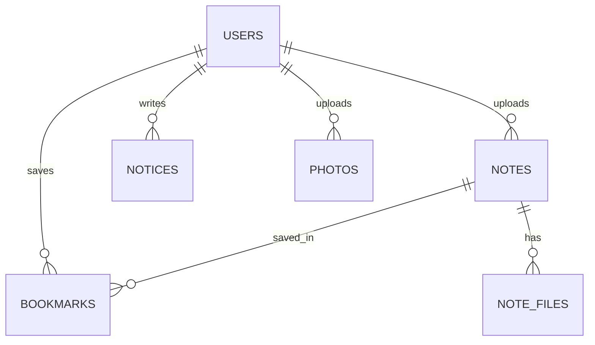

[← 스펙 인덱스](README.md)

# 3-2. 계약 — 데이터 모델과 API

프론트엔드와 백엔드가 공유하는 계약을 잡아준다. **스키마나 엔드포인트를 바꾸기 전에 이 문서를 확인하고, 바뀌면 같은 PR에서 갱신한다** (MUST). Flyway 마이그레이션(`V*__*.sql`)은 §3-2-2의 정의를 그대로 반영해야 한다.

> **출시 단계** — MVP는 인증, 공지, 회원 목록·승인·상태 변경 API를 우선 구현한다. 가입 거부, 자료·즐겨찾기·사진·회원 제거·권한 변경 API는 계약을 유지하되 `Post Launch`에서 구현한다.

구현된 API는 Swagger UI와 OpenAPI JSON(`/v3/api-docs`)으로 확인할 수 있어야 한다 (MUST). 엔드포인트를 구현하거나 변경하는 PR은 접근 권한, 요청·응답 스키마, 상태 코드와 대표 오류 응답을 OpenAPI 명세에도 함께 반영한다. Swagger는 이 문서를 대체하지 않으며, 이 문서는 기능·권한의 원본이고 OpenAPI는 구현 시점의 상세 계약이다.

```text
§3-2-1   ERD              테이블 관계
§3-2-2   테이블 정의       컬럼과 제약
§3-2-3   API — 인증
§3-2-4   API — 자료·즐겨찾기
§3-2-5   API — 공지·사진
§3-2-6   API — 회원 관리
§3-2-7   공통 에러 코드
§3-2-8   공통 페이지 응답
```

## 3-2-1 ERD



## 3-2-2 테이블 정의

### users

| 컬럼 | 타입 | 제약 | 설명 |
|---|---|---|---|
| `id` | bigint | PK, auto | |
| `email` | varchar(255) | UNIQUE, NOT NULL | 학교 이메일 (로그인 ID) |
| `student_no` | varchar(20) | UNIQUE, NOT NULL | 학번 (신원 확인용) |
| `name` | varchar(50) | NOT NULL | |
| `password_hash` | varchar(255) | NOT NULL | |
| `role` | enum | NOT NULL, default `USER` | `USER`, `ADMIN` |
| `status` | enum | NOT NULL, default `PENDING` | `PENDING`, `ACTIVE`, `SUSPENDED` |
| `created_at` | datetime | NOT NULL | 가입 신청일시 |
| `approved_at` | datetime | NULL | 승인일시 |

`student_no`에 UNIQUE를 건다 (MUST). 한 학번으로 여러 계정을 만드는 것을 막는다 — 승인제의 의미가 사라진다.

### notes

| 컬럼 | 타입 | 제약 | 설명 |
|---|---|---|---|
| `id` | bigint | PK, auto | |
| `category` | enum | NOT NULL | `EXAM`, `SUBJECT` |
| `title` | varchar(200) | NOT NULL | |
| `subject_name` | varchar(100) | NOT NULL | 과목명 |
| `professor` | varchar(50) | NULL | 교수명 |
| `year` | int | NOT NULL | 개설 연도 |
| `semester` | enum | NOT NULL | `SPRING`, `FALL` |
| `exam_type` | enum | NULL | `MIDTERM`, `FINAL` |
| `uploader_id` | bigint | FK → users.id | |
| `created_at` | datetime | NOT NULL | |
| `updated_at` | datetime | NOT NULL | |

- 인덱스: `(category, created_at)`, `(subject_name)`, `(year, semester)`
- **CHECK 제약** (MUST): `category = 'EXAM'`이면 `exam_type IS NOT NULL`, `category = 'SUBJECT'`면 `exam_type IS NULL`. 애플리케이션 검증에만 맡기지 않는다.

### note_files

| 컬럼 | 타입 | 제약 | 설명 |
|---|---|---|---|
| `id` | bigint | PK, auto | |
| `note_id` | bigint | FK → notes.id, **ON DELETE CASCADE** | |
| `original_name` | varchar(255) | NOT NULL | 업로드 당시 파일명 |
| `stored_path` | varchar(500) | NOT NULL | S3 오브젝트 키 |
| `size_bytes` | bigint | NOT NULL | |

파일은 S3에만 저장한다. **서버 디스크에 저장하지 않는다** (MUST). 저장 키 형식은 `notes/{uuid}.{ext}`이며, presigned 업로드 시점에는 `note_id`가 아직 없으므로 키에 포함하지 않는다.

### bookmarks

| 컬럼 | 타입 | 제약 | 설명 |
|---|---|---|---|
| `user_id` | bigint | PK, FK → users.id, **ON DELETE CASCADE** | |
| `note_id` | bigint | PK, FK → notes.id, **ON DELETE CASCADE** | |
| `created_at` | datetime | NOT NULL | |

복합 PK `(user_id, note_id)`로 중복 등록을 막는다. 양쪽 FK 모두 CASCADE를 건다 (MUST) — [2-1 §2-1-3](2-1-USER-STORIES.md)이 자료 삭제 시 즐겨찾기도 지워진다고 정의하고 있다.

### notices

| 컬럼 | 타입 | 제약 | 설명 |
|---|---|---|---|
| `id` | bigint | PK, auto | |
| `title` | varchar(200) | NOT NULL | |
| `content` | text | NOT NULL | |
| `is_pinned` | boolean | NOT NULL, default false | 상단 고정 여부 |
| `author_id` | bigint | FK → users.id | |
| `created_at` | datetime | NOT NULL | |
| `updated_at` | datetime | NOT NULL | |

정렬 기준: `is_pinned DESC, created_at DESC`

### photos

| 컬럼 | 타입 | 제약 | 설명 |
|---|---|---|---|
| `id` | bigint | PK, auto | |
| `caption` | varchar(200) | NULL | |
| `stored_path` | varchar(500) | NOT NULL | 리사이즈된 이미지의 S3 오브젝트 키 |
| `uploader_id` | bigint | FK → users.id | |
| `created_at` | datetime | NOT NULL | |

저장 키 형식: `photos/{photoId}/{uuid}.jpg`, 썸네일은 `photos/{photoId}/thumb/{uuid}.jpg`

---

Base path: `/api`. 권한 컬럼은 [3-1 §3-1-3](3-1-DESIGN-ARCHITECTURE.md) 매트릭스와 반드시 일치해야 한다 (MUST).

## 3-2-3 API — 인증

| Method | Path | 권한 | 설명 |
|---|---|---|---|
| POST | `/auth/signup` | 비로그인 | 가입 신청 |
| POST | `/auth/login` | 비로그인 | 로그인 |
| POST | `/auth/logout` | 로그인 | 로그아웃 |
| GET | `/auth/me` | 로그인 | 내 정보 + role/status |

## 3-2-4 API — 자료·즐겨찾기

| Method | Path | 권한 | 설명 |
|---|---|---|---|
| GET | `/notes` | ACTIVE | 목록·검색·필터 |
| GET | `/notes/filters` | ACTIVE | 필터 옵션(과목/교수/연도) 목록 |
| GET | `/notes/{id}` | ACTIVE | 상세 |
| POST | `/notes/upload-url` | ACTIVE | 파일별 presigned PUT URL 발급 |
| POST | `/notes` | ACTIVE | 메타데이터 등록 (JSON) — body에 업로드 완료된 파일 키 목록 |
| PATCH | `/notes/{id}` | 본인/ADMIN | 수정 |
| DELETE | `/notes/{id}` | 본인/ADMIN | 삭제 |
| GET | `/notes/{id}/files/{fileId}` | ACTIVE | presigned GET URL 발급 (파일 바이트는 서버를 거치지 않음) |
| GET | `/bookmarks` | ACTIVE | 내 즐겨찾기 목록 |
| POST | `/notes/{id}/bookmark` | ACTIVE | 추가 |
| DELETE | `/notes/{id}/bookmark` | ACTIVE | 해제 |

**`GET /notes` 쿼리 파라미터**

| 이름 | 타입 | 설명 |
|---|---|---|
| `category` | string | `EXAM` \| `SUBJECT` |
| `q` | string | 통합 검색어 (제목/과목/교수) |
| `subject` | string | 과목 필터 |
| `professor` | string | 교수 필터 |
| `year` | int | 연도 필터 |
| `semester` | string | `SPRING` \| `FALL` |
| `examType` | string | `MIDTERM` \| `FINAL` |
| `sort` | string | `latest`(기본) \| `title` |
| `page` | int | 0부터 시작 |
| `size` | int | 기본 20 |

## 3-2-5 API — 공지·사진

| Method | Path | 권한 | 설명 |
|---|---|---|---|
| GET | `/notices` | ACTIVE | 목록 (고정 우선 정렬) |
| GET | `/notices/{id}` | ACTIVE | 상세 |
| POST | `/notices` | ADMIN | 등록 |
| PATCH | `/notices/{id}` | ADMIN | 수정 |
| DELETE | `/notices/{id}` | ADMIN | 삭제 |
| PATCH | `/notices/{id}/pin` | ADMIN | 고정 토글 |
| GET | `/photos` | ACTIVE | 목록 |
| POST | `/photos` | ADMIN | 다중 업로드 (multipart, 서버 리사이즈) |
| DELETE | `/photos/{id}` | ADMIN | 삭제 |

> `POST /photos`의 업로드 경로는 미결정이다 ([1-BACKGROUND §1-5](1-BACKGROUND.md) #5).

## 3-2-6 API — 회원 관리

| Method | Path | 권한 | 설명 |
|---|---|---|---|
| GET | `/admin/users` | ADMIN | 목록 — `status`, `role`, `q`, `sort`, `page`, `size` |
| POST | `/admin/users/approve` | ADMIN | 일괄 승인 — body: `{ "userIds": [1,2,3] }` |
| POST | `/admin/users/reject` | ADMIN | 일괄 거부 — body: `{ "userIds": [1,2,3] }` |
| PATCH | `/admin/users/{id}/status` | ADMIN | `ACTIVE` ↔ `SUSPENDED` |
| PATCH | `/admin/users/{id}/role` | ADMIN | 권한 부여/회수 (본인 불가) |
| DELETE | `/admin/users/{id}` | ADMIN | 회원 제거 (본인 불가) |

## 3-2-7 공통 에러 코드

| HTTP | 코드 | 상황 |
|---|---|---|
| 400 | `VALIDATION_ERROR` | 입력값 검증 실패 |
| 401 | `UNAUTHENTICATED` | 미로그인 |
| 403 | `PENDING_APPROVAL` | `PENDING` 사용자의 일반 API 접근 |
| 403 | `SUSPENDED` | 정지된 계정의 로그인 시도 |
| 403 | `FORBIDDEN` | 권한 부족 / 본인 권한 회수·삭제 시도 |
| 404 | `NOT_FOUND` | 리소스 없음 |
| 409 | `DUPLICATE_EMAIL` | 이메일 중복 |
| 413 | `FILE_TOO_LARGE` | 파일 용량 초과 |
| 415 | `UNSUPPORTED_FILE_TYPE` | 허용되지 않는 확장자 |

에러 응답은 커스텀 예외 + `@RestControllerAdvice`로 일괄 처리한다 (MUST). 응답 형식은 [5-TESTING §5-4](5-TESTING.md)에 있다.

## 3-2-8 공통 페이지 응답

목록 API는 모두 페이지 응답을 쓴다. MVP는 `GET /notices`, `GET /admin/users`, `Post Launch`는 `GET /notes`, `GET /bookmarks`, `GET /photos`가 대상이다.

공통 요청 파라미터는 `page`(0부터 시작), `size`(기본 20)다.

응답 형태는 Spring Data `PagedModel`로 고정한다 (MUST).

```json
{
  "content": [],
  "page": { "size": 20, "number": 0, "totalElements": 300, "totalPages": 15 }
}
```

서버는 `@EnableSpringDataWebSupport(pageSerializationMode = VIA_DTO)`를 전역에 한 번 적용한다 (MUST).

`Page` 객체를 그대로 직렬화하지 않는다 (MUST). Spring 3.3+는 이 방식의 구조 안정성을 보장하지 않고 경고를 남기며, `pageable`·`sort`·`offset` 같은 내부 구현 필드가 응답에 노출된다.

---
[← 이전: 아키텍처](3-1-DESIGN-ARCHITECTURE.md) · [다음: 결정 기록 →](3-3-DESIGN-DECISIONS.md)
