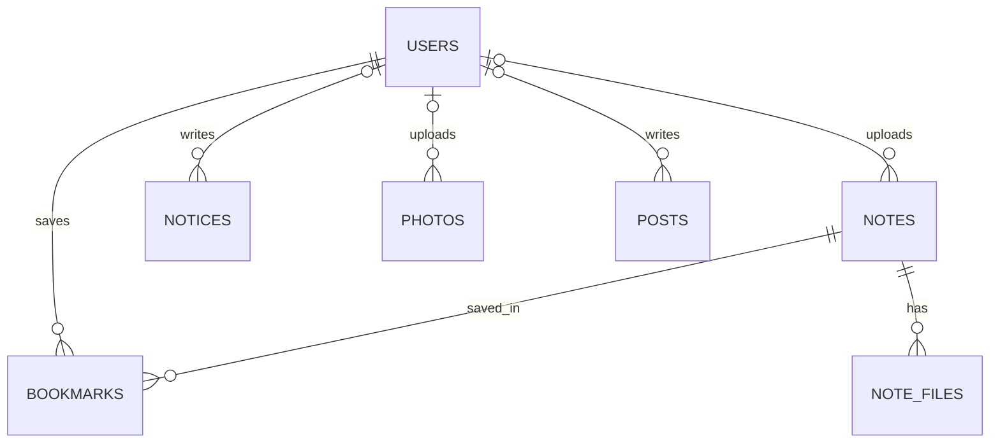

[← 스펙 인덱스](README.md)

# 3-2. 계약 — 데이터 모델과 API

프론트엔드와 백엔드가 공유하는 계약을 잡아준다. **스키마나 엔드포인트를 바꾸기 전에 이 문서를 확인하고, 바뀌면 같은 PR에서 갱신한다** (MUST). Flyway 마이그레이션(`V*__*.sql`)은 §3-2-2의 정의를 그대로 반영해야 한다.

> **출시 단계** — MVP는 인증, 공지, 회원 목록·승인·상태 변경 API를 우선 구현한다. 가입 거부, 자료·즐겨찾기·사진·회원 제거·권한 변경 API는 계약을 유지하되 `Post Launch`에서 구현한다.

구현된 API는 Swagger UI와 OpenAPI JSON(`/v3/api-docs`)으로 확인할 수 있어야 한다 (MUST). 엔드포인트를 구현하거나 변경하는 PR은 접근 권한, 요청·응답 스키마, 상태 코드와 대표 오류 응답을 OpenAPI 명세에도 함께 반영한다. Swagger는 이 문서를 대체하지 않으며, 이 문서는 기능·권한의 원본이고 OpenAPI는 구현 시점의 상세 계약이다.

```text
§3-2-1   ERD              테이블 관계
§3-2-2   테이블 정의       컬럼과 제약
§3-2-3   API — 인증
§3-2-4   API — 자료·즐겨찾기
§3-2-5   API — 공지·사진·게시판
§3-2-6   API — 회원 관리
§3-2-7   공통 에러 코드
§3-2-8   공통 페이지 응답
```

**미합의 항목을 이 문서에 쌓아 두지 않는다.** 계약이 말하지 않는 것을 발견하면 **이슈로 올리고**, 정해지면 그 내용을 해당 절에 바로 적는다. 예전에는 §3-2-9에 모아 두었는데, 확정한 뒤 지우는 것을 놓치거나 오래된 브랜치가 되살려 **이미 정해진 것이 미정으로 보이는 일이 생겼다** (2026-08-15, #140).

## 3-2-1 ERD



`admin_actions`는 ERD에 넣지 않는다. `users`를 가리키지만 **FK가 없어 관계가 아니고**, 그렇게 둔 이유가 바로 "이력은 현재 상태에 종속되지 않는다"이기 때문이다 — 선으로 이으면 정반대로 읽힌다.

**작성자 쪽이 `|o`(0 또는 1)인 것은 오타가 아니다.** 회원을 지워도 자료·공지·사진은 남고 작성자만 비므로([2-2 §2-2-4](2-2-OPERATOR-REQUIREMENTS.md#2-2-4-회원-제거)), 작성자가 없는 행이 정상으로 존재한다. `BOOKMARKS`만 `||`인데, 즐겨찾기는 주인과 함께 사라져 주인 없는 행이 생기지 않기 때문이다.

## 3-2-2 테이블 정의

> **아래 표는 DB 컬럼 이름이다. JSON 응답의 필드 이름과는 층위가 다르다** — 컬럼은 `is_pinned`, JSON은 `isPinned`다. 서버는 Jackson을 Spring Boot 기본값(Java 필드명 그대로)으로 직렬화한다 — 엔티티·DTO를 camelCase로 쓰므로 JSON도 자연히 camelCase다 (확정, 2026-08-13, #33).

### 작성자를 내려주는 규칙

자료·공지·활동사진의 작성자를 응답에 담을 때는 **`uploaderName`**(자료·사진)과 **`authorName`**(공지)을 쓴다 — `string`, **null이 아니다** (MUST).

작성자 행이 없으면(`uploader_id`/`author_id`가 `NULL`) 서버가 그 자리에 **`"탈퇴한 회원"`** 을 넣는다. **`null`을 내려보내고 화면이 알아서 채우게 하지 않는다** — 화면마다 다른 문구를 쓰게 되고, 문구를 바꾸려면 웹을 배포해야 한다.

`uploaderId`/`authorId`를 함께 내릴 때는 그쪽이 `null`이 될 수 있다. **"본인 것만 수정·삭제" 판단은 id로 한다** ([3-1 §3-1-3](3-1-DESIGN-ARCHITECTURE.md)) — 이름으로 견주면 "탈퇴한 회원"끼리 서로의 자료를 지울 수 있다.

근거는 [2-2 §2-2-4](2-2-OPERATOR-REQUIREMENTS.md#2-2-4-회원-제거)다.

#### 표시 이름은 이름 + 학번 끝 두 자리다 (2026-08-30 확정, [#300](https://github.com/HackerKHU/hacker_HP/issues/300))

**작성자 자리에는 계정 이름이 아니라 표시 이름이 들어간다** (MUST). 이름 뒤에 학번 끝 두 자리를 구분자 없이 붙인다 — `권승원66`.

이름이 같은 부원을 화면에서 가려내려는 것이다. 근거는 [2-1 §2-1-1](2-1-USER-STORIES.md#2-1-1-자료-목록검색필터)의 "표시 이름"에 있다.

| 계정 | 표시 이름 |
|---|---|
| 이름 `권승원`, 학번 `2021102466` | `권승원66` |
| 학번이 **비어 있다** (`student_no IS NULL`) | `권승원` — **붙이지 않는다** |
| 학번이 **한 글자** | `권승원1` — 있는 만큼만 |
| 작성자 행이 **없다** (탈퇴) | `탈퇴한 회원` — 위 규칙 그대로 |

**뒤 두 글자를 그대로 쓴다** (MUST). 숫자인지 따지지 않는다 — 학번에는 형식 제약이 없어([§3-2-3](#3-2-3-api--인증)) 편입·교환학생처럼 형태가 다른 값이 들어올 수 있고, **여기서 하려는 일은 구별이지 학번 해석이 아니다.** 형식을 요구하면 그런 계정만 표시가 달라진다.

**"두 글자"는 코드포인트 기준이다** (MUST). Java의 `substring(length - 2)`는 **UTF-16 코드 유닛**으로 자르므로, BMP 밖 문자(이모지 등)가 걸리면 **서로게이트 쌍을 반으로 쪼개** 깨진 글자를 내보낸다. 학번에 형식이 없는 이상 그런 값이 저장될 수 있다 (T-434).

> 입력을 숫자로 조이는 것은 [#328](https://github.com/HackerKHU/hacker_HP/issues/328)이 따로 본다. **그것이 끝나도 이 규칙은 그대로다** — 이미 저장된 값은 바뀌지 않으므로 표시 규칙이 어차피 견뎌야 한다.

**만드는 곳은 한 곳이다** (MUST). `"탈퇴한 회원"` 문구와 같은 자리에 두고 네 도메인이 그것만 쓴다.

> ⚠️ **활동사진은 지금 이 규칙 밖에 있다.** `PhotoService`가 `"탈퇴한 회원"`을 직접 적고 있어 공용 자리를 쓰지 않는다. 그대로 두고 나머지만 고치면 **같은 사람이 자료에서는 `권승원66`, 갤러리에서는 `권승원`** 으로 나온다. 구현([#301](https://github.com/HackerKHU/hacker_HP/issues/301))이 함께 고친다.

**관리자 회원 목록은 대상이 아니다.** 거기에는 학번 열이 따로 있어 이름 옆에 또 붙이면 같은 값이 두 번 나온다. 그 화면의 확인 문구가 이름만 쓰는 문제는 [#302](https://github.com/HackerKHU/hacker_HP/issues/302)가 맡는다.

### users

| 컬럼 | 타입 | 제약 | 설명 |
|---|---|---|---|
| `id` | bigint | PK, auto | |
| `google_sub` | varchar(255) | UNIQUE, NOT NULL | 구글 계정 식별자 (ID 토큰의 `sub`) |
| `email` | varchar(255) | UNIQUE, NOT NULL | 학교 이메일 (`khu.ac.kr`) |
| `student_no` | varchar(20) | UNIQUE, NULL | 학번 (신원 확인용). 신청서 제출 시 채운다 |
| `name` | varchar(50) | NOT NULL | 구글 프로필에서 받는다. **신청서로 바꿀 수 없다** — 아래 참고 |
| `department` | varchar(50) | NULL | 학과. 정해진 목록에서 선택 (자유 입력 아님). 신청서 제출 시 채운다 |
| `role` | enum | NOT NULL, default `USER` | `USER`, `ADMIN` |
| `status` | enum | NOT NULL, default `PENDING` | `PENDING`, `ACTIVE`, `INACTIVE`, `SUSPENDED` |
| `created_at` | datetime | NOT NULL | 계정 생성일시 (첫 구글 로그인) |
| `applied_at` | datetime | NULL | 신청서 제출일시 |
| `approved_at` | datetime | NULL | 승인일시 |
| `deactivated_at` | datetime | NULL | **비활성화 배치로 내려간 시각** (2026-08-28 리뷰, #228). `status = 'INACTIVE'`일 때는 항상 값이 있고, 다른 상태는 `NULL`이다 — 아래 참고 |
| `version` | bigint | NOT NULL, default 0 | 낙관적 잠금용. 아래 참고 |

**비밀번호 컬럼이 없다.** 인증은 구글이 담당하며 자체 비밀번호를 받지도 저장하지도 않는다 ([3-3 결정 13](3-3-DESIGN-DECISIONS.md#3-3-14-결정-13--가입로그인을-구글-oauth로-한다)).

계정의 신원 키는 `email`이 아니라 **`google_sub`** 이다 (MUST). 이메일은 학교 정책에 따라 바뀔 수 있지만 `sub`는 구글 계정에 영구적으로 고정된다. 로그인 시 `google_sub`로 기존 계정을 찾는다.

**기존 계정에 붙일 때 구글이 준 이메일이 저장된 값과 다르면 `email`을 갱신한다** (MUST). 갱신하지 않으면 회원 목록·검색과 `GET /auth/me`에 옛 주소가 남아, `google_sub`를 신원 키로 고른 이유가 절반만 실현된다. 갱신된 이메일도 허용 도메인 검증을 통과해야 한다.

**새 이메일이 다른 계정에 이미 쓰이고 있으면 로그인을 거부한다** (MUST). 학교가 주소를 회수해 다른 사람에게 재할당하면 `email` UNIQUE에 걸린다. 이때 **이메일로 기존 행을 찾아 붙이지 않는다** — 서로 다른 구글 계정이 한 사용자로 합쳐져 남의 자료에 접근하게 된다.

`/login?error=failed`로 되돌리고 서버 로그에 두 계정의 `id`를 남긴다. 관리자가 어느 쪽이 유효한 계정인지 판단해 정리해야 하는 상황이며, 자동으로 해결하지 않는다.

`student_no`는 NULL을 허용한다. 구글이 학번을 주지 않으므로 계정 생성 시점에는 비어 있고, 신청서 제출 시 채워진다 ([3-1 §3-1-4](3-1-DESIGN-ARCHITECTURE.md)). UNIQUE는 그대로 유지한다 (MUST) — 한 학번으로 여러 계정을 만드는 것을 막는다. PostgreSQL의 UNIQUE는 NULL을 서로 다른 값으로 보므로 미신청 계정이 여럿이어도 충돌하지 않는다.

**`department`는 정해진 목록에서만 고른다** (MUST) — 자유 입력이 아니다. `컴공`/`컴퓨터공학과`/`소프트웨어융합대학 컴퓨터공학부`처럼 표기가 제각각이 되면 회원 목록에서 학과로 걸러보는 것이 사실상 불가능해진다. 목록은 경희대 서울·국제캠퍼스 전체 학과이며, 별도 관리 화면 없이 `apps/api`의 `Department` 클래스(`domain/user/entity` 패키지)에 코드로 고정한다 — 학과 개편이 잦지 않아 관리 화면을 따로 둘 만큼의 빈도가 아니다.

**`GET /departments`가 이 목록을 그대로 내려준다** (아래 §3-2-3, #166). 화면은 이 응답만 쓴다 — 목록을 복사해 갖고 있던 `apps/web`의 `features/auth/departments.ts`는 #166에서 지웠다. 남은 사본은 둘이다: 위 `Department.ALL`(원본)과 CHECK 제약을 정의하는 마이그레이션(최초 `V3__add_department.sql`, 목록을 학교 공식 안내와 대조해 바로잡은 `V10__fix_department_names.sql`이 갱신 — develop에 먼저 병합된 다른 작업이 V9를 먼저 썼다). **둘 중 하나만 고치면 그 학과 지원자의 가입이 막힌다** — CHECK에 없으면 저장이 터진다. 어긋남은 `apps/api`가 감시한다.

**목록을 못 받은 화면은 그 사실을 말한다** (MUST). `department`는 필수이고 목록에서만 고를 수 있으므로, 조용히 빈 `<select>`를 두면 사용자는 신청이 막힌 이유를 알 방법이 없다. 실패를 알리고 다시 부를 자리를 준다 (T-115).

신규 신청은 `department`를 **필수**로 받는다 (MUST) — 관리자가 승인 심사에서 실제로 참고하는 값이다. 다만 **컬럼 자체는 `NULL`을 허용한다**: 이 필드가 생기기 전에 이미 승인된 기존 회원은 값이 없고, 일괄 채우지 않는다 — 잘못 추정한 기본값을 넣느니 비워 두고 개별적으로 보완하는 쪽을 택했다. 그래서 "필수"는 DB 제약이 아니라 `POST /auth/application`의 검증이 담당한다 (아래).

**`role = 'ADMIN' AND status = 'SUSPENDED'`를 막는 CHECK 제약은 두지 않는다** (MUST, #296). 기존 데이터와 회원 제거·본인 탈퇴의 내부 선행 정지가 이 조합을 가질 수 있다. 배포가 기존 행을 자동으로 `USER`로 바꾸지도 않는다 — 권한 회수 감사와 운영 판단을 조작하기 때문이다. 일반 상태 PATCH의 서비스 정책이 새 직접 정지만 막는다.

**승인 대상은 `status = 'PENDING' AND applied_at IS NOT NULL`이다** (MUST). 구글 로그인만 하고 신청하지 않은 계정을 관리자의 승인 목록에서 제외한다.

**가입 거부는 같은 `users` 행을 미승인으로 초기화한다** (MUST). `id`·`google_sub`·
`email`·`name`·`created_at`은 유지하고, 신청서 데이터인 `student_no`·`department`·
`applied_at` 세 필드만 `NULL`로 만든다. `role`·`status`·`approved_at`·`deactivated_at`도
이 조작이 바꾸지 않는다. 정상 대상은 원래 `USER/PENDING`이고 승인·비활성화 시각이 없으므로
그 불변식은 그대로다. 기존 세션도 유지하며, 재신청은 같은 id로 `POST /auth/application`을
다시 호출한다.

**`deactivated_at`은 되돌리기의 근거다** (MUST, 2026-08-28 리뷰 #228). 비활성화가 조건으로 실행되므로 *"방금 누가 내려갔나"* 는 응답에만 담기는데, **응답은 잃을 수 있다** — 세션 반영이 실패해 `500`이 나가거나, 브라우저가 닫히거나, 연결이 끊긴다. 그러면 관리자는 **원래 비활동이던 사람과 방금 내려간 사람을 가르지 못해** 되돌릴 수 없다. 이력은 대안이 되지 못한다: 이력은 세션 반영보다 **뒤에** 남기고 실패를 삼키므로([2-2 §2-2-7](2-2-OPERATOR-REQUIREMENTS.md#2-2-7-안전장치) MUST) 정확히 그 실패 경로에서 비어 있다.

- **한 배치는 같은 값을 갖는다** (MUST). 그래서 "가장 최근 비활성화"가 곧 직전 배치이고, 화면이 그것만 골라 복구에 넣을 수 있다.
- **선택 한 명도 하나의 배치다.** `SUSPENDED` 한 명을 `INACTIVE`로 바꾸면 그
  요청 시각이 `deactivated_at`이고, 그 회원이 직전 배치 복구 후보가 되는 것은
  의도된 정책이다.
- **`INACTIVE`를 벗어나면 `NULL`로 되돌린다** (MUST) — 복구든 정지든 그렇다. 남겨 두면 지금 비활동이 아닌 사람이 배치에 섞여 **되돌리기가 엉뚱한 사람을 올린다.**
- **이전 상태를 기억하는 열이 아니다.** `SUSPENDED`가 된 사람에게서도 지워지므로 정지 해제가 `INACTIVE`로 돌아가는 근거로 쓸 수 없다 ([5-TESTING T-348](5-TESTING.md#비활동-부원과-학기-전환-228)).

`version`은 개인정보가 아니라 **동시성 제어용 컬럼**이다. 신청서 제출과 관리자 승인이 같은 행을 동시에 고칠 때 한쪽만 성공하게 만든다 ([3-1 §3-1-4](3-1-DESIGN-ARCHITECTURE.md)의 직렬화 요구). 상태 검사만으로는 두 트랜잭션이 각자 읽어둔 값을 보고 모두 통과하므로, 나중에 쓰는 쪽이 앞의 변경을 덮는다.

### 세션 테이블

인가 상태를 서버 세션으로 관리하므로([3-3 결정 12](3-3-DESIGN-DECISIONS.md#3-3-13-결정-12--인증은-jwt-인가-상태는-서버-세션으로-나눈다)) 세션 저장용 테이블이 RDS에 필요하다. Spring Session JDBC가 요구하는 스키마를 쓰며, 컬럼 정의는 이 문서가 아니라 Spring Session 쪽이 원본이다.

`ddl-auto`가 `validate`이므로 이 테이블도 **Flyway 마이그레이션에 포함해야 한다** (MUST). 애플리케이션 테이블이 아니라 인증 기반이므로 위 ERD에는 넣지 않는다.

`V2__session.sql`이 그 마이그레이션이며, 내용은 `spring-session-jdbc` jar의 `schema-postgresql.sql`을 그대로 옮긴 것이다. **손으로 고치지 않는다** — 컬럼 하나만 어긋나도 세션 저장이 런타임에 실패한다. Spring Session 버전을 올릴 때 그 jar의 스키마와 대조하고, 달라졌으면 새 마이그레이션을 만든다. 스키마 생성은 Flyway가 맡으므로 `spring.session.jdbc.initialize-schema`는 `never`다 — 둘 다 만들려 들면 기동이 실패한다.

### notes

| 컬럼 | 타입 | 제약 | 설명 |
|---|---|---|---|
| `id` | bigint | PK, auto | |
| `category` | enum | NOT NULL | `EXAM`, `SUBJECT` |
| `title` | varchar(200) | NOT NULL | 신규·변경은 코드포인트 50자 이하. 51~200자는 기존 데이터 보존 범위 |
| `subject_name` | varchar(100) | NOT NULL | 과목명 |
| `professor` | varchar(50) | NULL | 교수명 |
| `year` | int | NOT NULL | 개설 연도 |
| `semester` | enum | NOT NULL | `SPRING`, `SUMMER`, `FALL`, `WINTER` — **학사 순서다** (2026-08-29 #272) |
| `exam_type` | enum | NULL | `MIDTERM`, `FINAL` |
| `uploader_id` | bigint | NULL, FK → users.id, **ON DELETE SET NULL** | `NULL`이면 탈퇴한 회원 |
| `view_count` | bigint | NOT NULL, default 0 | 상세를 연 횟수 (2026-08-29 #244) |
| `created_at` | datetime | NOT NULL | |
| `updated_at` | datetime | NOT NULL | |

- 인덱스: `(category, created_at)`, `(subject_name)`, `(year, semester)`
- **`view_count`에는 인덱스를 걸지 않는다.** 중복을 걸러내지 않으므로([2-1 §2-1-1](2-1-USER-STORIES.md#2-1-1-자료-목록검색필터)) **상세를 열 때마다 이 컬럼이 갱신된다** — 인덱스를 걸면 조회 경로가 인덱스까지 함께 고쳐야 한다. 자료 수백 건 규모에서 정렬 비용보다 그쪽이 크다. 느려지면 그때 단다.
- **조회 기록 표를 두지 않는다** (MUST). "누가 언제 봤나"는 이 기능의 목적이 아니다 ([2-1 §2-1-1](2-1-USER-STORIES.md#2-1-1-자료-목록검색필터)).
- **CHECK 제약** (MUST): `category = 'EXAM'`이면 `exam_type IS NOT NULL`, `category = 'SUBJECT'`면 `exam_type IS NULL`. 애플리케이션 검증에만 맡기지 않는다.
- `uploader_id`는 **`ON DELETE SET NULL`이다** (MUST) — [2-2 §2-2-4](2-2-OPERATOR-REQUIREMENTS.md#2-2-4-회원-제거)가 회원을 지워도 자료는 남긴다고 정했다. 기본값(`NO ACTION`)으로 두면 자료를 올린 회원은 삭제 자체가 FK 위반으로 막힌다.

### note_files

| 컬럼 | 타입 | 제약 | 설명 |
|---|---|---|---|
| `id` | bigint | PK, auto | |
| `note_id` | bigint | FK → notes.id, **ON DELETE CASCADE** | |
| `original_name` | varchar(255) | NOT NULL | 업로드 당시 파일명 |
| `stored_path` | varchar(500) | NOT NULL | S3 오브젝트 키 |
| `size_bytes` | bigint | NOT NULL | |

파일은 S3에만 저장한다. **서버 디스크에 저장하지 않는다** (MUST). 저장 키 형식은 `notes/{uuid}.{ext}`이며, presigned 업로드 시점에는 `note_id`가 아직 없으므로 키에 포함하지 않는다.

### bookmarks

| 컬럼 | 타입 | 제약 | 설명 |
|---|---|---|---|
| `user_id` | bigint | PK, FK → users.id, **ON DELETE CASCADE** | |
| `note_id` | bigint | PK, FK → notes.id, **ON DELETE CASCADE** | |
| `created_at` | datetime | NOT NULL | |

복합 PK `(user_id, note_id)`로 중복 등록을 막는다. 양쪽 FK 모두 CASCADE를 건다 (MUST) — [2-1 §2-1-3](2-1-USER-STORIES.md)이 자료 삭제 시 즐겨찾기도 지워진다고 정의하고 있다.

**작성자 FK가 `SET NULL`인데 여기만 `CASCADE`인 이유** — 즐겨찾기는 그 사람이 *본* 기록이지 *남긴* 것이 아니다. 주인이 없어지면 남길 이유도 없다 ([2-2 §2-2-4](2-2-OPERATOR-REQUIREMENTS.md#2-2-4-회원-제거)).

### notices

| 컬럼 | 타입 | 제약 | 설명 |
|---|---|---|---|
| `id` | bigint | PK, auto | |
| `title` | varchar(200) | NOT NULL | |
| `content` | text | NOT NULL | |
| `is_pinned` | boolean | NOT NULL, default false | 상단 고정 여부 |
| `author_id` | bigint | NULL, FK → users.id, **ON DELETE SET NULL** | `NULL`이면 탈퇴한 회원 |
| `created_at` | datetime | NOT NULL | |
| `updated_at` | datetime | NOT NULL | |

정렬 기준: `is_pinned DESC, created_at DESC`

`author_id`도 `notes.uploader_id`와 같은 이유로 **`ON DELETE SET NULL`이다** (MUST). 공지는 동아리의 기록이라 작성한 관리자가 나가도 남아야 한다 ([2-2 §2-2-4](2-2-OPERATOR-REQUIREMENTS.md#2-2-4-회원-제거)). **`V1__init.sql`은 `ON DELETE` 절 없이 만들어졌으므로 회원 제거 기능(#58)에서 마이그레이션으로 맞춘다.**

### photos

| 컬럼 | 타입 | 제약 | 설명 |
|---|---|---|---|
| `id` | bigint | PK, auto | |
| `caption` | varchar(200) | NULL | |
| `stored_path` | varchar(500) | NOT NULL | 리사이즈된 이미지의 S3 오브젝트 키 |
| `uploader_id` | bigint | NULL, FK → users.id, **ON DELETE SET NULL** | `NULL`이면 탈퇴한 회원 |
| `created_at` | datetime | NOT NULL | |

저장 키 형식: `photos/{photoId}/{uuid}.jpg`, 썸네일은 `photos/{photoId}/thumb/{uuid}.jpg`. 업로드 경로(원본을 어디에 잠깐 두고 어떻게 리사이즈본으로 바뀌는지)는 [1-BACKGROUND §1-5](1-BACKGROUND.md) 확정 사항, API는 아래 `POST /photos/upload-url`·`POST /photos`를 따른다.

`uploader_id`는 `ADMIN`만 채워진다(사진 업로드는 `ADMIN` 전용이다). 그래도 **`ON DELETE SET NULL`이다** (MUST) — 관리자도 삭제 대상이 될 수 있고, 활동사진은 아카이브라 남아야 한다.

### admin_bootstrap_attempts

관리자 승격 시도 (#144). 한 행은 **"자리를 잡았다"** 는 뜻이고, 승격에 성공하면 그 계정의 것을 지우므로 남아 있는 것은 실질적으로 실패한 시도다. 성공한 조작은 `admin_actions`에 남는다 — 목적도 보존 주기도 달라 섞지 않는다.

| 컬럼 | 타입 | 제약 | 설명 |
|---|---|---|---|
| `id` | bigint | PK, auto | |
| `account_id` | bigint | NOT NULL, **FK 없음** | 시도한 계정 |
| `created_at` | datetime | NOT NULL | |

- 인덱스: `(account_id, created_at)`, `(created_at)`

`admin_actions`와 같은 이유로 **`users` FK가 없다** — 잠금 판단이 `users`의 생명주기에 묶이면 안 된다. **창을 벗어난 행은 판단에 쓰이지 않으므로 지운다.**

### admin_actions

관리자 조작 이력 ([2-2 §2-2-7](2-2-OPERATOR-REQUIREMENTS.md#2-2-7-안전장치)). "누가 누구를 언제 정지했나"에 답하기 위한 것이다.

| 컬럼 | 타입 | 제약 | 설명 |
|---|---|---|---|
| `id` | bigint | PK, auto | |
| `actor_id` | bigint | NOT NULL, **FK 없음** | **조작한 사람.** 대개 관리자이고, `WITHDRAW`에서는 본인이다 — 아래 |
| `target_id` | bigint | NOT NULL, **FK 없음** | 대상 |
| `action` | enum | NOT NULL | `APPROVE`, `SUSPEND`, `ACTIVATE`, `DEACTIVATE`, `REACTIVATE`, `REJECT`, `REMOVE`, `WITHDRAW`, `GRANT_ADMIN`, `REVOKE_ADMIN`, `PROMOTE_ADMIN` — **열한 개가 전부다** |
| `created_at` | datetime | NOT NULL | |

- 인덱스: `(target_id, created_at DESC)`, `(actor_id, created_at DESC)`

**`ACTIVATE`와 `REACTIVATE`는 다른 조작이다** (2026-08-26, #228). `ACTIVATE`는 **정지 해제**(`SUSPENDED` → `ACTIVE`), `REACTIVATE`는 **학기 복구**(`INACTIVE` → `ACTIVE`)다. 도착지가 같아 뭉치고 싶어지지만, 그러면 이력을 읽는 사람이 *"저는 정지당한 적이 없는데요"* 를 확인할 수 없다 — 출발지가 곧 그 조작의 의미다. 같은 이유로 `SUSPEND`와 `DEACTIVATE`도 가른다.

**값을 더할 때는 기존 값을 전부 다시 적는다** (MUST, 2026-08-28 리뷰). 마이그레이션이 `CHECK` 제약을 **교체**하므로(`DROP CONSTRAINT` → `ADD CONSTRAINT`), 새 값 둘만 적은 제약으로 갈아끼우면 `REJECT`·`REMOVE`·`GRANT_ADMIN`·`REVOKE_ADMIN`의 이력 INSERT가 전부 거절되어 **성공한 관리 작업의 기록이 조용히 사라진다.** 이력은 실패를 삼키는 경로라([2-2 §2-2-7](2-2-OPERATOR-REQUIREMENTS.md#2-2-7-안전장치)) 화면에는 아무 일도 없어 보인다. 위 열한 개가 목록의 전부이고, `AdminAction` enum과 제약이 같아야 한다.

**`REMOVE`와 `WITHDRAW`를 가른다** (MUST, 2026-08-28, #223). 계정이 사라진 뒤 남는 것은 숫자 id뿐이라, 뭉치면 *"관리자가 지웠다"* 와 *"본인이 나갔다"* 를 영영 가를 수 없다 ([2-2 §2-2-4](2-2-OPERATOR-REQUIREMENTS.md#본인-탈퇴--같은-처리-다른-문)). `WITHDRAW`는 `actor_id`와 `target_id`가 같다 — 그 조합은 `PROMOTE_ADMIN`에 이미 있다.

**`actor_id`는 "관리자"가 아니라 "요청한 사람"이다** (MUST, 2026-08-28 리뷰). 본인 탈퇴가 생기면서 **일반 `USER`도 이 열에 들어온다.** 관리자로 읽으면 `ACTIVE` 부원이 탈퇴할 때 남는 `SUSPEND`·`WITHDRAW` 두 행이 *"관리자가 남에게 한 조작"* 으로 잘못 읽힌다. **`action`이 그 구분을 담는다** — `WITHDRAW`와, 그 바로 앞의 `actor_id = target_id`인 `SUSPEND`가 본인이 밟은 것이다.

**여기만 `users`를 가리키는 FK가 없다** (MUST). 다른 테이블처럼 `ON DELETE SET NULL`을 걸면 **회원을 지우는 순간 "누구를 정지했는지"가 사라져** 이력의 존재 이유가 무너진다. 자료·공지와 성격이 다르다 — 그쪽은 보여줄 콘텐츠라 작성자 표시가 필요하지만, **이력은 일어난 일의 기록이라 현재 상태에 종속되면 안 된다.**

**이름·이메일 같은 스냅샷은 두지 않는다** (MUST). 계정을 지운 뒤에도 개인정보가 남는다 ([§2-2-4](2-2-OPERATOR-REQUIREMENTS.md#2-2-4-회원-제거)). 남는 것은 숫자 id뿐이다.

**고쳐 쓰지 않는다.** 이력은 일어난 일이라 나중에 달라질 수 없다.

---

Base path: `/api/v1`. 아래 표의 경로는 모두 이 base path 뒤에 붙는다 — `/auth/me`의 실제 URL은 `/api/v1/auth/me`다.

**경로에 버전을 붙인다** (MUST). 응답 필드를 지우거나 의미를 바꾸는 등 기존 클라이언트를 깨는 변경이 필요하면, `/api/v1`을 고치지 않고 `/api/v2`를 새로 연다 ([3-3 결정 9](3-3-DESIGN-DECISIONS.md#3-3-10-결정-9--api-경로에-버전을-붙인다)). 필드 추가처럼 호환되는 변경은 `v1` 안에서 한다.

**enum에 값을 더하는 것은 `v1` 안에서 하되, 배포 순서를 지킨다** (MUST, 2026-08-26 리뷰 #228). 필드 추가와 다르다 — 필드는 모르는 쪽이 무시하면 그만이지만 **값은 모르면 다룰 수가 없다.** 웹의 세션 판정은 상태를 빠짐없이 가르도록 되어 있어([3-1 §3-1-5](3-1-DESIGN-ARCHITECTURE.md#클라이언트가-세션-상태를-바꾸는-근거)) 모르는 값을 받으면 그 자리에서 멈춘다. 그렇다고 `v2`를 여는 것은 과하다 — **상태 하나를 더하려고 모든 경로를 두 벌로 만들게 된다.** 대신 셋을 이 순서로 한다.

1. **웹을 먼저 배포한다.** 새 값을 아는 번들이 먼저 나가 있어야 한다.
2. **그다음 API를 배포한다.**
3. **마지막으로 운영자가 그 값을 실제로 만드는 조작을 한다** — `INACTIVE`는 학기 전환 실행이 그것이다.

**3번이 사람의 조작이라 이 순서에 의미가 있다.** 배포만으로는 어떤 계정도 새 값을 갖지 않으므로, 1과 2가 끝나도 관리자가 누르기 전까지 그 값은 존재하지 않는다. **사람의 조작 없이 값이 생기는 상태를 더한다면 이 순서로는 부족하고, 그때는 `v2`를 검토한다.**

**1과 2를 같은 릴리스에 담지 않는다** (MUST, 2026-08-28 리뷰). `deploy-api.yml`은 `apps/api/**`가 바뀔 때만 돌고 Vercel은 같은 push에서 **독립적으로** 배포하므로, 한 릴리스에 둘 다 담으면 순서가 강제되지 않고 **API가 먼저 뜰 수 있다.** 웹만 담은 릴리스를 먼저 내면 그 path filter가 순서를 실제로 지켜 준다.

**그래도 이미 열려 있는 탭은 우리가 고칠 수 없다.** 웹을 먼저 배포해도 그 전에 열어 둔 탭은 낡은 번들을 그대로 들고 있다. 무엇을 못 막는지 적어 둔다 — 관용 배포 이전의 번들이 새 값을 받으면 이렇게 된다.

| 어디서 | 결과 |
|---|---|
| 최초 세션 확인 | `guest`로 떨어져 **로그인 화면**이 뜬다. 새로 고치면 새 번들을 받는다 |
| 이용 중 갱신 | 오류가 호출부로 올라가 **"다시 시도해 달라"** 가 반복된다. 세션은 낡은 값으로 남는다 |

**데이터가 새거나 권한이 잘못 열리지는 않는다** — 못 알아본 상태를 `ACTIVE`로 취급하지 않기 때문이다. 손실은 **그 탭 하나가 새로 고칠 때까지 쓸모없어지는 것**이고, `v2`를 여는 비용과 견주어 이쪽을 감수한다.

**대신 관용을 먼저, 따로 배포한다** (MUST). *"모르는 상태값을 만나면 던지지 않는다"* 는 [3-1 §3-1-5](3-1-DESIGN-ARCHITECTURE.md#클라이언트가-세션-상태를-바꾸는-근거)의 규칙만 담은 릴리스를, **새 값을 아는 배포(1번)보다 앞서** 내보낸다. 낡은 탭을 소급해 고칠 방법은 없으므로 **고칠 수 있는 시점을 앞당기는 것이 유일한 대책이고**, 그 배포와 3번 사이의 간격이 곧 보호 폭이다.

버전을 붙이지 않는 경로가 두 개 있다. `/actuator/health`는 ALB 헬스체크가 쓰는 운영 경로이고, `/v3/api-docs`와 Swagger UI는 springdoc이 제공하는 경로다. 둘 다 클라이언트 계약이 아니므로 `/api/v1` 아래에 두지 않는다.

권한 컬럼은 [3-1 §3-1-3](3-1-DESIGN-ARCHITECTURE.md) 매트릭스와 반드시 일치해야 한다 (MUST).


### posts

**자유 게시판** (2026-08-23 확정, #235). 부원끼리 글을 올리고 읽는다.

| 컬럼 | 타입 | 제약 | 설명 |
|---|---|---|---|
| `id` | bigint | PK, auto | |
| `title` | varchar(200) | NOT NULL | `notices.title`과 같은 상한이다 |
| `content` | text | NOT NULL, **CHECK(길이 ≤ 10000)** | 평문만 담는다 |
| `author_id` | bigint | NULL, FK → users.id, **ON DELETE SET NULL** | `NULL`이면 탈퇴한 회원 |
| `created_at` | timestamp | NOT NULL | |
| `updated_at` | timestamp | NOT NULL | 수정 기능은 없지만 열은 둔다 — 다른 테이블과 모양을 맞춘다 |

인덱스: `(created_at DESC, id DESC)` — 목록의 고정 정렬과 같다.

**`author_id`의 `ON DELETE SET NULL`은 MUST다.** 빠뜨리면 **글을 한 번이라도 쓴 회원은 삭제 자체가 FK 위반으로 실패한다** — `notices.author_id`가 `ON DELETE` 절 없이 만들어져 #58에서 뒤늦게 마이그레이션으로 고쳤다. 같은 실수를 두 번 하지 않는다.

**본문 길이를 DB에서도 막는다** (MUST). `text`는 무제한이라 요청 검증만 두면 다른 경로로 들어온 값이 그대로 저장되고, **글 하나로 목록 응답이 망가진다.** 반대로 DB에만 두면 위반이 사용자 오류가 아니라 `500`으로 나간다 — 양쪽에 건다. **양쪽을 각각 확인한다** ([5-TESTING](5-TESTING.md) T-325·T-331) — API만 재면 `CHECK`를 빠뜨려도 통과한다.

## 3-2-3 API — 인증

| Method | Path | 권한 | 설명 |
|---|---|---|---|
| GET | `/auth/csrf` | 비로그인 | CSRF 토큰 발급 |
| GET | `/oauth2/authorization/google` | 비로그인 | 구글 로그인 시작 (가입 겸용) |
| GET | `/login/oauth2/code/google` | 비로그인 | 구글 콜백. 성공 시 계정 생성 또는 조회 후 세션 발급 |
| GET | `/departments` | **비로그인 포함 전체** | 학과 고정 목록 (#166). 신청 폼이 그린다 |
| POST | `/auth/application` | PENDING | 신청서 제출·수정. body: `{ "studentNo": "...", "department": "..." }` |
| POST | `/auth/logout` | 로그인 | 로그아웃 |
| GET | `/auth/me` | **비로그인 포함 전체** | 로그인이면 내 정보, 아니면 `204`. **마이페이지도 이것으로 그린다** ([2-1 §2-1-9](2-1-USER-STORIES.md#2-1-9-마이페이지)) |
| GET | `/auth/me/content-summary` | 로그인 (**`PENDING` 포함**) | 탈퇴 확인 창이 쓰는 건수 — 내가 남길 자료·공지·활동사진·게시글 |
| DELETE | `/auth/me` | 로그인 (**`PENDING` 포함**) | **회원 탈퇴.** 마지막 활성 관리자면 차단 |
| POST | `/auth/bootstrap-admin` | 로그인 + **신청서 제출 완료** | 최초 관리자 승격/마지막 관리자 복구. body: `{ "token": "..." }` — [3-3 결정 11](3-3-DESIGN-DECISIONS.md) |

**`POST /auth/signup`과 `POST /auth/login`은 없다.** 자체 비밀번호를 쓰지 않으므로 두 엔드포인트가 사라졌다 ([3-3 결정 13](3-3-DESIGN-DECISIONS.md#3-3-14-결정-13--가입로그인을-구글-oauth로-한다)).

### `GET /departments` — 학과 고정 목록

응답은 문자열 배열이다 — `["컴퓨터공학과", "인공지능학과", ...]`. `Department.ALL`(§3-2-2)을 순서 그대로 내려준다.

**인증 없이 연다.** 신청 폼(`PENDING`)이 쓰는 값이라 로그인 상태에서만 불러도 되지만, 목록 자체가 민감한 정보가 아니라 굳이 가릴 이유가 없다 — 여는 쪽이 더 단순하다.

### `POST /auth/application` — 신청서

**`name`을 받지 않는다** (MUST, 2026-08-23 #224). 이름은 구글 프로필에서 받아 `users.name`에 저장된 값을 그대로 쓰며, 신청서는 그것을 바꾸지 못한다. 본문에 `name`을 담아 보내도 무시한다.

한때는 신청서에서 본명을 다시 받았다. 학교 Google Workspace가 표시 이름에 학적 정보를 붙여 내려주기 때문이었다 — `강경현[학생](소프트웨어융합대학 컴퓨터공학부)`. #215가 계정 생성 시점에 그 접미사를 걷어내면서 저장된 값이 곧 실명이 됐고, 본인이 다시 칠 이유가 사라졌다.

**화면을 잠그는 것으로는 부족하다** (MUST). 신청 폼이 이름을 읽기 전용으로 보여줘도 API를 직접 부르면 그만이다. 서버가 그 필드를 아예 받지 않아야 우회 경로가 남지 않는다.

**`studentNo`·`department`는 공백이 아니어야 한다** (MUST). 둘 중 하나라도 비었거나 공백뿐이면 `400 VALIDATION_ERROR`를 반환하고 **`applied_at`을 기록하지 않는다** (MUST).

PostgreSQL의 `NOT NULL`·`UNIQUE`는 빈 문자열을 거부하지 않는다. 검증이 없으면 `""`를 제출한 계정이 `applied_at`을 얻어 승인 대상이 되고, 식별 정보가 없는 채로 관리자 부트스트랩까지 통과한다.

**`department`는 정해진 목록에 있는 값만 받는다** (MUST). 목록에 없는 값이면 `400 VALIDATION_ERROR`다 — 자유 입력을 허용하면 §3-2-2가 막으려는 표기 불일치가 API 쪽에서 다시 생긴다.

### `POST /auth/bootstrap-admin` — 신청 완료 계정만

**`applied_at IS NOT NULL`인 계정만 호출할 수 있다** (MUST). 신청서를 내지 않은 계정이 이 경로로 곧장 `ACTIVE`가 되면 `student_no`가 비어 있는 관리자가 만들어지는데, 신청 API는 `PENDING` 전용이라 나중에 채울 방법이 없다. 이 조건이 빠지면 최초 관리자만 학번 없는 계정으로 남는다.

성공하면 `204`다. 본문은 없다 — 화면이 쓰는 경로가 아니라 운영자가 한 번 부르는 경로이고, 결과는 `GET /auth/me`로 확인한다.

**거절은 사유를 가르지 않는다** (MUST, 2026-08-14 #89). 활성 관리자가 이미 있든, 이메일이 다르든, 토큰이 틀리든, 신청서를 내지 않았든, **정지된 계정이든** 전부 같은 `403 FORBIDDEN`과 같은 문구다. 사유가 갈리면 *"이메일은 맞았고 토큰만 틀렸다"* 를 알아낼 수 있어 무차별 대입의 탐색 공간이 줄어든다. 진짜 사유는 서버 로그에만 남기고, **토큰은 로그에도 남기지 않는다.**

**시도 횟수를 제한한다** (MUST, #144). 한 계정은 **15분에 5회**, 이 경로 전체는 **15분에 20회**까지 시도할 수 있다. 계정을 갈아타며 두드리는 것을 전체 상한이 막는다.

**확인과 자리 잡기가 한 연산이어야 한다** (MUST). 세어 보고 나중에 기록하면 **동시에 도착한 요청들이 모두 같은 옛 카운트를 읽고 전부 통과한다** — 병렬로 보내는 것만으로 상한이 무의미해진다. 시도를 시작하기 전에 잠금 아래에서 자리를 잡는다.

**잠긴 동안의 요청은 세지 않는다** (MUST). 세면 두드릴수록 창이 뒤로 밀려 **"기다리면 풀린다"가 참이 아니게 된다** — 사고 대응 중인 운영자가 재시도하다 영영 못 들어가는 쪽이 더 위험하다.

**잠긴 것도 위와 같은 `403`이고 문구도 같다** (MUST). 응답이 달라지면 **잠기는 시점을 재서 토큰이 맞았는지를 역으로 알아낼 수 있다** — 틀린 토큰만 세어진다면, 잠기지 않는 시도가 곧 맞는 토큰이다. 잠금은 로그에만 남는다.

**IP는 세지 않는다.** 브라우저가 Vercel 프록시를 거쳐 도착하므로([deployment.md](../docs/ops/deployment.md)) 서버가 보는 주소는 프록시의 것이고, `X-Forwarded-For`는 우리가 통제하지 않는 구간을 지나며 요청자가 값을 넣을 수 있다 — **믿을 수 없는 값으로 나누면 버킷만 늘어나 제한이 사라진다.**

**승격에 성공하면 그 계정의 시도 기록을 지운다** (MUST). 토큰을 몇 번 잘못 붙여넣고 성공하는 것은 흔한 일이라, 남겨 두면 **바로 다음 사고의 복구가 막힌다.**

**설정값(`ADMIN_BOOTSTRAP_EMAIL`·`ADMIN_BOOTSTRAP_TOKEN`)이 없으면 이 경로는 닫힌다** — 응답은 위와 같아서 설정 여부조차 밖에서 알 수 없다. 값이 없다고 기동을 막지는 않는다: 일회성 운영 경로를 기동 조건으로 묶으면 나중에 토큰을 회전하거나 지우는 순간 API 전체가 죽는다.

**이미 승인된 계정이 호출하면 `role`만 바꾼다** (MUST). 마지막 관리자 사고의 복구 경로로 쓰일 때가 그렇다 ([2-2 §2-2-7](2-2-OPERATOR-REQUIREMENTS.md)) — 다시 승인 처리하면 `approved_at`이 오늘로 덮여 **실제 승인일이 사라진다.**

**`INACTIVE` 계정은 `ACTIVE`로 올린 뒤 승격한다** (MUST, 2026-08-26 리뷰 #228). **거절하지 않는다** — 활성 관리자가 0명인데 자격을 갖춘 그 계정이 마침 비활동이면 복구 경로가 통째로 막힌다. 그렇다고 상태를 그대로 두고 `role`만 바꿔서도 안 된다: `ADMIN`/`INACTIVE`는 [3-1 §3-1-2](3-1-DESIGN-ARCHITECTURE.md#비활동-부원inactive은-자료만-막힌다)의 MUST를 깨고, **이 문이 열리는 조건이 "활성 관리자 0명"이라 0명이 그대로 남아 몇 번을 불러도 복구되지 않는다.** `PENDING`을 승인하는 것과 같은 취급이다 — **이 경로를 지난 계정은 어느 상태로 들어왔든 `ACTIVE` `ADMIN`으로 끝난다** (MUST). 거절하는 상태는 `SUSPENDED` 하나다.

이때 `approved_at`은 건드리지 않는다(이미 승인된 계정이다). 이력도 `PROMOTE_ADMIN` 한 행이고 `REACTIVATE`를 따로 남기지 않는다 — 학기 복구가 아니라 승격의 일부다.

### 구글 OAuth 경로

두 경로는 Spring Security OAuth2 Client가 제공하며, **base path `/api/v1` 아래에 오도록 설정한다** (MUST). 실제 URL은 `/api/v1/oauth2/authorization/google`과 `/api/v1/login/oauth2/code/google`이다.

프레임워크 기본값(`/oauth2/...`, `/login/...`)을 그대로 두면 Vercel rewrites가 `/api/*`만 프록시하므로 브라우저 요청이 ALB에 닿지 않는다 ([3-3 결정 5](3-3-DESIGN-DECISIONS.md#3-3-5-결정-5--도메인-없이-vercel-프록시로-https를-우회한다)). 프록시 규칙을 늘리는 대신 서버 경로를 옮긴다.

구글 콘솔에 등록할 redirect URI도 **프론트엔드 오리진** 기준이다. 브라우저는 Vercel과만 통신하므로 ALB 주소를 등록하면 콜백이 다른 오리진에 떨어져 쿠키가 붙지 않는다.

### `GET /auth/me` — 세션 확인

**비로그인에게도 열려 있고, 세션이 없으면 `204`다** (MUST, 2026-08-22, #190). 오류가 아니다.

화면은 랜딩을 포함해 **최초 렌더마다** 이것을 부른다([3-1 §3-1-3](3-1-DESIGN-ARCHITECTURE.md)). `401`로 답하면 **비로그인 방문자마다 실패 응답이 하나씩 남고**, 브라우저가 콘솔에 남기는 그 줄은 앱이 지울 수 없어 진짜 오류가 묻힌다.

**비로그인에게 나가는 것은 "세션이 없다"뿐이다** (MUST). 본문이 없으므로 계정 정보가 실릴 자리도 없다. `GET /auth/csrf`를 연 것과 같은 성격이다.

**로그인 사용자의 `200` 응답은 바뀌지 않았다.** 그래서 `authenticated` 같은 필드로 감싸지 않는다 — 감싸면 화면·픽스처·기존 사례가 전부 따라 움직이는데, 얻는 것은 같다.

**세션은 있는데 계정이 사라진 경우도 `204`다.** 화면에게 그 상태는 "로그인되어 있지 않다"와 같고, 실제로 다음 요청부터 인증이 성립하지 않는다.

> **결합 검사가 느슨해진 것이 아니다.** `JwtSessionAuthenticationFilter`는 이 경로에서도 그대로 돌아, 토큰과 세션이 어긋나면 인증을 세우지 않고 **양쪽 쿠키를 폐기한다** (T-29). 다만 그 결과가 `401`이 아니라 `204`일 뿐이다.

`GET /auth/me`는 신청서 제출 여부를 함께 반환한다. 프론트엔드가 `PENDING` 사용자에게 신청 폼을 보일지 대기 안내를 보일지 이 값으로 가른다 ([3-1 §3-1-6](3-1-DESIGN-ARCHITECTURE.md)).

**신청 여부는 `appliedAt`(스키마의 `applied_at`)으로 판단한다** (MUST). 값이 있으면 제출한 것이다. 같은 사실을 알려주는 별도 boolean 필드를 두지 않는다 — 두 값이 어긋나는 자리가 생기고, 어긋나면 화면이 폼과 안내 중 틀린 쪽을 고른다.

### 마이페이지와 회원 탈퇴 (2026-08-28 확정, #223)

운영 규칙은 [2-1 §2-1-9](2-1-USER-STORIES.md#2-1-9-마이페이지)와 [2-2 §2-2-4](2-2-OPERATOR-REQUIREMENTS.md#본인-탈퇴--같은-처리-다른-문)에 있다. 여기는 계약만 적는다.

**마이페이지 조회에 새 경로를 두지 않는다** (MUST). `GET /auth/me`가 이름·이메일·학번·학과·`role`·`status`·`createdAt`·`appliedAt`·`approvedAt`을 이미 전부 내려준다. 같은 값을 두 경로에서 만들면 어긋나는 자리가 생긴다 — 신원 조회 경로를 하나로 유지하는 것은 콜백에도 적용한 규칙이다 (아래).

#### `GET /auth/me/content-summary` — 내가 남길 것

```json
응답  200 { "notes": 12, "notices": 0, "photos": 0, "posts": 5 }
```

**모양은 `GET /admin/users/{id}/content-summary`와 같고, 네 값을 항상 담는다** (MUST). `0`을 빼면 화면이 "없음"과 "모름"을 가르지 못한다.

**관리자용 경로를 일반 부원에게 열지 않는다** (MUST). 그쪽은 `{id}`를 받으므로 열면 **남의 콘텐츠 건수를 세어 볼 수 있다.** 이 경로는 대상이 언제나 요청자 자신이라 id를 받지 않는다.

**`PENDING`도 부를 수 있다.** 건수는 전부 `0`이겠지만 **화면이 그 사실을 확인하고 창을 그린다** — 상태에 따라 확인 창의 모양이 갈리면 그 분기가 두 벌이 된다.

**상태 필터의 `PENDING` 통과 목록에 이 경로도 넣는다** (MUST, 2026-08-28 리뷰). `DELETE /auth/me`만 넣으면 **탈퇴 자체는 되는데 확인 창이 건수를 읽지 못해 흐름이 그 앞에서 막힌다** — 인증 영역의 새 경로는 기본이 `403 PENDING_APPROVAL`이기 때문이다. 두 경로가 한 벌이다 ([5-TESTING T-392](5-TESTING.md#마이페이지와-회원-탈퇴-223)).

#### `DELETE /auth/me` — 회원 탈퇴

성공하면 `204`다. 본문은 없다.

| 요청 | |
|---|---|
| 로그인 (`PENDING`·`ACTIVE`·`INACTIVE`) | `204` |
| **탈퇴 뒤 활성 관리자가 0명** | `403 FORBIDDEN` ([2-2 §2-2-7](2-2-OPERATOR-REQUIREMENTS.md#2-2-7-안전장치) MUST) |
| 비로그인 | `401 UNAUTHENTICATED` |
| `SUSPENDED` | `403 SUSPENDED` — 상태 필터가 먼저 막는다. **탈퇴를 위한 예외를 만들지 않는다** (아래 "정지만 남고 끝나면") |

**응답이 세션과 신원 토큰 쿠키를 함께 버린다** (MUST). 저장소에서 세션 행을 지우는 것만으로는 부족하다 — **지금 요청에 붙어 있는 세션은 응답을 내보낼 때 다시 저장되어** 방금 지운 세션이 되살아난다. 관리자가 자기 자신을 제거할 때와 같은 규칙이다 ([2-2 §2-2-4](2-2-OPERATOR-REQUIREMENTS.md#본인을-지우면-지금-요청의-세션도-함께-끝낸다)).

**처리 순서도 회원 제거와 같다** (MUST) — `SUSPENDED`를 먼저 확정하고 그 반영을 확인한 뒤 지운다. 요청자와 대상이 같으므로 **정지 뒤에 요청자의 권한을 다시 확인하지 않는다**: 방금 자기 손으로 만든 상태에 걸려 **본인 탈퇴가 영영 실패한다** ([2-2 §2-2-4](2-2-OPERATOR-REQUIREMENTS.md#제거는-정지를-먼저-확정한다)).

**그 정지는 관리자 검사를 타지 않는다** (MUST, 2026-08-28 리뷰). 관리자 경로의 정지는 *"요청자가 활성 관리자인가"* 를 먼저 보는데, 그대로 재사용하면 **일반 부원의 탈퇴가 첫 단계에서 `403`이 되어 이 계약을 실행할 수 없다.** 본인 탈퇴의 선행 정지는 **요청자와 대상이 같다는 것**이 근거이므로 관리자 자격을 요구하지 않는다 — 내부 경로를 따로 두되 **다음 둘은 그대로 한다**: 대상 행을 잠근 채 바꾸는 것, 그리고 대상이 관리자일 때의 **마지막 활성 관리자 검사**. 뒤엣것을 빠뜨리면 관리자가 자기 자신을 정지시켜 활성 관리자를 0명으로 만든다.

**`PENDING`은 정지를 건너뛴다** (MUST, 2026-08-28 리뷰). `PENDING → SUSPENDED`는 [§2-2-3](2-2-OPERATOR-REQUIREMENTS.md#2-2-3-회원-상태-변경)이 허용하지 않는 전이라, 밟으려 하면 **탈퇴가 그 자리에서 실패한다.** 건너뛰어도 안전한 이유는 그 계정이 콘텐츠를 남길 수 없고 세션의 `status`가 `PENDING`이라 보호 API를 열지 못하기 때문이다. **다만 세션 반영 확인은 건너뛰지 않는다** (MUST): 정지를 밟지 않은 갈래에서도 *"지우기 전에 세션이 정리됐다"* 가 성립해야 한다.

**지우기 직전의 재확인도 회원 제거와 같다** (MUST). 대상이 `ACTIVE`로 돌아와 있으면 지우지 않고 **`409 CONCURRENT_CHANGE`** 로 멈춘다. 마지막 활성 관리자 검사도 이 시점에 다시 통과해야 한다.

> 처음에는 여기에 예외를 두려 했다 — *"되살릴 수 있는 사람은 관리자뿐이고 그것은 탈퇴를 막을 근거가 아니다"* 라고 적었는데 **근거를 잘못 짚었다.** 이 검사가 있는 이유는 *누가 되살렸는가*가 아니라 **차단이 먼저 확정되어야 한다**는 것이다: `ACTIVE`인 채로 지운 뒤 세션 폐기가 실패하면 **계정 없는 `ACTIVE` 세션이 만료까지 보호 API를 쓰고**, 되돌릴 계정도 없다 ([2-2 §2-2-4](2-2-OPERATOR-REQUIREMENTS.md#제거는-정지를-먼저-확정한다)). 본인 탈퇴에서 `409`를 받으면 다시 누르면 되고, 그 재요청이 정지부터 다시 밟는다.

##### 정지만 남고 끝나면

**본인은 이어갈 수 없다** (2026-08-28 리뷰). 정지가 커밋된 뒤 세션 반영 확인이나 삭제가 실패하면 계정은 `SUSPENDED`로 남는데, **그 사람은 로그인도 API 접근도 함께 잃어 재시도할 수 없다.** 관리자 제거는 관리자가 같은 요청을 다시 보내면 되지만 여기서는 요청자가 곧 대상이다.

**이 상태를 없앨 수는 없다.** 정지를 먼저 확정하는 것이 *"세션 폐기가 실패해도 이미 막혀 있다"* 를 보장하는 유일한 수단이고, 그 보장을 포기하면 계정 없는 `ACTIVE` 세션이 생긴다.

**그래서 복구는 관리자가 이어받는다** (MUST). 그 계정은 `SUSPENDED`로 회원 목록에 그대로 보이므로, 관리자가 **제거해 탈퇴를 완결하거나 해제해 되돌린다** — 둘 다 이미 있는 경로라 새로 만들 것이 없다.

**`SUSPENDED`에게 탈퇴를 열어 이어가게 하지 않는다** (MUST). 그러면 정지된 사람이 **탈퇴 후 재가입으로 정지를 지운다.** *"탈퇴하다 멈춘 것"* 과 *"관리자가 정지시킨 것"* 을 계정만 보고 가르려면 표시를 하나 더 두어야 하는데, **그 표시는 곧 정지 회피의 표적이 된다** — 스스로 세워 놓고 그 값을 근거로 나가면 된다.

**이 실패는 로그로 알린다** (MUST). 서버 로그에 대상 id와 *"탈퇴 중 정지만 남았다"* 를 남긴다. 그 계정은 겉보기에 관리자가 정지시킨 것과 구별되지 않아, **로그가 없으면 아무도 이어받지 못한다.** 문구는 **`"탈퇴 중 정지만 남았다"`** 이고 대상 id를 함께 찍는다 — **세션 반영 확인 실패와 삭제 실패 두 갈래 모두** 같은 문구다 (MUST). 운영자가 그 문구로 찾아 제거·해제를 고르는 절차는 [docs/ops/runbook.md](../docs/ops/runbook.md#중단된-탈퇴를-이어받는다)에 있다.

**이력에 `WITHDRAW`를 남긴다** (MUST) — `actor_id = target_id`. `REMOVE`와 가르는 이유는 §3-2-2에 있다.

### 콜백은 항상 SPA로 되돌린다

**구글 콜백은 성공이든 실패든 JSON을 반환하지 않는다** (MUST). 브라우저 전체가 이동한 흐름이므로, 오류 본문을 그대로 내보내면 사용자가 SPA 밖의 빈 화면에 갇힌다. `request()`를 거치지 않아 프론트엔드의 공통 오류 처리도 동작하지 않는다.

| 결과 | 리다이렉트 |
|---|---|
| 성공 | `/` — 이후 SPA가 `GET /auth/me`로 상태를 판단해 알맞은 화면으로 보낸다 |
| 실패 | `/login?error={코드}` |

실패 코드는 이용자에게 무엇을 해야 하는지 알려줄 수 있는 것만 쓴다 (MUST).

| 코드 | 상황 | 로그인 화면이 보여줄 것 |
|---|---|---|
| `domain` | 허용 도메인이 아닌 계정 | "`khu.ac.kr` 계정으로 로그인하세요" |
| `unverified` | `email_verified`가 거짓 | 구글에서 이메일 인증을 마치라는 안내 |
| `suspended` | 정지된 계정 | 정지 안내 ([3-1 §3-1-5](3-1-DESIGN-ARCHITECTURE.md)) |
| `failed` | 그 외 (`state` 불일치, 토큰 교환 실패 등) | 일반 오류. 원인을 자세히 알리지 않는다 |

**쿼리 파라미터에 이메일·토큰·예외 메시지를 담지 않는다** (MUST). 주소창과 브라우저 기록, 리퍼러에 남는다.

§3-2-7의 상태 코드(`403 SUSPENDED`, `403 FORBIDDEN` 등)는 **API 호출에만 쓴다.** 콜백 실패는 상태 코드가 아니라 위 표의 리다이렉트로 알린다.

### CSRF 토큰

인증 쿠키가 자동 전송되므로 상태를 바꾸는 요청은 CSRF 토큰을 검증한다 ([3-3 결정 12](3-3-DESIGN-DECISIONS.md#3-3-13-결정-12--인증은-jwt-인가-상태는-서버-세션으로-나눈다)).

| 항목 | 값 |
|---|---|
| 쿠키 이름 | `XSRF-TOKEN` — **`httpOnly`가 아니다.** 클라이언트가 읽어 헤더에 실어야 한다 |
| 헤더 이름 | `X-XSRF-TOKEN` |
| 검증 대상 | `POST`, `PATCH`, `DELETE` 등 상태를 바꾸는 모든 요청 |
| 발급 경로 | `GET /auth/csrf` |

**`POST /auth/application`도 검증 대상이다** (MUST). `PENDING` 사용자만 호출할 수 있지만 세션 쿠키가 자동 전송되므로 다른 사이트가 대신 학번을 제출하게 만들 수 있다.

구글 로그인 시작(`GET /oauth2/authorization/google`)은 `GET`이라 CSRF 검증 대상이 아니다. 대신 **OAuth `state` 파라미터가 같은 역할을 한다** (MUST). Spring Security OAuth2 Client가 기본으로 생성·검증하므로 이를 끄지 않는다 — 끄면 로그인 CSRF(피해자를 공격자 계정에 로그인시키는 공격)가 열린다.

세션도 토큰도 없는 최초 진입에는 발급 경로가 필요하다. **클라이언트는 첫 상태 변경 요청 전에 `GET /auth/csrf`를 호출해 `XSRF-TOKEN` 쿠키를 받는다** (MUST). 이 엔드포인트는 응답 본문 없이 쿠키만 내려주며 비로그인으로 접근할 수 있다.

토큰이 없거나 쿠키와 헤더 값이 다르면 `403 FORBIDDEN`을 반환한다.

### 로그인 후 신원 조회

클라이언트는 로그인(구글 콜백 처리)이 끝난 뒤 `GET /auth/me`로 `role`·`status`·신청 여부를 조회한다 (MUST).

신원 조회 경로를 하나로 유지하기 위함이다. 콜백 응답에 사용자 정보를 실으면 같은 값을 두 곳에서 만들게 되고, 새로고침으로 세션을 복구할 때는 어차피 `GET /auth/me`를 쓰므로 흐름이 갈라진다.

## 3-2-4 API — 자료·즐겨찾기

| Method | Path | 권한 | 설명 |
|---|---|---|---|
| GET | `/notes` | ACTIVE | 목록·검색·필터 |
| GET | `/notes/filters` | ACTIVE | 필터 옵션(과목/교수/연도) 목록 |
| GET | `/notes/{id}` | ACTIVE | 상세 |
| POST | `/notes/upload-url` | ACTIVE | 파일별 presigned PUT URL 발급 |
| POST | `/notes` | ACTIVE | 메타데이터 등록 (JSON) — body에 업로드 완료된 파일 키 목록 |
| PATCH | `/notes/{id}` | 본인/ADMIN | 수정 |
| DELETE | `/notes/{id}` | 본인/ADMIN | 삭제 |
| GET | `/notes/{id}/files/{fileId}` | ACTIVE | presigned GET URL 발급 (파일 바이트는 서버를 거치지 않음) |
| GET | `/bookmarks` | ACTIVE | 내 즐겨찾기 목록 |
| POST | `/notes/{id}/bookmark` | ACTIVE | 추가 |
| DELETE | `/notes/{id}/bookmark` | ACTIVE | 해제 |

**이 표의 `ACTIVE`는 `INACTIVE`를 뺀다** (MUST, 2026-08-26 #228). 위 열한 경로가 **`403 INACTIVE`가 나가는 경로의 전부**다 — 비활동 부원은 이 갈래에서만 막히고 공지·활동사진·게시판은 그대로 쓴다 ([3-1 §3-1-3](3-1-DESIGN-ARCHITECTURE.md#3-1-3-권한-매트릭스)). **자료 경로가 늘면 여기도 늘어야 한다.**

**`GET /notes` 쿼리 파라미터**

| 이름 | 타입 | 설명 |
|---|---|---|
| `category` | string | `EXAM` \| `SUBJECT` |
| `q` | string | 통합 검색어 (제목/과목/교수) |
| `subject` | string | 과목 필터 |
| `professor` | string | 교수 필터 |
| `year` | int | 연도 필터 |
| `semester` | string | `SPRING` \| `SUMMER` \| `FALL` \| `WINTER` |
| `examType` | string | `MIDTERM` \| `FINAL` |
| `sort` | string | `latest`(기본) \| `title` \| `views` |
| `page` | int | 0부터 시작 |
| `size` | int | 기본 20 |

**`sort`는 `latest`·`title`·`views`만 받는다** (MUST). 그 밖의 값은 기본값으로 본다 — 화면이 조합해 보내는 값이라 `400`으로 막을 이유가 없다. **Spring Data의 속성 정렬(`?sort=title,asc`)이 아니다** — 그대로 넘기면 없는 속성 이름 하나에 `500`이 난다 (2026-08-21, #52).

> **`views`를 더하는 것은 배포 순서를 타지 않는다.** [결정 9의 2026-08-26 노트](3-3-DESIGN-DECISIONS.md#3-3-10-결정-9--api-경로에-버전을-붙인다)가 *웹 → API* 순서를 요구하는 것은 **서버가 내려보내는 새 enum 값을 웹이 빠짐없이 갈라야 하기 때문**이다(`status`의 `INACTIVE`가 그랬다). 여기는 반대다 — `views`는 **화면이 보내는** 값이고, 모르는 값을 기본값으로 보는 위 규칙 덕분에 어느 쪽을 먼저 배포해도 **오류가 아니라 최신순**이 된다. 학기(`semester`)가 없는 값에 `400`을 내는 것과 다르다 ([#272](https://github.com/HackerKHU/hacker_HP/issues/272)·[#273](https://github.com/HackerKHU/hacker_HP/issues/273)이 순서를 지킨 이유).

**정렬의 마지막 기준은 언제나 `id`다** (MUST). 같은 시각에 등록됐거나 제목이 같은 자료가 여럿이면 순서가 정해지지 않아, 페이지를 넘길 때마다 배치가 달라진다 — **같은 자료가 두 번 보이거나 아예 빠지고, 훑는 사람은 그것을 알아채지 못한다.** `views`에서 특히 그렇다: 새로 올라온 자료는 **전부 0이라 동률이 목록을 통째로 채운다.**

**있을 수 없는 필터 조합은 오류가 아니라 결과 0건이다.** `category=SUBJECT&examType=MIDTERM`이 그렇다 — 조회에 검증을 넣으면 화면이 필터를 조합하는 순간마다 `400`을 받는다. 그 짝을 강제하는 것은 등록 경로와 §3-2-2의 CHECK 제약이다.

**`GET /notes` 응답** (2026-08-21 확정, #52)

목록의 한 행은 `id`·`category`·`title`·`subjectName`·`professor`·`year`·`semester`·`examType`·`uploader`·`fileCount`·`viewCount`·`createdAt`이다.

**파일은 개수만 담는다.** 목록에서 쓰는 것은 "첨부가 있나"뿐인데 파일 목록을 전부 실으면 20건 × N개가 된다. 내용은 상세가 준다.

**`GET /notes/{id}` 응답**

목록의 항목에 `files`와 `updatedAt`이 더해진다. `files`의 각 항목은 `id`·`originalName`·`sizeBytes`다.

**`stored_path`(S3 오브젝트 키)는 어디에도 담지 않는다** (MUST). 버킷이 비공개라 키를 알아도 열 수 없고, 키 구조를 밖에 드러낼 이유가 없다. 파일을 받는 길은 presigned URL을 발급하는 `GET /notes/{id}/files/{fileId}`뿐이며, 그래서 파일 `id`가 필요하다.

**조회수 (2026-08-29 확정, [#244](https://github.com/HackerKHU/hacker_HP/issues/244))**

**`GET /notes/{id}`가 성공할 때 `view_count`를 1 올린다** (MUST). 올리는 경로는 이 하나뿐이다 — 목록도, 파일 URL 발급도, 즐겨찾기도 세지 않는다. 세는 규칙은 [2-1 §2-1-1](2-1-USER-STORIES.md#2-1-1-자료-목록검색필터)에 있다.

**따로 부르는 경로를 두지 않는다.** `POST /notes/{id}/view` 같은 것을 나누면 화면이 **언제 부를지**(진입 즉시인지 얼마간 머문 뒤인지)를 또 정해야 하고, 부르는 것을 잊은 화면은 **조용히 안 세진다.** 자료는 `ACTIVE` 전용이라 봇이 닿지 않고, 인증 쿠키가 필요해 중간 캐시가 응답을 대신 돌려주는 일도 없다 — `GET`이 쓰기를 하는 대가가 여기서는 작다.

**상세 응답의 `viewCount`는 올린 뒤의 값이다** (MUST). 올리기 전 값을 주면 **목록으로 돌아갔을 때 1 큰 숫자가 보여** 두 화면이 어긋난다.

**세지 못해도 자료는 보인다** (MUST). 증가에 실패해도 `200`이고 응답은 그대로 나간다 — 세는 것이 읽는 것의 조건이 되면, 숫자를 올리다 실패한 사람이 자료를 못 보게 된다.

**그때는 증가 전 값을 내려보낸다** (MUST). 위 두 규칙이 부딪치는 유일한 자리다 — **없는 증가를 응답에서만 더하면** DB에 반영되지 않은 숫자가 나가 직후 목록과 어긋난다. 실패했으면 안 오른 것이 사실이다.

**맞추려고 다시 읽지 않는다.** 같은 자료를 동시에 연 사람이 있으면 DB는 이미 더 크다 — 응답의 숫자는 **내 조회를 반영한 값**이지 그 순간의 정확한 총합이 아니다. 정확히 맞추려면 조회마다 쿼리가 하나 더 늘고, 그래도 다음 순간이면 또 어긋난다.

**목록과 상세의 숫자가 다른 것은 정상이다.** 목록은 세지 않고 상세는 올린 뒤의 값을 주므로, 목록에서 `3`이던 자료를 열면 `4`다. 두 숫자를 같게 맞추려 들면 **목록에서 세거나 상세가 증가 전 값을 주거나** 둘 중 하나로 무너진다.

**그래서 조회 트랜잭션 안에서 올리지 않는다** (MUST). 조회는 읽기 전용 트랜잭션이라 그 안의 쓰기는 PostgreSQL이 거절하고, 같은 트랜잭션에 두면 증가 실패가 조회까지 되돌린다. **조회를 마친 뒤 별도 트랜잭션에서 올리고 실패는 삼킨다.** [2-2 §2-2-7](2-2-OPERATOR-REQUIREMENTS.md#2-2-7-안전장치)의 관리자 이력이 같은 모양이다 — **곁다리 기록이 본 작업을 되돌리면 안 된다**는 같은 원칙이다.

**`updated_at`을 건드리지 않는다** (MUST). 엔티티를 읽어 고치면 수정 시각이 함께 바뀌어 **아무도 손대지 않은 자료의 수정일이 오늘이 된다.** `view_count` 컬럼만 더하는 문장이어야 한다.

```sql
UPDATE notes SET view_count = view_count + 1 WHERE id = ?
```

**읽고 더해서 쓰지 않는다** (MUST). 두 사람이 같은 자료를 동시에 열면 한 번이 사라진다.

**업로드·등록 (2026-08-22 확정, #53)**

`POST /notes/upload-url`은 **파일을 한 번에 받는다** — 최대 10개인데 하나씩 발급하면 왕복이 10번이고, 개수 상한을 걸 자리도 없다.

```json
// 요청
{ "files": [ { "originalName": "정리본.pdf", "sizeBytes": 1048576 } ] }

// 응답
{ "uploads": [ {
  "originalName": "정리본.pdf",
  "key": "notes/uploads/7/0f8c….pdf",
  "url": "https://…",
  "expiresAt": "2026-08-22T09:05:00Z"
} ] }
```

`originalName`을 그대로 되돌려주는 것은 **여러 개를 발급받았을 때 화면이 짝을 잃지 않게** 하기 위해서다.

**받은 `key`는 임시 자리다** (MUST). 등록되지 않으면 **하루 뒤 라이프사이클 규칙이 걷어간다** — 올리기만 하고 창을 닫는 일은 흔한데, 한 자리만 쓰면 그렇게 남은 파일과 멀쩡히 등록된 파일이 섞여 구분할 수 없다. 등록되면 `notes/{uuid}.{ext}`로 옮겨진다.

**키에 업로더 id가 박혀 있고, 등록 시 대조한다** (MUST). 등록은 키 목록을 그대로 받으므로, 막지 않으면 **키 문자열만 알면 남이 올린 파일을 자기 자료로 등록할 수 있다.**

**등록 요청의 `originalName`도 확장자 검사를 받는다** (MUST). 발급 때 `safe.pdf`로 통과한 뒤 등록에 `malware.exe`를 붙이면 그 이름이 저장되고 **내려받을 때 사용자가 보는 이름이 된다** — 발급의 `415`를 우회하는 길이다.

**잰 오브젝트와 옮기는 오브젝트가 같아야 한다** (MUST). 발급한 URL은 만료까지 살아 있어, 작은 파일을 재게 하고 곧바로 큰 파일로 갈아치우면 **옮겨지는 것은 큰 파일인데 DB에는 작은 크기가 적혀 용량 제한이 무력해진다.** 잴 때 얻은 표식(ETag)을 복사 조건으로 걸고, 어긋나면 `400`으로 거절한다.

**최종 키는 등록할 때마다 새로 뽑는다** (MUST). 임시 키에서 물려받으면 **같은 임시 키의 두 번째 등록이 첫 자료의 파일을 덮어쓴다** — 첫 등록이 임시본을 지워도 URL은 만료까지 살아 있어 같은 자리에 다시 올릴 수 있기 때문이다.

**저장 직전에 업로더를 잠그고 `ACTIVE`를 다시 본다** ([3-1 §3-1-4](3-1-DESIGN-ARCHITECTURE.md) MUST). 인가는 세션 값이라, 세션 반영이 끝나기 전에 시작된 요청은 **정지된 뒤에도 그대로 커밋될 수 있다.**

`POST /notes`는 메타데이터와 `files: [{ key, originalName }]`을 받아 `201`과 상세 응답을 돌려준다. **업로더는 인증 주체로만 정한다** (MUST) — 본문으로 받으면 다른 사람 이름으로 올릴 수 있다.

신규 `title`은 Java `String.trim()`과 같이 양끝의 **U+0000~U+0020 문자만 제거한 뒤
유니코드 코드포인트 기준 50자 이하**다 (MUST). NBSP(U+00A0)는 제거하지 않고 제목 문자로
센다. UTF-16 길이나 UTF-8 바이트 수로 세지 않는다. 초과하면 `400 VALIDATION_ERROR`다.
요청 원문에는 저장되지 않는 U+0000~U+0020 문자가 동적으로 붙을 수 있으므로 OpenAPI의 raw
`maxLength`는 선언하지 않고 정규화 뒤 상한을 설명으로 공개한다.

| 오류 | 언제 |
|---|---|
| `413 FILE_TOO_LARGE` | 발급 요청의 크기가 상한을 넘음 · **실제로 올라온 오브젝트가 상한을 넘음**(그 오브젝트는 삭제된다) |
| `415 UNSUPPORTED_FILE_TYPE` | 허용되지 않는 확장자. **크기보다 먼저 본다** — "이 종류는 아예 안 받는다"가 "조금 줄여서 다시"보다 먼저 알아야 할 사실이다 |
| `403 FORBIDDEN` | 남이 발급받은 키로 등록 |
| `400 VALIDATION_ERROR` | 제목 50코드포인트 초과 · 개수 상한 초과 · `category`와 `examType`의 짝이 어긋남 · **아직 올라오지 않은 키** |

**수정·삭제 (2026-08-22 확정, #54)**

`PATCH /notes/{id}`는 **보낸 것으로 통째로 바꾼다.** 경로는 `PATCH`지만 동작은 전체 교체다 — 부분 수정이면 `professor`를 **지우려는 의도(`null`)와 건드리지 않는 의도를 JSON으로 구별**해야 하는데, 자료 수정은 폼 하나를 통째로 다시 내는 화면이라 그 구별이 필요 없다.

바꿀 `title`도 **양끝의 U+0000~U+0020 문자만 제거한 저장값**이 코드포인트 50자 이하다.
이는 서버의 기존 Java `String.trim()` 범위이며 NBSP(U+00A0)는 의미 문자로 남는다. 저장
상한 200자와 변경 50자 판정도 모두 이 값 하나로 한다. 단, 배포 전에 저장된 51~200자 제목은
그 값이 DB 원문과 **정확히 같을 때만** 유지할 수 있다. 그래서 제목을 줄이지 않고
다른 메타데이터나 첨부만 고칠 수 있다. 다른 50자 초과 제목은 `400 VALIDATION_ERROR`다.
수정 DTO와 DB가 정규화 뒤 200자를 받아 두는 것은 이 기존 데이터 왕복을 위한 저장 외피이지,
새 장문을 허용한다는 뜻이 아니다. raw 요청 길이는 저장되지 않는 공백 때문에 동적이므로
OpenAPI `maxLength`로 거짓 상한을 선언하지 않는다 ([3-3 결정 22](3-3-DESIGN-DECISIONS.md#3-3-23-결정-22--자료-제목은-신규변경만-50자로-제한한다)).

```json
{ "category": "SUBJECT", "title": "…", "subjectName": "…", "professor": null,
  "year": 2025, "semester": "SPRING",
  "files": [ { "fileId": 12 }, { "key": "notes/uploads/7/…pdf", "originalName": "추가본.pdf" } ] }
```

`files`는 **수정 뒤에 남을 첨부 전부**다. 각 항목은 그대로 둘 기존 파일의 `fileId`이거나, 새로 올린 파일의 `key`+`originalName`이며 **둘 중 하나만** 채운다 (둘 다이거나 둘 다 비면 `400` — 무엇을 뜻하는지 서버가 정할 수 없다). **목록에 없는 기존 파일은 삭제된다.** 하나도 남기지 않을 수는 없다 ([§2-1-2](2-1-USER-STORIES.md) MUST).

**업로더는 바뀌지 않는다** (MUST). `ADMIN`이 남의 자료를 고쳐도 그렇다 — 업로더는 "누가 이 자료를 제공했나"이지 "누가 마지막에 만졌나"가 아니다.

`DELETE /notes/{id}`는 `204`다. **첨부와 즐겨찾기는 DB가 함께 지운다** (`ON DELETE CASCADE`).

**S3 정리는 응답의 조건이 아니다** (§2-1-3 SHOULD). 정리에 실패해도 `204`이고 실패한 키는 로그에 남는다 — 사용자에게 삭제는 이미 끝난 일이고, 여기서 실패로 답하면 **재요청해도 자료가 없어 영원히 실패한다.**

**같은 자료의 수정·삭제는 한 줄로 선다** (MUST). 자료 행을 잠근다 — 두 요청이 각자 기존 목록을 읽고 각자 갈아끼우면 **보낸 목록이 최종 상태라는 위 계약이 깨진다.**

**둘 다 본인 것만, `ADMIN`은 전체다** ([3-1 §3-1-3](3-1-DESIGN-ARCHITECTURE.md)). 남의 것이면 `403 FORBIDDEN`, 없으면 `404`다. **업로더가 비어 있는 자료(탈퇴한 회원의 것)는 `ADMIN`만 손댈 수 있다** — 주인이 없으므로 "본인"이 성립하지 않는다.

**내려받기 (2026-08-22 확정, #55)**

`GET /notes/{id}/files/{fileId}`는 **짧은 수명의 presigned GET URL**을 준다. 파일 바이트는 서버를 거치지 않는다 ([2-1 §2-1-4](2-1-USER-STORIES.md) MUST).

```json
{ "url": "https://…", "originalName": "운영체제 정리본.pdf", "expiresAt": "2026-08-22T09:01:00Z" }
```

**저장될 이름을 서명에 담는다** (MUST). S3 키는 `uuid`라 그냥 받으면 알아볼 수 없는 이름으로 저장되는데, **프론트의 `<a download="…">`로는 고칠 수 없다** — 그 힌트는 다른 오리진 링크에서 브라우저가 무시한다. 서버가 `Content-Disposition: attachment; filename*=UTF-8''<encoded>`를 서명에 넣고 S3가 직접 내려준다.

- **언제나 `attachment`다.** `inline`은 저장소가 내려준 것을 브라우저가 렌더링하게 만드는 길이다.
- **파일명은 `filename*`로만 싣는다.** 한글·공백이 들어간 이름이 흔한데 옛 `filename="…"` 형식은 그것을 안전하게 담지 못한다. 공백은 `%20`, `*`는 `%2A`로 인코딩한다 — 폼 인코딩을 그대로 쓰면 `+`가 이름에 박히고, `*`는 `attr-char`에 없어 엄격한 클라이언트가 파라미터를 무시한다.
- 서명에 들어가므로 **받는 쪽이 바꿀 수 없다.** 쿼리스트링을 손대면 서명이 깨진다.

**`expiresAt`은 실제 만료보다 늦지 않다** (MUST). S3의 만료는 서명이 만들어진 순간부터 세므로 기준 시각을 **서명 전에** 잡는다 — 뒤에 잡으면 "아직 유효하다고 적혀 있는데 S3는 거절하는" 구간이 생긴다.

**수명은 업로드보다 짧다** (`1m`, 설정값). 업로드는 파일 여럿을 순차로 올리는 동안 살아 있어야 하지만 **내려받기는 발급받자마자 브라우저가 연다.** 전송이 그보다 오래 걸려도 끊기지 않는다 — S3는 요청이 *시작될 때* 서명을 본다.

**`fileId`는 그 자료의 것이어야 한다** (MUST). 아니면 `404`다 — 경로가 거짓말하게 두면, 소유자를 따지기 시작하는 수정·삭제(#54)와 기준이 갈린다.

**자료 상세 응답에 URL을 미리 담지 않는다.** 담으면 **상세를 열어보기만 해도 모든 파일의 URL이 발급되어**, 받지도 않을 주소가 응답·로그·히스토리에 남는다.

**`GET /notes/filters` 응답**

```json
{ "subjects": ["네트워크", "운영체제"], "professors": ["김교수"], "years": [2025, 2024] }
```

**실제 등록된 값에서 만든다** (MUST, [2-1 §2-1-1](2-1-USER-STORIES.md)). 없는 과목을 고를 수 있으면 결과가 늘 0건이고, 등록된 과목이 빠지면 찾을 방법이 사라진다. 교수명이 없는 자료는 옵션을 만들지 않는다 — 화면이 빈 항목을 그린다.

**학기·시험 구분은 담지 않는다.** 값이 enum으로 고정이라 등록 현황과 무관하고 화면이 이미 안다.

### 즐겨찾기 (2026-08-21 확정, #56)

**자료 목록·상세 응답에 `bookmarked`(boolean)가 있다** (MUST). 목록에서도 추가·해제하므로([2-1 §2-1-5](2-1-USER-STORIES.md)) 화면이 별표를 채울지 비울지 알아야 한다 — 없으면 `GET /bookmarks`를 통째로 받아 대조해야 하고, 즐겨찾기가 많으면 그것부터 문제가 된다.

**`POST`·`DELETE` 둘 다 멱등이다** (MUST).

| 요청 | |
|---|---|
| 이미 담긴 자료에 `POST` | `204`. 아무것도 바뀌지 않는다 |
| 담기지 않은 자료에 `DELETE` | `204` |
| 없는 자료에 `POST` | `404 NOT_FOUND` — 확인 뒤 그 자료가 지워진 경우도 같다. FK 위반이 `500`으로 새지 않는다 |
| 없는 자료에 `DELETE` | `204`. 자료가 지워지면 즐겨찾기도 함께 사라져 뺄 것이 이미 없다 |

**멱등은 DB에서 보장한다** (MUST). 확인하고 저장하는 방식은 **동시에 도착한 요청들이 모두 "없다"를 읽고 지나가고**, 읽고 지우는 방식은 뒤의 요청이 지울 것을 잃어 터진다 — 재시도가 예상되는 경로라 그러면 안 된다. 담기는 있으면 넘어가는 한 문장으로, 빼기는 읽지 않는 한 문장으로 끝낸다.

**토글이 아니다** (MUST). 같은 요청이 상태를 뒤집으면 **재시도가 방금 담은 것을 조용히 뺀다** — 응답이 오는 길에 끊겨 클라이언트가 다시 보내는 일은 흔하고, 그때 사용자는 한 번 눌렀는데 별표가 꺼진 것을 보게 되며 오류는 하나도 나지 않는다. 화면은 `bookmarked`를 보고 담을지 뺄지 고르므로 **사용자가 보는 동작은 토글과 같다.**

**`GET /bookmarks` 응답은 `GET /notes`와 같은 형태다.** 같은 카드를 그리는 화면이라 응답이 다르면 화면이 두 벌이 된다. **그 목록의 `bookmarked`는 언제나 `true`다** (MUST) — 목록에 있다는 것이 곧 담겨 있다는 뜻이라 다시 묻지 않는다. 한 번 더 물으면 그 사이에 해제된 항목이 `false`로 돌아와 이 계약이 깨진다.

**그래서 `viewCount`도 함께 실린다.** 같은 형태라 자동으로 따라오는 것이지 여기서 세는 것이 아니다 — **즐겨찾기 목록을 여는 것은 조회가 아니다** (위 조회수 규칙).

**정렬은 내가 표시한 순서(최신)** 다 — 자료의 등록 시각이 아니다. 이 화면의 기준은 "언제 올라온 자료인가"가 아니라 "언제 내가 담았나"다. 마지막 기준으로 자료 `id`를 붙인다(§3-2-4의 정렬 규칙과 같은 이유). **`sort`를 받지 않으므로 조회수순도 없다.**

**검색·필터는 받지 않는다.** 이미 본인이 추린 목록이다.

## 3-2-5 API — 공지·사진·게시판

| Method | Path | 권한 | 설명 |
|---|---|---|---|
| GET | `/notices` | ACTIVE | 목록 (고정 우선 정렬) |
| GET | `/notices/{id}` | ACTIVE | 상세 |
| POST | `/notices` | ADMIN | 등록 |
| PATCH | `/notices/{id}` | ADMIN | 수정 |
| DELETE | `/notices/{id}` | ADMIN | 삭제 |
| PATCH | `/notices/{id}/pin` | ADMIN | 고정 토글 |
| GET | `/photos` | ACTIVE | 목록 |
| POST | `/photos/upload-url` | ADMIN | 원본 파일별 presigned PUT URL 발급 (다중) |
| POST | `/photos` | ADMIN | 메타데이터 등록 (JSON) — body에 업로드 완료된 원본 파일 키 목록. 서버가 그 키들을 S3에서 읽어 리사이즈한 뒤 최종 위치에 저장하고 사진마다 행을 만든다 |
| DELETE | `/photos/{id}` | ADMIN | 삭제 |
| GET | `/posts` | ACTIVE | 자유 게시판 목록 (최신순 고정) |
| GET | `/posts/{id}` | ACTIVE | 게시글 상세 |
| POST | `/posts` | ACTIVE | 게시글 등록 |
| PATCH | `/posts/{id}` | ACTIVE·INACTIVE (작성자 본인만) | 게시글 수정 (통째로 교체, #256) |
| DELETE | `/posts/{id}` | ACTIVE·INACTIVE 작성자 본인 / ACTIVE ADMIN | 게시글 삭제 (완전 삭제, #238) |

### `POST /photos` — 업로드 경로 (확정, [1-BACKGROUND §1-5](1-BACKGROUND.md) #5)

**원본은 presigned PUT으로 브라우저→S3 직접 올리고, 리사이즈는 서버가 동기로 한다** (MUST). 서버 리사이즈가 필요해([2-1 §2-1-7](2-1-USER-STORIES.md) MUST) `POST /photos`가 원본을 그대로 받는 방식(multipart)은 Vercel 프록시의 요청 본문 4.5MB 제한에 걸린다 — 요즘 휴대폰 사진은 그보다 흔히 크다. presigned PUT은 Vercel을 거치지 않고 브라우저가 S3에 직접 쓰므로 이 제한과 무관하다.

절차:

1. 관리자가 `POST /photos/upload-url`을 불러 올릴 개수만큼 presigned PUT URL을 받는다. 원본은 `photos/uploads/{uuid}.{ext}`에 임시로 쓴다 — 이 시점엔 `photoId`가 없다 (`note_files`의 `notes/{uuid}.{ext}`와 같은 이유, §3-2-2).
2. 브라우저가 각 URL로 원본을 S3에 직접 올린다.
3. 관리자가 `POST /photos`를 불러 업로드된 원본 키 목록(과 캡션)을 보낸다.
4. **서버가 그 요청 처리 중에** 각 원본을 S3에서 읽어(이 트래픽도 Vercel을 거치지 않는다) 리사이즈하고, 최종 키(`photos/{photoId}/{uuid}.jpg`, 썸네일 `photos/{photoId}/thumb/{uuid}.jpg`)에 다시 쓴 뒤 DB 행을 만든다.
5. 리사이즈가 끝나면 임시 원본(`photos/uploads/...`)을 지운다 — 남겨 둘 이유가 없고, 쌓이면 스토리지 비용만 는다.

**대안이었던 "Lambda 등으로 비동기 리사이즈"는 채택하지 않는다.** 지금 규모(부원 수, 업로드 빈도)에서 얻는 이득보다 새 인프라(이벤트 트리거, 별도 실행 환경)와 "업로드 직후엔 리사이즈본이 아직 없는" 처리 지연을 다루는 비용이 크다. 업로드량이 실제로 늘면 그때 다시 검토한다.

### `POST /photos` 응답

`POST /photos`는 §3-2-6 일괄 승인과 같은 원칙이다 — 원본 하나의 실패(원본 없음, 손상된 이미지, 상한 초과)가 이미 등록된 나머지를 되돌리지 않는다. 실패를 예외로 던지면 한 건 때문에 스무 장을 한 번에 올린 요청이 통째로 실패한다.

```json
{
  "registered": [{ "id": 12, "caption": null, "url": "...", "thumbnailUrl": "...", "uploaderId": 3, "uploaderName": "홍길동", "createdAt": "..." }],
  "failed": [{ "key": "photos/uploads/abc.png", "reason": "NOT_FOUND" }]
}
```

| 항목 | 이유 |
|---|---|
| 건수 필드를 두지 않는다 | 배열 길이가 곧 건수다 |
| 실패에 원본 `key`를 담는다 | 어느 원본이 실패했는지 알아야 화면이 그 항목만 다시 시도하도록 안내할 수 있다 |
| 일부 실패도 `200` | 요청 자체의 실패가 아니다 |

`reason`은 넷이다.

| `reason` | 상황 |
|---|---|
| `NOT_FOUND` | 그 키의 임시 원본이 없다 — 아직 안 올라왔거나, 이미 등록·삭제됐거나, 너무 커서 서버가 지웠다 |
| `FILE_TOO_LARGE` | 원본이 상한(20MB)을 넘는다 |
| `UNSUPPORTED_FILE_TYPE` | 디코딩할 수 없는 바이트다 |
| `VALIDATION_ERROR` | 이 API가 발급한 임시 키 형식이 아니다 |

**요청자의 권한을 잠근 뒤 다시 확인한다** (MUST, §3-2-6과 같은 이유). 이건 항목별 실패가 아니라 요청 전체가 §3-2-7의 오류 규약을 그대로 따른다 — 요청자 권한이 이미 사라졌다면 남은 항목을 계속 처리할 이유가 없다.

### 성공 응답 본문

`POST /notices`, `PATCH /notices/{id}`, `PATCH /notices/{id}/pin`은 저장된 공지를 본문으로 돌려준다 (확정, 2026-08-13, #33·#34) — `POST`는 `201`, 두 `PATCH`는 `200`이다. 화면은 등록·수정 응답 본문의 `id`로 상세 화면으로 이동한다. `DELETE /notices/{id}`는 본문 없이 `204`다.

공지 응답은 **`authorId`(`null` 가능)와 `authorName`(`null` 아님)을 함께 담는다** (MUST, #58) — 규칙은 [§3-2-2 "작성자를 내려주는 규칙"](#작성자를-내려주는-규칙)과 같다. 작성자가 제거되어 `author_id`가 `NULL`이면 서버가 `authorName`에 `"탈퇴한 회원"`을 넣는다.

### 자유 게시판 (2026-08-23 확정, #235 · 수정은 #256 · 삭제는 #238)

| Method | Path | 권한 | 설명 |
|---|---|---|---|
| GET | `/posts` | ACTIVE | 목록 (최신순 고정) |
| GET | `/posts/{id}` | ACTIVE | 상세 |
| POST | `/posts` | ACTIVE | 등록 |
| PATCH | `/posts/{id}` | ACTIVE·INACTIVE (작성자 본인만) | 수정 |
| DELETE | `/posts/{id}` | ACTIVE·INACTIVE 작성자 본인 / ACTIVE ADMIN | 삭제 |

**수정은 작성자 본인만 할 수 있고, 삭제는 활성 관리자 또는 작성자 본인이 할 수 있다.** 관리자도 남의 글은 고칠 수 없지만 모든 글을 삭제할 수 있다 ([3-3 결정 21](3-3-DESIGN-DECISIONS.md#3-3-22-결정-21--작성자가-자유-게시판-글을-수정할-수-있다), [결정 20](3-3-DESIGN-DECISIONS.md#3-3-21-결정-20--관리자와-작성자가-자유-게시판-글을-삭제할-수-있다)).

**`PATCH /posts/{id}`는 보낸 것으로 통째로 바꾼다.** 요청·응답 본문은 `POST /posts`와 같은 모양이다(`PostCreateRequest` 재사용). 성공 시 저장된 글을 `200`으로 돌려준다. **작성자가 아니면 `403 FORBIDDEN`**이다 — 없는 글이면 `404 NOT_FOUND`가 먼저 나간다. 요청자 권한은 세션이 아니라 **잠근 계정 행**으로 저장 직전에 다시 확인하고, 삭제와 같은 계정→게시글 순서로 잠근다(`POST /posts`와 같은 이유, [3-1 §3-1-7](3-1-DESIGN-ARCHITECTURE.md)). 관리자 삭제와 경쟁하면 삭제가 먼저일 때 수정은 `404`, 수정이 먼저일 때 수정 `200` 뒤 삭제 `204`로 직렬화된다. **수정 기한은 없다.** `updatedAt`이 `createdAt`과 달라지는 것 자체가 "수정됨"의 근거이므로 별도 표시 필드를 두지 않는다.

**`DELETE /posts/{id}`는 완전 삭제다.** 감추는 것이 아니라 행 자체가 사라지며 되돌릴 수 없다. 성공 시 본문 없이 `204`, 없는 글이면 `404 NOT_FOUND`, 활성 관리자가 아니면서 작성자 본인도 아니면 `403 FORBIDDEN`이다. `PENDING`·`SUSPENDED`와 삭제된 계정은 거부한다. 요청자 계정과 게시글을 잠근 최신 DB 행으로 이 권한을 커밋 직전에 다시 확인한다. **삭제 이력은 남기지 않는다** — 이유는 [3-3 결정 20](3-3-DESIGN-DECISIONS.md#3-3-21-결정-20--관리자와-작성자가-자유-게시판-글을-삭제할-수-있다)에 있다.

**정렬 파라미터를 받지 않는다** (MUST). `created_at DESC, id DESC` 고정이다 — 이유는 [2-1 §2-1-8](2-1-USER-STORIES.md#2-1-8-자유-게시판)에 있다. 페이지 파라미터는 [§3-2-8](#3-2-8-공통-페이지-응답)의 공통 규약을 따른다.

**`GET /posts` 응답** — 한 행은 `id`·`title`·`author`·`createdAt`이다.

**본문을 담지 않는다** (MUST). 상세에서만 준다 — 자료 목록이 파일을 개수만 담는 것과 같은 판단이다. 본문 상한이 10,000자라 20건이면 그것만으로 응답이 200KB가 된다.

**`GET /posts/{id}` 응답** — 위에 `content`와 `updatedAt`이 더해진다.

**`POST /posts` 요청·응답**

```json
// 요청
{ "title": "이번 학기 스터디 모집합니다", "content": "매주 수요일 저녁에…" }

// 응답 201
{ "id": 12, "title": "…", "content": "…",
  "author": { "id": 7, "name": "김부원" },
  "createdAt": "2026-08-23T09:00:00Z", "updatedAt": "2026-08-23T09:00:00Z" }
```

**작성자를 요청으로 받지 않는다** (MUST). 인증 주체의 id로만 정한다 — 받으면 **다른 사람 이름으로 글을 올릴 수 있다.** 공지 등록·자료 등록과 같은 규칙이다.

**`author`는 [§3-2-2 "작성자를 내려주는 규칙"](#작성자를-내려주는-규칙)을 따른다** — `id`는 `null`이 될 수 있고 `name`은 절대 `null`이 아니다. 작성자가 나갔으면 서버가 `"탈퇴한 회원"`을 채운다.

**본문은 평문이다** (MUST). 서버는 받은 문자열을 그대로 저장하고 그대로 내보낸다 — 마크다운으로 해석하지도, HTML을 정화하지도 않는다. 화면이 텍스트 노드로 그리는 것까지가 이 계약의 일부다 ([2-1 §2-1-8](2-1-USER-STORIES.md#2-1-8-자유-게시판)).

**상한은 코드포인트로 센다** (MUST). 이모지 한 개는 한 글자다 — DB의 `CHECK(LENGTH(...))`가 세는 단위와 같아야 하고, 사용자가 세는 "자"도 그쪽이다. `@Size`는 UTF-16 길이를 세므로 이 자리에 쓰면 안 된다 (T-332·T-333).

| 오류 | 언제 |
|---|---|
| `400 VALIDATION_ERROR` | 제목·본문이 비었거나 상한(200자 / 10,000자)을 넘었다 |
| `401 UNAUTHENTICATED` | 쿠키 두 개가 함께 있어야 한다 |
| `403` | `PENDING_APPROVAL` · `SUSPENDED` · CSRF 토큰 없음 |
| `404 NOT_FOUND` | 없는 게시글 |

## 3-2-6 API — 회원 관리

| Method | Path | 권한 | 설명 |
|---|---|---|---|
| GET | `/admin/users` | ADMIN | 목록 — `status`, `role`, `q`, `applied`, `sort`, `page`, `size` |
| POST | `/admin/users/approve` | ADMIN | 일괄 승인 — body: `{ "userIds": [1,2,3] }` |
| POST | `/admin/users/reject` | ADMIN | 일괄 거부 — body: `{ "userIds": [1,2,3] }` |
| POST | `/admin/users/deactivate` | ADMIN | 비활성화 — body 없음은 조건 전원(하위 호환), `{ "userIds": [...] }`는 선택 회원 |
| POST | `/admin/users/reactivate` | ADMIN | 학기 복구 — body: `{ "userIds": [1,2,3] }` |
| PATCH | `/admin/users/status` | ADMIN | 선택 회원 일괄 활성화·정지 — body: `{ "userIds": [1,2,3], "status": "ACTIVE" }` |
| PATCH | `/admin/users/{id}/status` | ADMIN | 하위 호환 단건 endpoint: `USER`의 `ACTIVE` ↔ `SUSPENDED`, `INACTIVE` → `SUSPENDED`; `INACTIVE`는 목표값으로 받지 않는다 |
| PATCH | `/admin/users/{id}/role` | ADMIN | `PENDING`을 제외한 `USER` 승격은 원자적 `ACTIVE ADMIN` 정규화, 회수는 `ACTIVE USER` (마지막 활성 관리자면 차단) |
| GET | `/admin/users/{id}/content-summary` | ADMIN | 제거 확인 창이 쓰는 건수 — 그 회원이 남길 자료·공지·사진·게시글 |
| DELETE | `/admin/users/{id}` | ADMIN | 회원 제거 (본인 대상: 마지막 활성 관리자면 차단) |

### 목록 파라미터

`GET /admin/users`의 파라미터는 아래로 확정한다 (2026-08-12, #29). 프론트엔드가 먼저 구현하고 확인을 요청했던 두 항목이 여기에 흡수됐다.

| 파라미터 | 값 | 비고 |
|---|---|---|
| `status` | `PENDING` \| `ACTIVE` \| `INACTIVE` \| `SUSPENDED` | |
| `role` | `USER` \| `ADMIN` | |
| `q` | 문자열 | 이름·학번·이메일 통합 검색. **대소문자를 가리지 않는 부분 일치**다. 공백뿐이면 거르지 않는다 |
| `applied` | `true` \| `false` | **신청서 제출 여부** (`applied_at`의 유무) |
| `sort` | `name` \| `studentNo` \| `appliedAt` | Spring Data 형식이다 — `sort=name`은 `name` 오름차순, `sort=appliedAt,desc`도 받는다 |

**`sort`에 그 밖의 값이 오면 `400 VALIDATION_ERROR`다** (MUST). 조용히 무시하지 않는다 — 관리자는 정렬이 적용된 줄 알고 그 순서를 신뢰해 승인·정지를 누른다. 정렬을 보내지 않으면 **가입 신청일 최신순**이고, **값이 없는 행은 언제나 뒤로 간다** (MUST). PostgreSQL은 `DESC`에서 널을 맨 앞에 올리므로, 그대로 두면 신청조차 하지 않은 계정이 승인 대기자보다 위에 온다.

**`applied`가 필요한 이유는 `status=PENDING`만으로는 승인 대기를 고를 수 없기 때문이다.** 구글 로그인만 해보고 신청서를 내지 않은 계정도 `PENDING`이다. **승인 대상 집합은 `status=PENDING&applied=true`다** — 아래 절이 말하는 `status = 'PENDING' AND applied_at IS NOT NULL`과 같다.

화면에서 거르는 것은 답이 아니다. 서버가 20건을 주고 화면이 그중 일부를 버리면 페이지마다 보이는 건수가 들쭉날쭉하고, 총 건수와 총 페이지 수가 실제와 어긋난다 — 관리자가 "12명 남았다"고 읽는 숫자가 틀리게 된다.

### 일괄 승인 응답

`POST /admin/users/approve`의 응답은 아래로 확정한다 (2026-08-13, #30). 프론트엔드가 먼저 구현하고 확인을 요청했던 형태를 그대로 받았다.

```json
{
  "approved": [1, 2],
  "failed": [{ "userId": 3, "reason": "NOT_APPLIED" }]
}
```

| 항목 | 이유 |
|---|---|
| 건수 필드를 두지 않는다 | 배열 길이가 곧 건수다. `successCount`를 따로 두면 배열과 어긋날 자리가 생긴다 |
| 실패에 `userId`를 담는다 | 건수만으로는 운영자가 조치할 수 없다. "1명 실패"로는 누구에게 신청서를 내라고 안내할지 모른다 |
| 일부 실패도 `200` | 요청 자체의 실패가 아니다. 권한 없음 같은 실패는 §3-2-7의 규약을 그대로 쓴다 |

**`reason`은 셋이다** (MUST). 계약이 명시한 실패는 `NOT_APPLIED` 하나였지만 실제로 거절되는 경우는 셋이고, 하나로 뭉개면 **이미 승인된 사람에게 "신청서를 내지 않았다"고 안내하게 된다.**

| `reason` | 상황 |
|---|---|
| `NOT_FOUND` | 그 id의 계정이 없다 |
| `NOT_PENDING` | 이미 승인됐거나 정지된 계정이다 |
| `NOT_APPLIED` | 구글 로그인만 하고 신청서를 내지 않았다 |

**요청자의 권한을 잠근 뒤 다시 확인한다** (MUST). 상태 변경과 같은 이유다 — 인가는 세션 값으로 이루어지므로, 대상 행을 기다리는 동안 다른 관리자가 요청자를 정지시켰을 수 있다. 확인하지 않으면 **정지된 관리자가 회원을 활성화한다.**

**실패는 성공을 되돌리지 않는다** (MUST). 한 건 때문에 트랜잭션이 되돌아가면 관리자가 20명을 골랐을 때 한 명이 신청서를 내지 않았다는 이유로 아무도 승인되지 않는다.

요청의 `userIds`는 **최대 100개**이고 빈 배열은 `400 VALIDATION_ERROR`다. 상한은 회원 목록의 페이지 크기와 같다 — 화면이 한 번에 고를 수 있는 최대가 "현재 페이지 전부"이기 때문이다 ([5-TESTING T-75](5-TESTING.md#5-2-필수-테스트-사례)). 같은 id가 두 번 오면 한 번만 센다.

### 상태 변경

`PATCH /admin/users/{id}/status`의 동작을 아래로 확정한다 (2026-08-13, #31).

```json
요청  { "status": "SUSPENDED" }
응답  200 — 갱신된 회원 (목록의 한 행과 같은 형태)
```

**본문으로 갱신된 회원을 돌려준다** (MUST). 화면이 재조회 없이 그 행을 고칠 수 있어야 한다.

| 요청 | |
|---|---|
| **desired가 `SUSPENDED`이고 잠금 후 대상 role이 `ADMIN`** | `403 FORBIDDEN`. 자기/타인, 활성 관리자 수, 대상 status와 무관하다. 메시지는 **"관리자 계정은 바로 정지할 수 없습니다. 먼저 관리자 권한을 회수한 뒤 정지해 주세요."** |
| `ACTIVE` → `SUSPENDED`, `SUSPENDED` → `ACTIVE` | 허용 |
| **`INACTIVE` → `SUSPENDED`** | 허용 (2026-08-26, #228). 비활동 부원도 곧바로 정지할 수 있어야 한다 — 복구부터 하라고 하면 **안전 조치가 두 단계가 된다** |
| **대상이 `INACTIVE`인데 `ACTIVE`를 보냄** | `400 VALIDATION_ERROR` (MUST, 2026-08-26 리뷰). 비활성화·복구가 **한 짝이라 경로도 하나여야 한다** — 여기서 받으면 이력이 `ACTIVATE`(정지 해제)로 남아 학기 복구와 섞이고, 학기 전환 규칙을 거치지 않은 개별 복구가 생긴다. 한 명만 올려야 하면 `reactivate`에 그 한 명을 넣는다 |
| **이미 그 상태** | 일반 회원은 아무것도 하지 않고 `200` + 현재 상태. 확인 창을 두 번 지나거나 낡은 목록에서 눌러도 오류가 아니다. 단, `ADMIN` + desired `SUSPENDED`는 기존 `SUSPENDED ADMIN`이어도 위 `403`이 먼저다. **`INACTIVE` 대상에 `INACTIVE`를 보내는 것은 여기가 아니라 아래 `400`이다** |
| **대상이 `PENDING`** | `400 VALIDATION_ERROR`. 이 경로로 승인시키면 승인일시가 기록되지 않고 신청 여부도 확인하지 않는다 |
| **`status`로 `INACTIVE`를 보냄** | `400 VALIDATION_ERROR` (MUST, #228). 비활성화·복구는 학기 전환 경로의 몫이다 ([2-2 §2-2-3](2-2-OPERATOR-REQUIREMENTS.md#학기-전환--일괄-비활성화와-복구)) — **여기서도 받으면 전이 규칙이 두 곳에 생긴다** |
| `status`가 `ACTIVE`·`SUSPENDED`가 아님 | `400 VALIDATION_ERROR` |
| 없는 `id` | `404 NOT_FOUND` |

**`SUSPENDED` 해제는 언제나 `ACTIVE`다** — 정지 전이 `INACTIVE`였어도 그렇다 ([2-2 §2-2-3](2-2-OPERATOR-REQUIREMENTS.md#2-2-3-회원-상태-변경)).

**서비스 트랜잭션의 판정 순서도 계약이다** (MUST, #296). 요청자·대상과 필요한 활성 관리자 행을 id 오름차순으로 잠그고, 잠긴 요청자가 여전히 활성 관리자인지 먼저 재검증한다. 그다음 없는 대상은 기존대로 `404`, 존재하면 위 관리자 직접 정지 정책을 다른 상태 전이 검사보다 먼저 적용한다. 그래서 기다리는 사이 정지·강등된 요청자의 코드는 대상 role보다 우선하고, `PENDING`·`INACTIVE`·이미 `SUSPENDED`인 관리자도 같은 직접 정지 거절을 받는다.

권한을 `USER`로 회수한 뒤 별도 정지는 성공한다. 서버가 두 조작을 자동으로 묶지 않으며 `REVOKE_ADMIN`·`SUSPEND` 감사와 세션 반영이 각각 남는다. 직접 정지 거절에는 role·status·세션·감사 변화가 없다.

**회원 제거와 본인 탈퇴의 내부 선행 정지는 이 PATCH 정책의 대상이 아니다** (MUST). 계정 삭제 뒤 세션 폐기에 실패해도 접근을 차단하는 §2-2-4 안전 절차다. 공통 정책은 서비스 계층의 작은 컴포넌트로 두어 일괄 상태 변경(#313)이 대상별 잠금 후 재사용하되, User 엔티티나 DB CHECK에는 넣지 않는다.
### 선택 회원 일괄 활성화·정지 (2026-08-30 확정, #313)

```json
요청  PATCH /admin/users/status
      { "userIds": [41, 7, 41, 999], "status": "ACTIVE" }
응답  200
      { "targetStatus": "ACTIVE", "processed": [41, 7],
        "failed": [{ "userId": 999, "reason": "NOT_FOUND" }] }
```

`status`는 `ACTIVE`·`SUSPENDED` 둘뿐이고 `INACTIVE`는 받지 않는다. 비활성화는 학기 전환 API의 몫이며, 여기에 더하면 `SUSPENDED → INACTIVE` 우회가 생긴다.

**본문과 두 필드는 모두 필수다** (MUST). 본문 없음·JSON 최상위 `null`·`userIds` 누락·`null`·빈 배열·원본 101개 이상·요소 `null`·0·음수·`status` 누락·`null`·잘못된 값은 `400 VALIDATION_ERROR`다. 원본 100개는 허용한다. **상한을 중복 제거 전에 검증한다** — 같은 id 101개도 거절한다.

검증 뒤 중복 id는 첫 등장만 남긴다. `processed`와 `failed`는 각자 원본의 첫 등장 상대 순서를 유지하고, 모든 id는 둘 중 하나에 한 번만 들어간다. **`processed`는 실제로 바뀐 id와 이미 목표 상태였던 멱등 id를 모두 담는다.** 혼합 부분 실패는 `200`이고 성공분을 되돌리지 않는다.

| `reason` | 조건 |
|---|---|
| `NOT_FOUND` | 잠금할 대상 행이 없다 |
| `NOT_APPLIED` | `ACTIVE` 요청의 `PENDING`이고 `applied_at IS NULL` |
| `PENDING_NOT_ALLOWED` | `SUSPENDED` 요청의 모든 `PENDING` |
| `ADMIN_SUSPEND_REQUIRES_ROLE_REVOCATION` | `SUSPENDED` 요청의 모든 `ADMIN` |

`ADMIN` 정지 정책은 멱등 판정보다 먼저다. `ADMIN`/`SUSPENDED`도 마지막 reason으로 실패한다. 반면 `USER`/`SUSPENDED → SUSPENDED`와 모든 role의 `ACTIVE → ACTIVE`는 멱등 성공이다. 단건 `PATCH /admin/users/{id}/status`는 관리자 직접 정지에 계속 `403 FORBIDDEN`을 쓴다.

| 목표 | 잠금 후 상태 | 처리 | 이력 |
|---|---|---|---|
| `ACTIVE` | 신청 완료 `PENDING` | 승인하고 `approved_at` 기록 | `APPROVE` |
| `ACTIVE` | `INACTIVE` | 복구하고 `deactivated_at=NULL` | `REACTIVATE` |
| `ACTIVE` | `SUSPENDED` | 정지 해제해 `ACTIVE` | `ACTIVATE` |
| `SUSPENDED` | `USER` `ACTIVE`/`INACTIVE` | 정지하고 `deactivated_at=NULL` | `SUSPEND` |

요청자 id와 선택 id의 합집합을 id 오름차순으로 잠그고, **잠긴 요청자가 여전히 활성 관리자인지를 대상 존재·상태·role 판정보다 먼저 재검증한다** (MUST). 잠긴 최신 값으로 처리하고 성공분을 한 `TransactionTemplate` 트랜잭션에 커밋한다. 항목별 업무 실패는 예외가 아니지만 DB·잠금 오류는 전체를 롤백한다.

성공 전이만 대상별로 이력 한 행을 남긴다. 멱등·실패는 남기지 않는다. 한 요청의 모든 성공 전이는 잠금 안에서 잡은 같은 `occurredAt`을 쓰며, 응답 순서와 무관하게 target id 오름차순으로 한 번에 best-effort 저장한다.

세션 반영은 커밋과 커넥션 반납 뒤에 `processed` 전체에 수행한다. `ACTIVE`는 전원을 끝까지 시도하고 실패를 기록하되 `200`을 유지한다. `SUSPENDED`는 `refreshReporting`으로 전원을 시도한 뒤 하나라도 실패하면 **상태와 성공 이력은 커밋한 채** `500 INTERNAL_ERROR`를 반환한다. 같은 요청을 재시도하면 이미 정지된 `USER`도 세션을 다시 맞추고 이력을 늘리지 않는다.

기존 일괄 승인·학기 복구·단건 상태 변경의 요청·응답은 바뀌지 않는다. 새 서비스는 그 서비스들을 차례로 호출하지 않고, 엔티티 전이·관리자 정지 정책·세션 동기화·요청자 재검증만 재사용한다.

### 가입 거부 (2026-08-22 확정, #58)

```json
요청  { "userIds": [1, 2, 3] }
응답  200 { "rejected": [1], "failed": [{ "userId": 2, "reason": "NOT_PENDING" }] }
```

**일부가 실패해도 `200`이다** — 승인과 같은 규칙이다. 한 건 때문에 되돌리면 성공한 거부까지 사라진다. 상한도 승인과 같은 **100개**다(같은 화면에서 같은 체크박스로 고른다).

**대상은 `PENDING`뿐이다** (MUST). 이용 중인 회원을 이 경로로 초기화하면 회원 제거·정지
규칙을 우회하므로 그 건은 `NOT_PENDING`으로 집계한다. 요청자와 대상 행의 잠금, 요청자의
`ACTIVE ADMIN` 재확인은 그대로 적용한다.

| `reason` | |
|---|---|
| `NOT_FOUND` | 그 id의 계정이 없다 |
| `NOT_PENDING` | `PENDING`이 아니다 — 활동 계정의 신청 정보를 지우는 우회를 막는다 |

`rejected`에는 미승인 상태로 되돌린 id를 담는다. `student_no`·`department`·`applied_at`이
이미 모두 `NULL`이면 목표 상태이므로 멱등 성공으로 이 배열에 포함하지만, 실제 신청서 변경이
없어 `REJECT` 이력을 추가하지 않는다. 셋 중 하나라도 값이 있던 계정은 세 필드를 비우고
대상당 `REJECT` 한 행을 남긴다. 거부 전후의 role/status가 같으므로 세션 갱신·폐기는 하지
않는다. 응답은 기존 `rejected` 필드명을 하위 호환으로 유지한다.

### 학기 전환 — 일괄 비활성화·복구 (2026-08-26 확정, #228)

*2026-08-30, #295에서 선택 비활성화를 추가했다.*

운영 규칙은 [2-2 §2-2-3](2-2-OPERATOR-REQUIREMENTS.md#학기-전환--일괄-비활성화와-복구)에 있다. 여기는 계약만 적는다.

#### `POST /admin/users/deactivate` — 조건 전원 또는 id 선택

```json
요청  (본문 없음)                         → 조건에 맞는 전원
요청  { "userIds": [1, 2, 999] }         → 고른 계정만
응답  200 { "deactivated": [1], "failed": [{ "userId": 2, "reason": "NOT_ACTIVE_USER" }, { "userId": 999, "reason": "NOT_FOUND" }] }
```

본문 없음·JSON 최상위 `null`·`userIds` 누락·`null`·빈 배열은 기존처럼 `role = 'USER' AND status = 'ACTIVE'`인 전원을 서버가 정한다 (MUST). **전원 경로는 100개 상한이 없다.** 전원 비활성화를 페이지마다 선택하게 하면 한 페이지를 빠뜨려도 아무도 모르므로 이 경로가 기본으로 남는다.

`userIds`가 하나 이상이면 선택 경로다. 최대 100개이며 각 id는 양수여야 한다. 원본 배열이 101개면 중복 여부와 무관하게 `400 VALIDATION_ERROR`다. 같은 id가 여러 번 오면 **첫 등장만 남기며**, 처리와 `deactivated`·`failed`는 이 순서를 유지한다. 교착 방지를 위한 요청자·대상 행 잠금만 id 오름차순이다. `DEACTIVATE` 이력은 기존 규칙대로 id순으로 결정적으로 기록하되 변경 대상마다 한 행만 남긴다.

선택 경로는 `ACTIVE`/`SUSPENDED USER`를 `INACTIVE`로 바꾼다. 없는 id는 `NOT_FOUND`,
`ADMIN`·`PENDING`·이미 `INACTIVE`인 계정은 `NOT_ACTIVE_USER`다. 이 reason 이름은 하위
호환을 위해 유지하며 현재 의미는 **비활성화할 수 없는 상태·권한**이다.

**`deactivated`는 실제로 바뀐 id다** (MUST). 조건으로 실행했으므로 관리자는 목록에서 누가 바뀌는지 볼 수 없다 — 이 배열이 **그 자리에서 결과를 보여주는 수단**이다. 잘못 눌렀으면 그대로 복구 요청에 넣는다. 이미 `INACTIVE`였던 사람은 여기 들어가지 않는다. **응답을 잃어도 되돌릴 수 있어야 하므로 근거는 따로 남긴다** — `deactivated_at`이 그것이다 (아래).

**같은 배치는 같은 `deactivated_at`을 갖는다** (MUST). 시각은 [§2-2-7](2-2-OPERATOR-REQUIREMENTS.md#2-2-7-안전장치)의 규칙대로 **행을 잠근 채 한 번 잡아** 전원에게 같은 값을 쓴다. 행마다 따로 찍으면 한 배치가 시각으로 갈라져 "직전 배치"를 고를 수 없다. **한 명만 고른 선택 요청도 배치이며, 그 회원이 가장 최근 복구 후보가 된다.**

**조건 전원 응답에는 `failed` 배열이 없고, 선택 응답에는 항상 있다** (MUST). 조건 전원은
서버가 대상 집합을 고르므로 "이 사람은 대상이 아니었다"가 성립하지 않지만, 선택 경로는
관리자가 보낸 모든 id의 처리 여부를 알려야 한다.
일부 실패도 `200`이고 성공한 변경은 되돌리지 않는다.

| `reason` | 상황 |
|---|---|
| `NOT_FOUND` | 그 id의 계정이 없다 |
| `NOT_ACTIVE_USER` | 선택 비활성화 대상인 `ACTIVE`/`SUSPENDED USER`가 아니다 — `ADMIN`·`PENDING`·이미 `INACTIVE` 등을 한 안정된 사유로 묶는다 |

**멱등하다.** 두 번 불러도 두 번째는 `{"deactivated": []}`다.

**전원·선택 어느 경로든 동시에 도착한 요청 사이에서 한 id는 한 응답에만 담긴다** (MUST). 대상과 요청자를 id 오름차순으로 잠근 뒤 최신 값으로 다시 판단하고, 응답과 이력에는 실제로 바꾼 행만 담는다.

조건 전원 경로의 세션 반영은 `ACTIVE`·`INACTIVE`인 일반 부원 전원에게 한다 (MUST) —
`deactivated`보다 넓다. 선택 경로는 선택한 id 중 `ACTIVE`·`SUSPENDED`·`INACTIVE`
`USER`에게 반영해 재시도가 낡은 세션을 복구할 수 있게 한다. 어느
경로든 반영에 실패하면 `500 INTERNAL_ERROR`이고 변경은 되돌리지 않는다
([2-2 §2-2-5](2-2-OPERATOR-REQUIREMENTS.md#차단이-강해지는-변경은-세션에-닿아야-성공이다) MUST).

**그 `500`은 일반 오류 본문이다** — `deactivated`를 실어 보내지 않는다. **되돌릴 근거는 응답이 아니라 `deactivated_at`이다** (MUST, 2026-08-28 리뷰). 상태 변경과 같은 트랜잭션에서 찍히므로 세션 반영이 실패해도, 브라우저가 닫혀도 남는다. 응답의 `deactivated`는 **그 자리에서 바로 보여주기 위한 것**이지 유일한 기록이 아니다.

> 처음에는 이 `500`이 `deactivated`를 함께 담게 하려 했다. 두 가지 이유로 접었다. **오류 본문에 필드를 더해도 클라이언트가 그것을 들고 있을 곳이 없고**(관리자가 화면을 떠나면 다시 잃는다), 대안으로 삼았던 *"이력을 같은 트랜잭션에서 커밋한다"* 는 **§2-2-7의 MUST와 정면으로 충돌한다** — 이력은 커밋과 세션 반영보다 뒤에 남기고 실패를 삼켜야 하며([T-211·T-212](5-TESTING.md#5-2-필수-테스트-사례)), 구현도 변경 트랜잭션 안에서 부르면 거부한다. 되돌릴 근거는 **현재 상태의 일부**여야 했다.

조건 전원 경로의 대상 건수는 `GET /admin/users?status=ACTIVE&role=USER&size=1`의
`page.totalElements`로 얻는다. 미리보기 전용 API를 두지 않는다. 이 하위 호환 경로의 확인
UI는 #297 회원 관리 화면에 남겨 두지 않는다. 선택 경로는 현재 페이지에서 고른 대상 수와
이름을 확인 창에 보여준다.

#### `POST /admin/users/reactivate` — id 목록

```json
요청  { "userIds": [1, 2, 3] }
응답  200 { "reactivated": [1], "failed": [{ "userId": 2, "reason": "NOT_INACTIVE" }] }
```

**모양과 규약은 일괄 승인과 같다** — 최대 100개, 빈 배열은 `400 VALIDATION_ERROR`, 중복 id는 한 번만, 일부 실패도 `200`, 실패가 성공을 되돌리지 않는다.

| `reason` | 상황 |
|---|---|
| `NOT_FOUND` | 그 id의 계정이 없다 |
| `NOT_INACTIVE` | `INACTIVE`가 아니다 — 정지된 계정을 이 경로로 풀 수 없다 |

**복구는 `deactivated_at`을 `NULL`로 되돌린다** (MUST). 남겨 두면 이미 활동 중인 사람이 "직전 배치"에 계속 섞여 다음 되돌리기가 엉뚱한 사람을 건드린다.

**복구는 완화되는 변경이라 세션 반영 실패를 성공으로 답한다** ([2-2 §2-2-5](2-2-OPERATOR-REQUIREMENTS.md#차단이-강해지는-변경은-세션에-닿아야-성공이다)). 늦게 닿아도 그 사람이 아직 자료를 못 보는 것뿐이다.

**화면이 대상을 고를 수 있어야 이 경로가 쓰인다** (MUST, 2026-08-28 리뷰). 복구는 id 목록을 받으므로, 회원 목록이 **`INACTIVE`를 다른 상태와 구분해 보여주고 필터로 추릴 수 있어야** 한다. 그것이 없으면 전원을 내린 뒤 **아무도 다시 올릴 수 없다** — API만 있고 누를 곳이 없다. 목록 응답은 `deactivated_at`을 함께 내려주어 화면이 직전 배치를 고를 수 있게 한다. 검증은 [5-TESTING T-362 ~ T-365](5-TESTING.md#비활동-부원과-학기-전환-228)다.

**두 경로 모두 요청자의 권한을 잠근 뒤 다시 확인한다** (MUST). 승인·거부와 같은 이유다.

### 권한 부여·회수

```json
요청  { "role": "ADMIN" }
응답  200 — 갱신된 회원 (목록의 한 행과 같은 형태)
```

**뒤집는 것이 아니라 원하는 권한을 말한다** — 상태 변경과 같은 모양이다. 화면이 들고 있는 값이 낡았을 때 의도와 반대로 바뀌지 않는다.

| 요청 | |
|---|---|
| 이미 그 권한 | 아무것도 하지 않고 `200`. **이력도 쌓이지 않는다** |
| 대상이 `PENDING` | `400 VALIDATION_ERROR` — 승인일시 없는 `ADMIN`이 생긴다 |
| `ACTIVE USER` → `ADMIN` | `ACTIVE ADMIN`. role만 바꾼다 |
| `INACTIVE`/`SUSPENDED USER` → `ADMIN` | 한 트랜잭션에서 `status=ACTIVE`, `role=ADMIN`, `deactivated_at=NULL`로 정규화한다 (MUST) |
| `ADMIN` → `USER` | `ACTIVE USER`. 중간·최종 `INACTIVE ADMIN`/`SUSPENDED ADMIN`은 없다 |
| 없는 `id` | `404 NOT_FOUND` |
| **회수 뒤 활성 관리자가 0명** | `403 FORBIDDEN` ([§2-2-7](2-2-OPERATOR-REQUIREMENTS.md) MUST). 자기 대상인지와 무관하다 |

승격은 대상을 잠그고 상태 정규화와 role 변경을 **하나의 원자적 연산**으로
커밋한다 (MUST). 세션에도 커밋 후 최종 `ACTIVE ADMIN`만 반영하고, 이력은
대상당 `GRANT_ADMIN` 한 행만 남긴다. 동시 상태 변경과 경쟁해도 중간 invalid
조합을 커밋하지 않는다. 회수는 **그 사람의 기존 세션에도 즉시 반영된다** (T-34).

### 회원 제거

성공하면 `204`다. 본문은 없다.

| 요청 | |
|---|---|
| 없는 `id` | `404 NOT_FOUND` |
| **제거 뒤 활성 관리자가 0명** | `403 FORBIDDEN` |
| **본인 제거** | `204`. 응답이 **세션과 토큰 쿠키를 함께 버린다** (MUST) |

**본인을 지우면 지금 요청의 세션도 끝난다** (MUST). 저장소에서 세션 행을 지워도 **이 요청에 붙어 있는 세션은 응답을 내보낼 때 다시 저장되어** 방금 지운 `ADMIN` 세션이 되살아난다.

### 제거 영향 조회

`GET /admin/users/{id}/content-summary` — 제거 확인 창이 **"무엇이 남는지"** 를 보여주려면 필요하다 ([2-2 §2-2-4](2-2-OPERATOR-REQUIREMENTS.md#2-2-4-회원-제거) MUST).

```json
응답  200 { "notes": 12, "notices": 3, "photos": 0, "posts": 5 }
```

**네 값 모두 항상 담는다** (MUST). `0`을 빼면 화면이 "없음"과 "모름"을 가르지 못한다.

**`posts`는 게시판과 함께 들어온다** (2026-08-23, #235). 빠뜨리면 관리자가 **게시글이 남는다는 사실을 보지 못한 채** 되돌릴 수 없는 제거를 하게 되고, `author_id`가 `NULL`이 된 뒤에는 그 회원의 글을 다시 찾을 수도 없다 — 이 조회가 존재하는 이유 그대로다.

없는 `id`는 `404 NOT_FOUND`다. 이 값은 **확인 창을 여는 시점의 참고치**이지 제거의 조건이 아니다 — 그 사이 건수가 바뀌어도 제거는 그대로 진행한다. 건수를 맞추려고 제거까지 막으면 확인 창을 다시 열어도 같은 자리를 맴돌 수 있다.

`Post Launch`다. 자료·사진 테이블이 생기기 전에는 셀 대상이 없다.

**정지는 기존 세션에 즉시 반영된다** (MUST) — 세션을 지우지 않고 갱신하므로 다음 요청이 `403 SUSPENDED`다 ([3-1 §3-1-5](3-1-DESIGN-ARCHITECTURE.md), T-32).

**이미 그 상태인 요청도 세션을 다시 맞춘다** (MUST). 세션 갱신 실패는 예외로 올리지 않으므로 같은 요청을 다시 보내는 것이 유일한 복구 수단인데, 일찍 돌아가 버리면 그 재시도가 아무 일도 하지 않는다 — 정지된 사람이 만료까지 계속 쓴다.

**활성 관리자 수 확인과 변경은 한 연산이다** (§2-2-7 MUST). 일반 상태 PATCH는 모든 관리자 직접 정지를 먼저 막지만, 권한 회수·회원 제거·탈퇴의 내부 선행 정지는 여전히 활성 관리자를 0명으로 만들 수 있다. 관련 행을 잠근 뒤 세어 동시 요청에서도 한 명은 남긴다 ([5-TESTING T-15](5-TESTING.md#5-2-필수-테스트-사례)).

**요청자의 권한을 잠근 뒤 다시 확인한다** (MUST). 인가는 세션 값으로 이루어지므로 요청이 인증을 통과한 뒤에도 다른 관리자가 그 사람을 정지하거나 권한을 회수할 수 있다 — 확인하지 않으면 **이미 정지된 관리자의 대기 중 요청이 그대로 커밋된다.** 이때의 코드는 필터가 막았을 때와 같다(`SUSPENDED`·`PENDING_APPROVAL`·`FORBIDDEN`, §3-2-7).

### 신청일과 승인 대상

**`GET /admin/users`의 "가입 신청일"은 `applied_at`이다** (MUST). `created_at`(첫 구글 로그인)이 아니다 — 표시·정렬 모두 `applied_at`을 쓴다 ([2-2 §2-2-1](2-2-OPERATOR-REQUIREMENTS.md)). 응답에는 두 값을 모두 담되 화면이 무엇을 "신청일"로 부르는지 어긋나지 않게 한다.

**승인 대상 목록은 `status = 'PENDING' AND applied_at IS NOT NULL`로 거른다** (MUST). 신청하지 않은 계정은 **승인 대상에 포함되지 않는다.**

여기서 말하는 것은 **승인의 대상 집합**이지 회원 목록 화면이나 선택 상태 조작의 대상 집합이
아니다 (2026-08-30, #297 명확화). `GET /admin/users`는 신청하지 않은 계정도 보여주고,
화면은 이를 "미승인" 상태로 표시한다. 행별 승인 버튼은 없지만 선택 체크박스는 있으며,
일괄 `ACTIVE` 요청에서는 서버가 `NOT_APPLIED`로 집계한다
([5-TESTING T-73](5-TESTING.md#5-2-필수-테스트-사례)).

`POST /admin/users/approve`에 신청하지 않은 계정의 id가 섞여 오면 그 건은 실패로 집계하고 그 계정의 상태를 바꾸지 않는다 (MUST). 목록에서 걸렀더라도 API를 직접 부르는 경로가 남아 있다.

## 3-2-7 공통 에러 코드

| HTTP | 코드 | 상황 |
|---|---|---|
| 400 | `VALIDATION_ERROR` | 입력값 검증 실패 |
| 401 | `UNAUTHENTICATED` | 미로그인 |
| 403 | `PENDING_APPROVAL` | `PENDING` 사용자의 일반 API 접근 |
| 403 | `SUSPENDED` | **정지된 계정의 보호 API 접근.** 이용 중 정지된 세션의 다음 요청이 이 코드다 ([2-2 §2-2-3](2-2-OPERATOR-REQUIREMENTS.md) MUST — 정지는 세션을 지우지 않고 갱신한다). 로그인 시도가 막히는 경우는 이 코드가 아니라 §3-2-3의 `/login?error=suspended` 리다이렉트다 |
| 403 | `INACTIVE` | **비활동 부원의 자료 API 접근** ([3-1 §3-1-2](3-1-DESIGN-ARCHITECTURE.md), #228). `SUSPENDED`도 `FORBIDDEN`도 아니다 — 셋 다 `403`이라 **화면이 "정지"·"권한 없음"·"이번 학기 비활동"을 가르는 근거는 코드뿐이다.** 자료 경로에서만 나온다 |
| 403 | `FORBIDDEN` | 권한 부족 / **`ADMIN` 계정 직접 정지(먼저 `USER`로 권한 회수)** / 마지막 활성 관리자를 없애는 권한 회수·삭제 시도 / 허용 도메인이 아닌 구글 계정의 로그인 / **`ACTIVE` 계정의 `POST /auth/application` 호출** ([3-1 §3-1-6](3-1-DESIGN-ARCHITECTURE.md) MUST) |
| 404 | `NOT_FOUND` | 리소스 없음 |
| 409 | `DUPLICATE_STUDENT_NO` | 신청서의 학번이 다른 계정에 이미 쓰이고 있음 |
| 409 | `CONCURRENT_CHANGE` | **다른 관리자가 그 사이에 같은 회원을 바꿨다.** 회원 제거는 정지를 먼저 확정하는데([2-2 §2-2-4](2-2-OPERATOR-REQUIREMENTS.md#2-2-4-회원-제거) MUST), 그 사이에 대상이 다시 `ACTIVE`가 되면 전제가 무너지므로 지우지 않고 멈춘다. 화면은 목록을 새로고침하고 다시 시도하게 안내한다 |
| 413 | `FILE_TOO_LARGE` | 파일 용량 초과 |
| 415 | `UNSUPPORTED_FILE_TYPE` | 허용되지 않는 확장자 |

에러 응답은 커스텀 예외 + `@RestControllerAdvice`로 일괄 처리한다 (MUST). 응답 형식은 [5-TESTING §5-4](5-TESTING.md)에 있다.

## 3-2-8 공통 페이지 응답

목록 API는 모두 페이지 응답을 쓴다. MVP는 `GET /notices`, `GET /admin/users`, `Post Launch`는 `GET /notes`, `GET /bookmarks`, `GET /photos`, `GET /posts`가 대상이다.

공통 요청 파라미터는 `page`(0부터 시작), `size`(기본 20, **상한 100**)다. 상한을 두지 않으면 Spring 기본값인 2000까지 한 번에 요청할 수 있다.

응답 형태는 Spring Data `PagedModel`로 고정한다 (MUST).

```json
{
  "content": [],
  "page": { "size": 20, "number": 0, "totalElements": 300, "totalPages": 15 }
}
```

서버는 `spring.data.web.pageable.serialization-mode: via-dto`를 전역에 한 번 설정한다 (MUST).

**같은 뜻의 `@EnableSpringDataWebSupport(pageSerializationMode = VIA_DTO)`를 쓰지 않는다** (2026-08-12, #29에서 확인). 그 애너테이션을 붙이는 순간 Spring Boot의 자동설정이 통째로 물러나 `default-page-size`·`max-page-size` 설정이 **조용히 무시된다** — 응답 형태는 맞는데 `size=2000`이 그대로 통과한다.

`Page` 객체를 그대로 직렬화하지 않는다 (MUST). Spring 3.3+는 이 방식의 구조 안정성을 보장하지 않고 경고를 남기며, `pageable`·`sort`·`offset` 같은 내부 구현 필드가 응답에 노출된다.

---
[← 이전: 아키텍처](3-1-DESIGN-ARCHITECTURE.md) · [다음: 결정 기록 →](3-3-DESIGN-DECISIONS.md)
