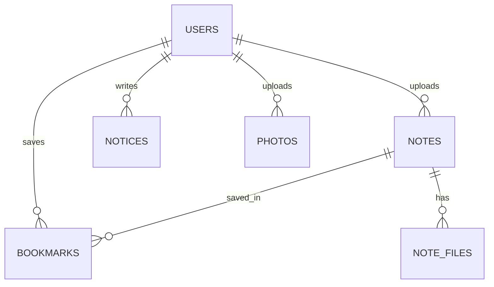

[← 스펙 인덱스](README.md)

# 3-2. 계약 — 데이터 모델과 API

프론트엔드와 백엔드가 공유하는 계약을 잡아준다. **스키마나 엔드포인트를 바꾸기 전에 이 문서를 확인하고, 바뀌면 같은 PR에서 갱신한다** (MUST). Flyway 마이그레이션(`V*__*.sql`)은 §3-2-2의 정의를 그대로 반영해야 한다.

> **출시 단계** — MVP는 인증, 공지, 회원 목록·승인·상태 변경 API를 우선 구현한다. 가입 거부, 자료·즐겨찾기·사진·회원 제거·권한 변경 API는 계약을 유지하되 `Post Launch`에서 구현한다.

구현된 API는 Swagger UI와 OpenAPI JSON(`/v3/api-docs`)으로 확인할 수 있어야 한다 (MUST). 엔드포인트를 구현하거나 변경하는 PR은 접근 권한, 요청·응답 스키마, 상태 코드와 대표 오류 응답을 OpenAPI 명세에도 함께 반영한다. Swagger는 이 문서를 대체하지 않으며, 이 문서는 기능·권한의 원본이고 OpenAPI는 구현 시점의 상세 계약이다.

```text
§3-2-1   ERD              테이블 관계
§3-2-2   테이블 정의       컬럼과 제약
§3-2-3   API — 인증
§3-2-4   API — 자료·즐겨찾기
§3-2-5   API — 공지·사진
§3-2-6   API — 회원 관리
§3-2-7   공통 에러 코드
§3-2-8   공통 페이지 응답
§3-2-9   미합의 — 확인이 필요한 항목들
```

## 3-2-1 ERD



## 3-2-2 테이블 정의

> **아래 표는 DB 컬럼 이름이다. JSON 응답의 필드 이름과는 층위가 다르다** — 컬럼은 `is_pinned`, JSON은 `isPinned`로 프론트엔드가 구현되어 있다. 아직 합의된 규칙이 아니므로 [§3-2-9](#3-2-9-미합의--json-필드명과-성공-상태-코드)에 사실만 적어두었다.

### users

| 컬럼 | 타입 | 제약 | 설명 |
|---|---|---|---|
| `id` | bigint | PK, auto | |
| `google_sub` | varchar(255) | UNIQUE, NOT NULL | 구글 계정 식별자 (ID 토큰의 `sub`) |
| `email` | varchar(255) | UNIQUE, NOT NULL | 학교 이메일 (`khu.ac.kr`) |
| `student_no` | varchar(20) | UNIQUE, NULL | 학번 (신원 확인용). 신청서 제출 시 채운다 |
| `name` | varchar(50) | NOT NULL | 최초에는 구글 프로필, 신청 시 본인이 정정 |
| `role` | enum | NOT NULL, default `USER` | `USER`, `ADMIN` |
| `status` | enum | NOT NULL, default `PENDING` | `PENDING`, `ACTIVE`, `SUSPENDED` |
| `created_at` | datetime | NOT NULL | 계정 생성일시 (첫 구글 로그인) |
| `applied_at` | datetime | NULL | 신청서 제출일시 |
| `approved_at` | datetime | NULL | 승인일시 |

**비밀번호 컬럼이 없다.** 인증은 구글이 담당하며 자체 비밀번호를 받지도 저장하지도 않는다 ([3-3 결정 13](3-3-DESIGN-DECISIONS.md#3-3-14-결정-13--가입로그인을-구글-oauth로-한다)).

계정의 신원 키는 `email`이 아니라 **`google_sub`** 이다 (MUST). 이메일은 학교 정책에 따라 바뀔 수 있지만 `sub`는 구글 계정에 영구적으로 고정된다. 로그인 시 `google_sub`로 기존 계정을 찾는다.

**기존 계정에 붙일 때 구글이 준 이메일이 저장된 값과 다르면 `email`을 갱신한다** (MUST). 갱신하지 않으면 회원 목록·검색과 `GET /auth/me`에 옛 주소가 남아, `google_sub`를 신원 키로 고른 이유가 절반만 실현된다. 갱신된 이메일도 허용 도메인 검증을 통과해야 한다.

**새 이메일이 다른 계정에 이미 쓰이고 있으면 로그인을 거부한다** (MUST). 학교가 주소를 회수해 다른 사람에게 재할당하면 `email` UNIQUE에 걸린다. 이때 **이메일로 기존 행을 찾아 붙이지 않는다** — 서로 다른 구글 계정이 한 사용자로 합쳐져 남의 자료에 접근하게 된다.

`/login?error=failed`로 되돌리고 서버 로그에 두 계정의 `id`를 남긴다. 관리자가 어느 쪽이 유효한 계정인지 판단해 정리해야 하는 상황이며, 자동으로 해결하지 않는다.

`student_no`는 NULL을 허용한다. 구글이 학번을 주지 않으므로 계정 생성 시점에는 비어 있고, 신청서 제출 시 채워진다 ([3-1 §3-1-4](3-1-DESIGN-ARCHITECTURE.md)). UNIQUE는 그대로 유지한다 (MUST) — 한 학번으로 여러 계정을 만드는 것을 막는다. PostgreSQL의 UNIQUE는 NULL을 서로 다른 값으로 보므로 미신청 계정이 여럿이어도 충돌하지 않는다.

**승인 대상은 `status = 'PENDING' AND applied_at IS NOT NULL`이다** (MUST). 구글 로그인만 하고 신청하지 않은 계정을 관리자의 승인 목록에서 제외한다.

### 세션 테이블

인가 상태를 서버 세션으로 관리하므로([3-3 결정 12](3-3-DESIGN-DECISIONS.md#3-3-13-결정-12--인증은-jwt-인가-상태는-서버-세션으로-나눈다)) 세션 저장용 테이블이 RDS에 필요하다. Spring Session JDBC가 요구하는 스키마를 쓰며, 컬럼 정의는 이 문서가 아니라 Spring Session 쪽이 원본이다.

`ddl-auto`가 `validate`이므로 이 테이블도 **Flyway 마이그레이션에 포함해야 한다** (MUST). 애플리케이션 테이블이 아니라 인증 기반이므로 위 ERD에는 넣지 않는다.

### notes

| 컬럼 | 타입 | 제약 | 설명 |
|---|---|---|---|
| `id` | bigint | PK, auto | |
| `category` | enum | NOT NULL | `EXAM`, `SUBJECT` |
| `title` | varchar(200) | NOT NULL | |
| `subject_name` | varchar(100) | NOT NULL | 과목명 |
| `professor` | varchar(50) | NULL | 교수명 |
| `year` | int | NOT NULL | 개설 연도 |
| `semester` | enum | NOT NULL | `SPRING`, `FALL` |
| `exam_type` | enum | NULL | `MIDTERM`, `FINAL` |
| `uploader_id` | bigint | FK → users.id | |
| `created_at` | datetime | NOT NULL | |
| `updated_at` | datetime | NOT NULL | |

- 인덱스: `(category, created_at)`, `(subject_name)`, `(year, semester)`
- **CHECK 제약** (MUST): `category = 'EXAM'`이면 `exam_type IS NOT NULL`, `category = 'SUBJECT'`면 `exam_type IS NULL`. 애플리케이션 검증에만 맡기지 않는다.

### note_files

| 컬럼 | 타입 | 제약 | 설명 |
|---|---|---|---|
| `id` | bigint | PK, auto | |
| `note_id` | bigint | FK → notes.id, **ON DELETE CASCADE** | |
| `original_name` | varchar(255) | NOT NULL | 업로드 당시 파일명 |
| `stored_path` | varchar(500) | NOT NULL | S3 오브젝트 키 |
| `size_bytes` | bigint | NOT NULL | |

파일은 S3에만 저장한다. **서버 디스크에 저장하지 않는다** (MUST). 저장 키 형식은 `notes/{uuid}.{ext}`이며, presigned 업로드 시점에는 `note_id`가 아직 없으므로 키에 포함하지 않는다.

### bookmarks

| 컬럼 | 타입 | 제약 | 설명 |
|---|---|---|---|
| `user_id` | bigint | PK, FK → users.id, **ON DELETE CASCADE** | |
| `note_id` | bigint | PK, FK → notes.id, **ON DELETE CASCADE** | |
| `created_at` | datetime | NOT NULL | |

복합 PK `(user_id, note_id)`로 중복 등록을 막는다. 양쪽 FK 모두 CASCADE를 건다 (MUST) — [2-1 §2-1-3](2-1-USER-STORIES.md)이 자료 삭제 시 즐겨찾기도 지워진다고 정의하고 있다.

### notices

| 컬럼 | 타입 | 제약 | 설명 |
|---|---|---|---|
| `id` | bigint | PK, auto | |
| `title` | varchar(200) | NOT NULL | |
| `content` | text | NOT NULL | |
| `is_pinned` | boolean | NOT NULL, default false | 상단 고정 여부 |
| `author_id` | bigint | FK → users.id | |
| `created_at` | datetime | NOT NULL | |
| `updated_at` | datetime | NOT NULL | |

정렬 기준: `is_pinned DESC, created_at DESC`

### photos

| 컬럼 | 타입 | 제약 | 설명 |
|---|---|---|---|
| `id` | bigint | PK, auto | |
| `caption` | varchar(200) | NULL | |
| `stored_path` | varchar(500) | NOT NULL | 리사이즈된 이미지의 S3 오브젝트 키 |
| `uploader_id` | bigint | FK → users.id | |
| `created_at` | datetime | NOT NULL | |

저장 키 형식: `photos/{photoId}/{uuid}.jpg`, 썸네일은 `photos/{photoId}/thumb/{uuid}.jpg`

---

Base path: `/api/v1`. 아래 표의 경로는 모두 이 base path 뒤에 붙는다 — `/auth/me`의 실제 URL은 `/api/v1/auth/me`다.

**경로에 버전을 붙인다** (MUST). 응답 필드를 지우거나 의미를 바꾸는 등 기존 클라이언트를 깨는 변경이 필요하면, `/api/v1`을 고치지 않고 `/api/v2`를 새로 연다 ([3-3 결정 9](3-3-DESIGN-DECISIONS.md#3-3-10-결정-9--api-경로에-버전을-붙인다)). 필드 추가처럼 호환되는 변경은 `v1` 안에서 한다.

버전을 붙이지 않는 경로가 두 개 있다. `/actuator/health`는 ALB 헬스체크가 쓰는 운영 경로이고, `/v3/api-docs`와 Swagger UI는 springdoc이 제공하는 경로다. 둘 다 클라이언트 계약이 아니므로 `/api/v1` 아래에 두지 않는다.

권한 컬럼은 [3-1 §3-1-3](3-1-DESIGN-ARCHITECTURE.md) 매트릭스와 반드시 일치해야 한다 (MUST).

## 3-2-3 API — 인증

| Method | Path | 권한 | 설명 |
|---|---|---|---|
| GET | `/auth/csrf` | 비로그인 | CSRF 토큰 발급 |
| GET | `/oauth2/authorization/google` | 비로그인 | 구글 로그인 시작 (가입 겸용) |
| GET | `/login/oauth2/code/google` | 비로그인 | 구글 콜백. 성공 시 계정 생성 또는 조회 후 세션 발급 |
| POST | `/auth/application` | PENDING | 신청서 제출·수정. body: `{ "studentNo": "...", "name": "..." }` |
| POST | `/auth/logout` | 로그인 | 로그아웃 |
| GET | `/auth/me` | 로그인 | 내 정보 + role/status/신청 여부 |
| POST | `/auth/bootstrap-admin` | 로그인 + **신청서 제출 완료** | 최초 관리자 승격/마지막 관리자 복구. body: `{ "token": "..." }` — [3-3 결정 11](3-3-DESIGN-DECISIONS.md) |

**`POST /auth/signup`과 `POST /auth/login`은 없다.** 자체 비밀번호를 쓰지 않으므로 두 엔드포인트가 사라졌다 ([3-3 결정 13](3-3-DESIGN-DECISIONS.md#3-3-14-결정-13--가입로그인을-구글-oauth로-한다)).

### `POST /auth/application` — 신청서

**`studentNo`와 `name`은 공백이 아니어야 한다** (MUST). 둘 중 하나라도 비었거나 공백뿐이면 `400 VALIDATION_ERROR`를 반환하고 **`applied_at`을 기록하지 않는다** (MUST).

PostgreSQL의 `NOT NULL`·`UNIQUE`는 빈 문자열을 거부하지 않는다. 검증이 없으면 `""`를 제출한 계정이 `applied_at`을 얻어 승인 대상이 되고, 식별 정보가 없는 채로 관리자 부트스트랩까지 통과한다.

### `POST /auth/bootstrap-admin` — 신청 완료 계정만

**`applied_at IS NOT NULL`인 계정만 호출할 수 있다** (MUST). 신청서를 내지 않은 계정이 이 경로로 곧장 `ACTIVE`가 되면 `student_no`가 비어 있는 관리자가 만들어지는데, 신청 API는 `PENDING` 전용이라 나중에 채울 방법이 없다. 이 조건이 빠지면 최초 관리자만 학번 없는 계정으로 남는다.

### 구글 OAuth 경로

두 경로는 Spring Security OAuth2 Client가 제공하며, **base path `/api/v1` 아래에 오도록 설정한다** (MUST). 실제 URL은 `/api/v1/oauth2/authorization/google`과 `/api/v1/login/oauth2/code/google`이다.

프레임워크 기본값(`/oauth2/...`, `/login/...`)을 그대로 두면 Vercel rewrites가 `/api/*`만 프록시하므로 브라우저 요청이 ALB에 닿지 않는다 ([3-3 결정 5](3-3-DESIGN-DECISIONS.md#3-3-5-결정-5--도메인-없이-vercel-프록시로-https를-우회한다)). 프록시 규칙을 늘리는 대신 서버 경로를 옮긴다.

구글 콘솔에 등록할 redirect URI도 **프론트엔드 오리진** 기준이다. 브라우저는 Vercel과만 통신하므로 ALB 주소를 등록하면 콜백이 다른 오리진에 떨어져 쿠키가 붙지 않는다.

`GET /auth/me`는 신청서 제출 여부를 함께 반환한다. 프론트엔드가 `PENDING` 사용자에게 신청 폼을 보일지 대기 안내를 보일지 이 값으로 가른다 ([3-1 §3-1-6](3-1-DESIGN-ARCHITECTURE.md)).

### 콜백은 항상 SPA로 되돌린다

**구글 콜백은 성공이든 실패든 JSON을 반환하지 않는다** (MUST). 브라우저 전체가 이동한 흐름이므로, 오류 본문을 그대로 내보내면 사용자가 SPA 밖의 빈 화면에 갇힌다. `request()`를 거치지 않아 프론트엔드의 공통 오류 처리도 동작하지 않는다.

| 결과 | 리다이렉트 |
|---|---|
| 성공 | `/` — 이후 SPA가 `GET /auth/me`로 상태를 판단해 알맞은 화면으로 보낸다 |
| 실패 | `/login?error={코드}` |

실패 코드는 이용자에게 무엇을 해야 하는지 알려줄 수 있는 것만 쓴다 (MUST).

| 코드 | 상황 | 로그인 화면이 보여줄 것 |
|---|---|---|
| `domain` | 허용 도메인이 아닌 계정 | "`khu.ac.kr` 계정으로 로그인하세요" |
| `unverified` | `email_verified`가 거짓 | 구글에서 이메일 인증을 마치라는 안내 |
| `suspended` | 정지된 계정 | 정지 안내 ([3-1 §3-1-5](3-1-DESIGN-ARCHITECTURE.md)) |
| `failed` | 그 외 (`state` 불일치, 토큰 교환 실패 등) | 일반 오류. 원인을 자세히 알리지 않는다 |

**쿼리 파라미터에 이메일·토큰·예외 메시지를 담지 않는다** (MUST). 주소창과 브라우저 기록, 리퍼러에 남는다.

§3-2-7의 상태 코드(`403 SUSPENDED`, `403 FORBIDDEN` 등)는 **API 호출에만 쓴다.** 콜백 실패는 상태 코드가 아니라 위 표의 리다이렉트로 알린다.

### CSRF 토큰

인증 쿠키가 자동 전송되므로 상태를 바꾸는 요청은 CSRF 토큰을 검증한다 ([3-3 결정 12](3-3-DESIGN-DECISIONS.md#3-3-13-결정-12--인증은-jwt-인가-상태는-서버-세션으로-나눈다)).

| 항목 | 값 |
|---|---|
| 쿠키 이름 | `XSRF-TOKEN` — **`httpOnly`가 아니다.** 클라이언트가 읽어 헤더에 실어야 한다 |
| 헤더 이름 | `X-XSRF-TOKEN` |
| 검증 대상 | `POST`, `PATCH`, `DELETE` 등 상태를 바꾸는 모든 요청 |
| 발급 경로 | `GET /auth/csrf` |

**`POST /auth/application`도 검증 대상이다** (MUST). `PENDING` 사용자만 호출할 수 있지만 세션 쿠키가 자동 전송되므로 다른 사이트가 대신 학번을 제출하게 만들 수 있다.

구글 로그인 시작(`GET /oauth2/authorization/google`)은 `GET`이라 CSRF 검증 대상이 아니다. 대신 **OAuth `state` 파라미터가 같은 역할을 한다** (MUST). Spring Security OAuth2 Client가 기본으로 생성·검증하므로 이를 끄지 않는다 — 끄면 로그인 CSRF(피해자를 공격자 계정에 로그인시키는 공격)가 열린다.

세션도 토큰도 없는 최초 진입에는 발급 경로가 필요하다. **클라이언트는 첫 상태 변경 요청 전에 `GET /auth/csrf`를 호출해 `XSRF-TOKEN` 쿠키를 받는다** (MUST). 이 엔드포인트는 응답 본문 없이 쿠키만 내려주며 비로그인으로 접근할 수 있다.

토큰이 없거나 쿠키와 헤더 값이 다르면 `403 FORBIDDEN`을 반환한다.

### 로그인 후 신원 조회

클라이언트는 로그인(구글 콜백 처리)이 끝난 뒤 `GET /auth/me`로 `role`·`status`·신청 여부를 조회한다 (MUST).

신원 조회 경로를 하나로 유지하기 위함이다. 콜백 응답에 사용자 정보를 실으면 같은 값을 두 곳에서 만들게 되고, 새로고침으로 세션을 복구할 때는 어차피 `GET /auth/me`를 쓰므로 흐름이 갈라진다.

## 3-2-4 API — 자료·즐겨찾기

| Method | Path | 권한 | 설명 |
|---|---|---|---|
| GET | `/notes` | ACTIVE | 목록·검색·필터 |
| GET | `/notes/filters` | ACTIVE | 필터 옵션(과목/교수/연도) 목록 |
| GET | `/notes/{id}` | ACTIVE | 상세 |
| POST | `/notes/upload-url` | ACTIVE | 파일별 presigned PUT URL 발급 |
| POST | `/notes` | ACTIVE | 메타데이터 등록 (JSON) — body에 업로드 완료된 파일 키 목록 |
| PATCH | `/notes/{id}` | 본인/ADMIN | 수정 |
| DELETE | `/notes/{id}` | 본인/ADMIN | 삭제 |
| GET | `/notes/{id}/files/{fileId}` | ACTIVE | presigned GET URL 발급 (파일 바이트는 서버를 거치지 않음) |
| GET | `/bookmarks` | ACTIVE | 내 즐겨찾기 목록 |
| POST | `/notes/{id}/bookmark` | ACTIVE | 추가 |
| DELETE | `/notes/{id}/bookmark` | ACTIVE | 해제 |

**`GET /notes` 쿼리 파라미터**

| 이름 | 타입 | 설명 |
|---|---|---|
| `category` | string | `EXAM` \| `SUBJECT` |
| `q` | string | 통합 검색어 (제목/과목/교수) |
| `subject` | string | 과목 필터 |
| `professor` | string | 교수 필터 |
| `year` | int | 연도 필터 |
| `semester` | string | `SPRING` \| `FALL` |
| `examType` | string | `MIDTERM` \| `FINAL` |
| `sort` | string | `latest`(기본) \| `title` |
| `page` | int | 0부터 시작 |
| `size` | int | 기본 20 |

## 3-2-5 API — 공지·사진

| Method | Path | 권한 | 설명 |
|---|---|---|---|
| GET | `/notices` | ACTIVE | 목록 (고정 우선 정렬) |
| GET | `/notices/{id}` | ACTIVE | 상세 |
| POST | `/notices` | ADMIN | 등록 |
| PATCH | `/notices/{id}` | ADMIN | 수정 |
| DELETE | `/notices/{id}` | ADMIN | 삭제 |
| PATCH | `/notices/{id}/pin` | ADMIN | 고정 토글 |
| GET | `/photos` | ACTIVE | 목록 |
| POST | `/photos` | ADMIN | 다중 업로드 (multipart, 서버 리사이즈) |
| DELETE | `/photos/{id}` | ADMIN | 삭제 |

> `POST /photos`의 업로드 경로는 미결정이다 ([1-BACKGROUND §1-5](1-BACKGROUND.md) #5).

## 3-2-6 API — 회원 관리

| Method | Path | 권한 | 설명 |
|---|---|---|---|
| GET | `/admin/users` | ADMIN | 목록 — `status`, `role`, `q`, `sort`, `page`, `size` |
| POST | `/admin/users/approve` | ADMIN | 일괄 승인 — body: `{ "userIds": [1,2,3] }` |
| POST | `/admin/users/reject` | ADMIN | 일괄 거부 — body: `{ "userIds": [1,2,3] }` |
| PATCH | `/admin/users/{id}/status` | ADMIN | `ACTIVE` ↔ `SUSPENDED` (본인을 `SUSPENDED`로: 마지막 활성 관리자면 차단) |
| PATCH | `/admin/users/{id}/role` | ADMIN | 권한 부여/회수 (본인 대상: 마지막 활성 관리자면 차단) |
| DELETE | `/admin/users/{id}` | ADMIN | 회원 제거 (본인 대상: 마지막 활성 관리자면 차단) |

### 신청일과 승인 대상

**`GET /admin/users`의 "가입 신청일"은 `applied_at`이다** (MUST). `created_at`(첫 구글 로그인)이 아니다 — 표시·정렬 모두 `applied_at`을 쓴다 ([2-2 §2-2-1](2-2-OPERATOR-REQUIREMENTS.md)). 응답에는 두 값을 모두 담되 화면이 무엇을 "신청일"로 부르는지 어긋나지 않게 한다.

**승인 대상 목록은 `status = 'PENDING' AND applied_at IS NOT NULL`로 거른다** (MUST). 신청하지 않은 계정은 **승인 대상에 포함되지 않는다.**

여기서 말하는 것은 **승인의 대상 집합**이지 회원 목록 화면이 아니다 (2026-08-10 명확화). `GET /admin/users`는 모든 회원을 보여주는 화면이고 신청하지 않은 계정도 관리자가 봐야 한다 — 그 사람이 존재한다는 것 자체가 운영 정보다. 요점은 **그 계정이 승인 대상에서 빠지는 것**이고, 화면은 이를 상태 표시("미승인")와 선택 불가로 드러낸다 ([5-TESTING T-73](5-TESTING.md#5-2-필수-테스트-사례)).

`POST /admin/users/approve`에 신청하지 않은 계정의 id가 섞여 오면 그 건은 실패로 집계하고 그 계정의 상태를 바꾸지 않는다 (MUST). 목록에서 걸렀더라도 API를 직접 부르는 경로가 남아 있다.

## 3-2-7 공통 에러 코드

| HTTP | 코드 | 상황 |
|---|---|---|
| 400 | `VALIDATION_ERROR` | 입력값 검증 실패 |
| 401 | `UNAUTHENTICATED` | 미로그인 |
| 403 | `PENDING_APPROVAL` | `PENDING` 사용자의 일반 API 접근 |
| 403 | `SUSPENDED` | 정지된 계정의 로그인 시도 / **정지된 계정의 보호 API 접근** — 이용 중 정지된 세션의 다음 요청도 이 코드다 ([2-2 §2-2-3](2-2-OPERATOR-REQUIREMENTS.md) MUST) |
| 403 | `FORBIDDEN` | 권한 부족 / 마지막 활성 관리자의 본인 권한 회수·삭제·정지 시도 / 허용 도메인이 아닌 구글 계정의 로그인 |
| 404 | `NOT_FOUND` | 리소스 없음 |
| 409 | `DUPLICATE_STUDENT_NO` | 신청서의 학번이 다른 계정에 이미 쓰이고 있음 |
| 413 | `FILE_TOO_LARGE` | 파일 용량 초과 |
| 415 | `UNSUPPORTED_FILE_TYPE` | 허용되지 않는 확장자 |

에러 응답은 커스텀 예외 + `@RestControllerAdvice`로 일괄 처리한다 (MUST). 응답 형식은 [5-TESTING §5-4](5-TESTING.md)에 있다.

## 3-2-8 공통 페이지 응답

목록 API는 모두 페이지 응답을 쓴다. MVP는 `GET /notices`, `GET /admin/users`, `Post Launch`는 `GET /notes`, `GET /bookmarks`, `GET /photos`가 대상이다.

공통 요청 파라미터는 `page`(0부터 시작), `size`(기본 20)다.

응답 형태는 Spring Data `PagedModel`로 고정한다 (MUST).

```json
{
  "content": [],
  "page": { "size": 20, "number": 0, "totalElements": 300, "totalPages": 15 }
}
```

서버는 `@EnableSpringDataWebSupport(pageSerializationMode = VIA_DTO)`를 전역에 한 번 적용한다 (MUST).

`Page` 객체를 그대로 직렬화하지 않는다 (MUST). Spring 3.3+는 이 방식의 구조 안정성을 보장하지 않고 경고를 남기며, `pageable`·`sort`·`offset` 같은 내부 구현 필드가 응답에 노출된다.

## 3-2-9 미합의 — 확인이 필요한 항목들

**이 절은 결정이 아니라 확인이 필요한 항목이다.** 계약이 말하지 않는데 프론트엔드가 이미 가정하고 구현해 굳어버린 것들을 사실 그대로 적는다. 항목이 늘 수 있으므로 개수를 문장에 적지 않는다 — 아래 소제목이 목록이다. 백엔드 담당과 맞춘 뒤에 이 절을 지우고 해당 절(§3-2-2, §3-2-5 등)에 확정 내용을 넣는다. 합의 전까지는 **어느 쪽이 맞다고 읽지 않는다.**

### JSON 필드명 — 프론트엔드는 camelCase로 구현했다

[§3-2-2](#3-2-2-테이블-정의)의 표는 **DB 컬럼**이라 `is_pinned`·`created_at`·`applied_at`처럼 snake_case다. 표만 보면 JSON 응답도 snake_case로 읽히는데, 프론트엔드는 그렇게 구현하지 않았다.

| 층위 | 예 | 근거 |
|---|---|---|
| DB 컬럼 | `is_pinned`, `created_at`, `student_no` | [§3-2-2](#3-2-2-테이블-정의) 표 |
| JSON 필드 | `isPinned`, `createdAt`, `studentNo` | `apps/web/src/api/types.ts`, `apps/web/src/api/notices.ts` |

**서버가 Jackson을 snake_case로 직렬화하면 프론트엔드의 모든 해당 필드가 `undefined`가 된다.** 타입 검사로는 잡히지 않는다 — 컴파일 시점에는 응답이 선언한 타입이라고 믿기 때문이다. 화면에는 빈 값과 `Invalid Date`가 나온다.

확인이 필요한 것: **서버가 JSON을 camelCase로 내려주는가.** Spring Boot 기본값은 Java 필드명 그대로이므로 엔티티·DTO를 camelCase로 쓰면 자연히 맞고, `spring.jackson.property-naming-strategy`를 snake_case로 바꾸면 어긋난다.

### 성공 상태 코드 — 계약에 없다

[§3-2-5](#3-2-5-api--공지사진)의 표는 method와 경로, 권한만 정하고 성공 시 상태 코드를 말하지 않는다. `POST`가 201인지 200인지, `DELETE`가 204인지 200인지 정해진 바가 없다.

프론트엔드의 현재 동작을 사실대로 적으면:

| 응답 | 프론트엔드 동작 |
|---|---|
| 2xx + JSON 본문 | 본문을 파싱해 쓴다. 등록·수정은 **응답 본문의 `id`로 상세 화면으로 이동하므로 본문이 필요하다** |
| 2xx + 빈 본문 (204 포함) | 오류 없이 `undefined`로 통과한다 (`apps/web/src/api/client.ts`) |
| 등록·수정이 빈 본문 | **저장은 됐는데 실패 화면이 뜬다** — 이동할 `saved.id`가 없어 예외가 나고, 폼이 오류 안내를 띄운 채 남는다 |
| 삭제가 빈 본문 | 문제없다. 반환값을 쓰지 않는다 |

즉 상태 코드 자체는 2xx이기만 하면 되고, **갈리는 것은 본문 유무다.** 등록·수정은 저장된 공지를 본문으로 돌려줘야 하고 삭제는 없어도 된다.

확인이 필요한 것: **`POST`·`PATCH`가 저장된 리소스를 본문으로 돌려주는가.**

### 일괄 승인 응답 — 프론트엔드가 형태를 제안한다

[§3-2-6](#3-2-6-api--회원-관리)은 `POST /admin/users/approve`의 요청 본문(`{ "userIds": [1,2,3] }`)만 정하고 **응답을 말하지 않는다.** 그런데 같은 절이 "신청하지 않은 계정의 id가 섞여 오면 그 건은 실패로 집계한다"(MUST)고 하고, [2-2 §2-2-2](2-2-OPERATOR-REQUIREMENTS.md#2-2-2-가입-승인거부)는 "처리 결과(성공/실패 건수)를 안내한다"(MUST)고 한다. **집계한 결과가 응답에 없으면 화면이 건수를 안내할 방법이 없다.**

프론트엔드는 아래 형태로 구현했다.

```json
{
  "approved": [1, 2],
  "failed": [{ "userId": 3, "reason": "NOT_APPLIED" }]
}
```

| 항목 | 이유 |
|---|---|
| 건수 필드를 따로 두지 않는다 | 배열 길이가 곧 건수다. `successCount`를 따로 두면 배열과 어긋날 자리가 생긴다 |
| 실패에 `userId`를 담는다 | **건수만으로는 운영자가 조치할 수 없다.** "1명 실패"로는 누구에게 신청서를 내라고 안내할지 모른다. 이름은 화면이 이미 들고 있으므로 id면 충분하다 |
| `reason`은 지금 `NOT_APPLIED` 하나뿐 | 계약이 정의한 실패가 그것뿐이다. 나중에 사유가 늘어도 응답 형태를 바꾸지 않아도 된다 |
| 전체는 `200`으로 본다 | 일부 실패는 요청 자체의 실패가 아니다. 권한 없음 같은 실패는 기존 오류 규약(§3-2-7)을 그대로 쓴다 |

**`reason`이 부담이면 `"failed": [3]`처럼 id 배열만 주셔도 된다.** 그 경우 화면은 사유를 일반 문구로 안내한다. 형태를 정하는 것이 목적이지 이 형태를 고집하는 것이 아니다.

확인이 필요한 것: **이 응답 형태로 구현하는가, 아니면 다른 형태를 쓰는가.**

### 회원 목록 정렬 파라미터 — 프론트엔드가 쓰는 값

[§3-2-6](#3-2-6-api--회원-관리)은 `GET /admin/users`의 파라미터 이름(`status`, `role`, `q`, `sort`, `page`, `size`)만 적고 **`sort`에 어떤 값이 오는지 말하지 않는다.** [2-2 §2-2-1](2-2-OPERATOR-REQUIREMENTS.md#2-2-1-회원-목록)이 "정렬: 이름, 학번, 가입 신청일"을 요구하므로 프론트엔드는 아래로 구현했다.

| 화면 | 보내는 값 |
|---|---|
| 이름순 | `sort=name` |
| 학번순 | `sort=studentNo` |
| 신청일 최신순 (기본) | `sort`를 보내지 않는다 |

**서버가 Spring Data 기본 형식(`sort=appliedAt,desc`)을 기대하면 어긋난다.** 값이 다르면 400이 나거나, 조용히 무시되고 다른 순서의 명단이 온다. 후자가 더 위험하다 — 관리자는 정렬이 적용된 줄 알고 그 순서를 신뢰한다.

기본 정렬을 신청일 최신순으로 잡은 것도 가정이다. 승인 대기자를 먼저 처리하는 화면이라 그렇게 두었다.

확인이 필요한 것: **`sort` 값의 형식과 기본 정렬.** Spring 식으로 가면 프론트엔드가 `sort=name,asc` 형태로 맞춘다.

### `PENDING`을 신청 여부로 가르는 방법이 없다

[§3-2-6](#3-2-6-api--회원-관리)의 `GET /admin/users` 필터는 `status`·`role`·`q`뿐이다. **`status=PENDING`으로 거르면 신청서를 낸 계정과 내지 않은 계정이 함께 온다.**

그런데 [§3-1-4](3-1-DESIGN-ARCHITECTURE.md#3-1-4-auth-01-가입-신청)는 이 상황을 이렇게 걱정한다.

> 구글 로그인만 해보고 신청하지 않은 계정이 관리자의 승인 목록에 섞이면 운영이 어려워진다

**"승인 대기만 보여줘"가 이 화면에서 제일 잦은 작업인데 지금은 할 수 없다.**

클라이언트에서 거르는 것은 답이 아니다. 페이지네이션과 맞지 않는다 — 서버가 20건을 주고 화면이 그중 일부를 버리면 페이지마다 보이는 건수가 들쭉날쭉하고, 총 건수와 총 페이지 수가 실제와 어긋난다. 관리자가 "12명 남았다"고 읽는 숫자가 틀리게 된다.

**요청은 "`PENDING`을 신청 여부로 가를 수 있는 방법"이다.** 파라미터 이름과 형태는 서버가 정하면 된다 — `applied=true` 같은 별도 파라미터든, `status=PENDING_APPLIED` 같은 값이든, 정렬·필터 규약에 맞는 쪽이면 무엇이든 화면이 맞춘다.

그때까지의 임시 조치: 화면은 상태 필터의 `PENDING` 라벨을 **"미승인"**으로 쓴다. 이 필터는 `PENDING` 전부를 데려오므로 — 목록에서 "미승인"으로 표시되는 계정과 "승인 대기"로 표시되는 계정을 함께 — 둘을 아우르는 이름이어야 한다. "승인 대기"라고 적으면 필터가 거짓말을 한다.

**같은 낱말이 두 범위로 쓰인다는 점에 주의한다.** 필터의 "미승인"은 `PENDING` 전부이고, 목록 상태 칸의 "미승인"은 그중 **신청서를 내지 않은 계정**만이다 (`applied_at IS NULL`). 상태 칸은 여전히 "미승인"과 "승인 대기"를 가른다.

확인이 필요한 것: **`PENDING`을 신청 여부로 가르는 파라미터를 추가할 수 있는가.**

---
[← 이전: 아키텍처](3-1-DESIGN-ARCHITECTURE.md) · [다음: 결정 기록 →](3-3-DESIGN-DECISIONS.md)
